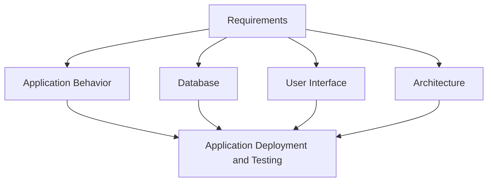

# Information Management
full name = *information systems management*

## What is information management ?
+ management process
+ IT systems that help to deal with data

## 3-Tier Architecture 
+ Presentation Layer
+ Application Layer
+ Database Layer

Steps of design:
1. Conceptual Design
2. Logical Design
3. Physical Design

Requirements:
+ Specification Documents
+ Use Cases
+ Business Models

Types of models:
+ Requirements Models (BMC)
+ Process models (BPMN)
+ Data models (class diagrams, ER diagrams)
+ Architecture models 
+ Interface Models