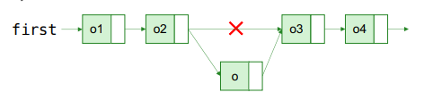
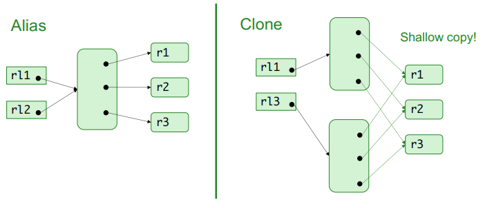

# List Implementations

@startuml
interface List<E: Class>
abstract class AbstractList<E: Class> implements List
class ArrayList<E: Class> extends AbstractList
class Vector<E: Class> extends AbstractList
abstract class AbstractSequentialList<E: Class> extends AbstractList
class LinkedList<E: Class> extends AbstractSequentialList
class Stack<E: Class> extends Vector
@enduml

## List Implementation With Array

```java
public class SimpleArrayList<E> implements List<E> {
    public static final int INITIAL_SIZE = 10;
    private Object[] list;
    private int size;

    public SimpleArrayList() {
        this.list = new Object[INITIAL_SIZE];
        this.size = 0;
    }

    public int size() {
        return this.size;
    }

    public boolean isEmpty() {
        return size == 0;
    }

    public boolean contains(Object o) {
        for (Object e : this.list) {
            if (e.equals(o)) {
                return true;
            }
        }

        return false;
    }

    public E get(int index) {
        if (index < 0 || index >= size) {
            throw new ArrayIndexOutOfBoundsException();
        }
        return (E) this.list[index];
    }

    public boolean add(E e) {
        if (this.size == this.list.length) {
            Object[] newList = new Object[this.list.length * 2]; // allocate twice the space ArrayList uses a more complex approach :)
            for (int i = 0; i < this.size; i++) {
                newList[i] = this.list[i]; // copy elements. 
            }
        }
        this.list[this.size++] = e;
        return true;
    }

    // more methods should be implemented in order to satisfy the List requirement.
}
```

## Linked List
node points to where the next piece of information is stored.


```java
public class SimpleLinkedList<E> implements List<E> {
    private class Node {
        E element;
        Node next;

        public Node (E element) {
            this.element = element;
            this.next = null;
        }
    }

    private int size;
    private Node first;

    public SimpleLinkedList() {
        this.size = 0;
        this.first = null;
    }

    private Node getNode(int pos) {
        Node p = first;
        for (int i = 0; i != pos; i++) {
            p = p.next;
        }
        return p;
    }

    public boolean contains(Object o) {
        for (Node p = first; p != null; p=p.next) {
            if (p.element.equals(o)) {
                return true;
            }
        }
        return false;
    }

    public int size() {
        return this.size;
    }

    public boolean isEmpty() {
        return this.size == 0;
    }

    public void add(int index, E element) {
        Node newNode = new Node(element);
        if (index == 0) {
            newNode.next = first;
            first = newNode;
        } else {
            Node p = getNode(index - 1);
            newNode.next = p.next;
            p.next = newNode;
        }
        this.size++;
    }
}
```



## Doubly Linked List

In a linked list adding an element to the end of the list implies
traversing the whole list :grimacing: To speed this up, double linked lists have the advantage of nodes with pointers to both previous and next nodes.


#### Adding an element.

---


#### Removing an element.

---


## Vector
ArrayList is a better choice if your program is thread-safe.
Vector and ArrayList require more space as more elements
are added. Vector each time doubles its array size, while
ArrayList grows 50% of its size each time.

## Comparison

| Operation | Array List | Linked List |
| --------- | ---------- | ----------- |
| Finding Element |  :smiley: Easy   |  :weary: Difficult |
| Inserting/Deleting | :weary: Difficult | :smiley: Easy |
| Reason    |  Possible Copying  |  Possible many node visits |

## Cloning

```java
// changes in rl2 are reflected in rl1!
List<Room> rl1 = new ArrayList<Room>();
List<Room> rl2 = rl1;
```

### Shallow Copy 

```java
// changes in rl3 are not reflected in rl1.
List<Room> rl1 = new ArrayList<Room>();
List<Room> rl3 = (List<Room>) ((ArrayList<Room>) rl1).clone();
```



## Summary

Multiple different implementations of `List<E>` are available
+ Implementations based on arrays, such as the `ArrayList<E>`, are
more suitable when the elements are not often added and
removed, and a lot of searching is done
+ Implementations based on linked lists, such as the
`LinkedList<E>`, are more suitable when elements are often added
and removed, but searching is limited
+ In practice, the differences are negligible!