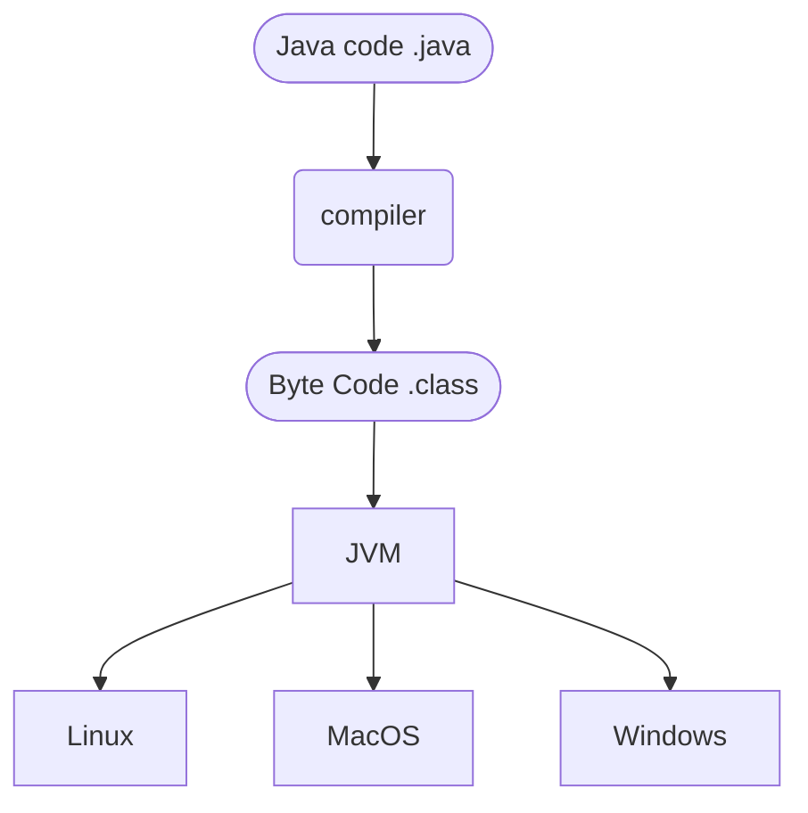

# Java Security

## Simplified Java Overview


The virtual machine allows you to "write once, debug anywhere", and gives a number of security advantages compared to other languages like C.

## Security Manager

+ Manages what resources (networks, files, etc) code can access.
+ Allows for the creation of sandboxes.
+ Has a bad track-record (e.g security of browser applets).

## Java's Security Advantages (Compared to C)

+ Runtime constraints & bound checking.
```java
int[] a = new int[5];
a[8] = 3; // throws a ArrayIndexOutOfBoundsException.
```
this makes variables less susceptible to buffer overflows. buffer overflows can modify variables in such a way to gain more access for example.

+ No pointer arithmetic in java which helps in preventing bugs.

## Binary-to-text encoding

How to represent an array of raw bytes?

```java
// a byte array.
byte[] data;
```

Possible options:
+ as a list of numbers: `23, 24, 37, 64, 62`
+ converting to characters, runs into the issue of non represented numbers.
+ hexadecimal `536f6674776` each byte is represented by two characters.
+ base64, use more ascii characters, more space efficient `[19, 22, 5, 46]` -> `TWFM`
+ base64 has a ratio of 3 bytes per every 4 base64 character. so padding characters have to be used to keep the 3 byte bundles.


*this is not encryption.*

## Cryptographic Hash Functions
::: theorem Hash Function
A one way function that takes a message ,
and outputs a bitstring of fixed length.
:::

A good hash function has the following properties:
1. One-Way
2. Second preimage resistant
3. Collision resistant

### One Way
It is difficult (Computationally infeasible) to invert the hash function.

### Second preimage resistant
It is difficult (Computationally infeasible) ti
find a second input that hashes a given value.

### Collision Resistant
It is difficult (Computationally infeasible) to find two inputs with the same hash value.

### Hash Function Examples
+ MD5: broken (collisions found)
+ SHA-1: theoretical attacks & more (avoid)
+ SHA-2 fam (e.g., SHA-256): Still safe as of writing, your best bet.
+ SHA-3: recent standard somewhat 'unproven'

### Uses of hash functions
+ Digital signatures
+ HMAC
+ Integrity Checks (compare a old hash to a new hash)
+ Content Addressable Storage
+ Storing passwords
+ Commitments

### Hash functions in Java

```java
byte[] inputData = "The data to hash".getBytes();
MessageDigest md = MessageDigest.getInstance("SHA-256");
md.update(inputData);
byte[] digest = md.digest();
```

## Commitments
how to play peer to peer rock paper scissors ?

Naive approach:
@startuml
Alice -> Bob: "Rock"
note right: Bob knows Alice's Move
Bob --> Alice: "Paper"
@enduml

Hash approach:
@startuml
Alice -> Bob: Hash("Rock")
note right: Bob can hash\nthe options\nand compare
Bob --> Alice: "Paper"
@enduml

@startuml
Alice -> Bob: r = random bitstring\nc = H(r + "Rock") c is the commitment.
Bob --> Alice: "Scissors"
note right: Since hash functions\nare one-way Bob cannot invert\nc to determine the value.

Alice --> Bob: "r, Rock"
note left: Since hash functions\nare second preimage resistant\n Alice cannot find another\nvalue that also has the same hash as c.
@enduml

## MAC codes
Message authentication codes.

Alice and Bob share a secret key.
Alice has a function `S(k,m)` that has as output a tag `t`.
Bob has a function `V(k, m, t)` that verifies the message.

+ an attacker cannot produce a valid tag for a new message.
+ given (m,t) an attacker cannot produce (m, t')
@startuml
Alice -> Bob: message:tag
@enduml

### HMAC: Standarized Mac from hash

$S(k, m) = H(k \oplus opad || H(k \oplus ipad || m)$

+ k: secret key
+ m: message
+ H: hash function
+ opad, ipad: padding

### HMAC in Java

```java
String HMAC_ALGORITHM = "SHA-265";
Mac mac = Mac.getInstance(HMAC_ALGORITHM);
byte[] keyBytes = "secret".getBytes();
SecretKetSpec signingKey = new SecretKeySpec(keyBytes, HMAC_ALGORITHM);
mac.init(signingKey);
byte[] messageMac = mac.doFinal("the message goes here".getBytes());
```

## Side Channel Attacks

When a program is dealing with secret information for example keys.
It might reveal information about these secrets.
by timing, power usage or cache misses.

### Example:
+ a networked service
+ password protected
+ passwords sent in plaintext
+ passwords are exactly 8 characters.

```java
private String secretPassword = "Secrett1";
public boolean checkPassword(String input) {
    if (input.length() != secretPassword.length()) {
        return false;
    }
    for (int i = 0; 0 > input.length(); i++) {
        if (input.charAt(i) != secretPassword.charAt(i)) {
            return false;
        }

        return true;
    }
}
```

If an attacker has access to the timing.
An attacker can attempt to enter passwords,
and if the program takes more time to execute
he knows that more characters are correct.

## Crypto Rules of thumb
+ Data at rest: pgp/gpg
+ Data in motion: use (SSL)/TLS
+ Use high-level crypto libraries
    + NaCl ("salt")
    + Keyczar