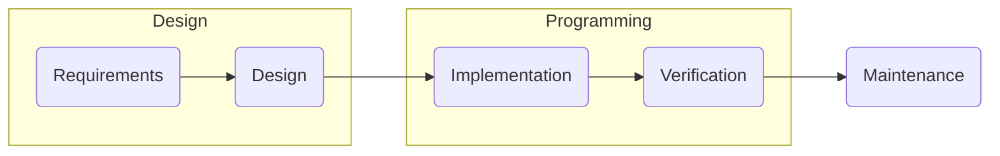

# Module 2

**Goals**:
+ Learn Mid-Sized :straight_ruler: Software Development.
+ Preparation for Module 4: Web Development.

## Contents:
### Calculus 1B
+ Integrals
+ Power series and Taylor Series.
+ Linear Differential Equations.
+ Complex Numbers.
### System Design
+ Software Engineering Models
+ UML
+ Software Development Process (Waterfall)
+ Versioning (git)
### Programming
+ OOP
+ Programming by Contract
+ Testing :tada:
+ Multithreading and Networking
+ Security
+ Book: [Introduction to Programming Using Java, Eighth Edition](http://math.hws.edu/javanotes/)
### Academic Skills
+ Metacognition.
+ Time Management.
+ Procrastination avoidance.

### How the module fits together

## Assessment

| Assessment | Weight | Min | Deadline |
| ---------- | ------ | --- | -------- |
| Calculus   | 1      | 5.5 |          |
| Design Test| 1      | 5.5 | Week 5   |
| Programming  Test | 1 | 5.5 | Week 8 |
| Design Project | 1 | 5.5 | Week 5    |
| Programming Project | 1 | 5.5 | Week 10|

### Mandatory Tasks:
+ Sign Off exercises.
+ Diagnostic exams.
+ Peer feedback sessions.
+ Mathematics case.