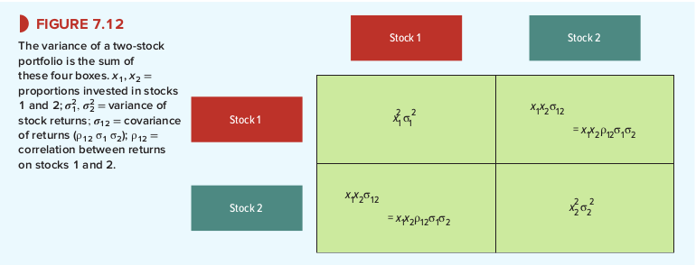

# 7-3 Calculating Portfolio Risk
:::tip portfolio risk <-> risk individual shares
to fully understand the effect of diversification you need to know how the risk of portfolio depends on the risk of the individual shares
:::

The expected return of your portfolio is a weighted average of the expected returns on the individual stocks.

:::theorem Expected portfolio return
+ 60% of portfolio -> Amazon
+ 40% of portfolio -> Southwest Airlines
+ expected return Amazon -> 10.0%
+ expected return Southwest Airlines -> 15.0%
    + Expected portfolio return = (.60 x 15) + (.40 x 10) = 13%
:::

Finding the risk of your portfolio is the hard part. In the past, standard deviation of returns was:
+ 26.6%: Amazon
+ 27.9%: Southwest Airlines

To calculate the risk of a two-stock portfolio you need to fill in four boxes.

1. (top-left) variance of the return on stock 1 x *square* of the proportion invested in it.
2. (bottom-right) variance of the return on stock 2 x *square* of the proportion invested in it.
3. (diagonal boxes) $​ x_1*x_2*\sigma_{12} ​​=  x_1*x_2*​\rho_{​12} * \sigma_1 *​ \sigma_2$

Add all four boxes together to obtain portfolio variance:

$Portfolio variance = x_1^2 * \sigma_1^2 + x_2^2 * \sigma_2^2 + 2(x_1*x_2*\rho_{12}*\sigma_1*\sigma_2)$

The portfolio standard deviatoin (variability) is the square root of the variance.

When the two stocks move in the same direction. The correlation coefficient is positive, and therefore the covariance is also positive. If the stocks were completely unrelated they would both be 0. And if the stocks move in opposite directions they would be negative.

## 📘 General Formula for Computing Portfolio Risk
The method for calculating portfolio risk can be easily be extended to portfolios of three or more securities. There are just going to be more boxes to fill in. All the boxes on the diagonal will contain the variance weighted by the square of the proportion invested. Each of the other boxes contain the covariance between that pair of securities, weighted by the product of the proportions invested.

## ➕ Adding Large Amount of Boxes Together?
If you have huge portfolio which contains a whole bunch of stucks. You are not even going to try and extent the formula to calculate the portfolio risk. These investors know how portfolio risk is determined by the covariance across securities. They worship the power of diversification and want a well-diversified portfolio. These investors often just end up holding the entire stock market.

You can basically buy the market by purchasing shares in an **index fund**. If you have no insider information about any of the stocks in the market it makes sense to be an **indexer**. In the case that you are willing to try to invest as an active investor instead of a passive investor (indexer) you are adives to:
1. Start with widely diversified portfolio.
2. Concentrate on few stocks as possible additions.

:::tip REMEMBER 🧠
**Smart and serious investors hold widely diversified portfolios**.
