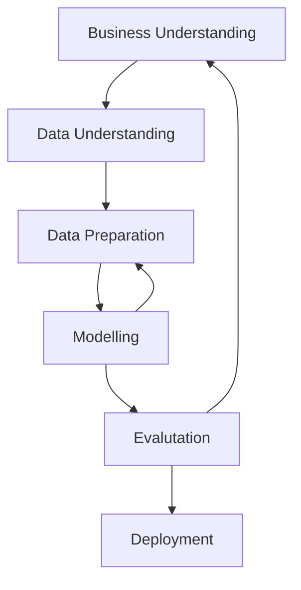

# CRISP-DM

Abstraction levels

- Phases
- Generic tasks
- specialized tasks
- process instances

Business Understanding:

- determine business objectives
- assess situation
- determine data mining goals
- produce project plans

Data Understanding:

- collect initial data
- describe data
- explore data
- verify data quantity

Data Preparation:

- select data
- clean data
- construct data
- format data

Modelling:

- select modelling technique
- generate test design
- building model
- assess model

Evaluation:

- evaluate results
- review process
- determine next steps

Deployment:

- plan deployment
- plan monitoring and maintenance
- produce final report
- review project

60% of time is spent on data preparation.

CRISP-DM: Limitations

- Data acquisition problem
- project managment aspect of data mining study
- how to evaluate success of each phase.

# Design Science Methodology

Design science is the design and investingation of artifacts in context.

- design problems
  - utility is main goal
  - knowledge is side-effect
- knowledge problems
  - knowledge is main goal
  - utility is side effect

This is a computer assisted language learning project.

I want to learn English soon because I have to bussines around the world, let me know your free time to practice.

Hello. I'm interested in communicating with other contries people. But my english skill id not good. So I would like to improve it. I can help if you need to improve Japanese
