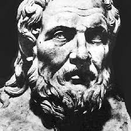

# Differentiation.
*It's a warm summer evening in ancient Greece...*

::: author1 Apollonius of Perga

A tangent to a curve C is a line l that intersects C, such that
no other line could fall between l and C.
:::

## Finding the tangent Using a limit.

+ the line through P an Q is called a **secant**.
+ the **tangent** to the curve (at P) is the limit of the secant line for Q approaching P.

+ the slope of the secant through P and Q is:
$$\frac{f(x_0 + h) - f(x_0)}{h}$$
+ The slope of the tangent to C at P is
$$\lim_{h \to 0}\frac{f(x_0 + h) - f(x_0)}{h}$$

## Differentiability and continuity

::: theorem Definition
Let f be a function defined on an open interval I, and let $x_0 \in I$ the derivative of f at $x_0$ is 

$$f'(x_0) = lim_{h \to 0}\frac{f(x_0 + h) - f(x_0)}{h}$$

provided this limit exists.
:::

+ If the limit exists we say: f is **differentiable** at $x_0$

+ When a function is **differentiable** it is also continuous.
+ But a function can be **continuous** but not **differentiable**.

### Possible notations for derivatives:

+ $f'(x_0)$
+ $\frac{df}{dx}(x_0)$
+ $f_x(x_0)$

### Differentiation Rules :scroll:
+ Sum Rule: $\frac{d}{dx}(f + g)(x) = f'(x) + g'(x)$
+ Difference Rule: $\frac{d}{dx}(f-g)(x) = f'(x) - g'(x)$
+ Constant multiple Rule: $\frac{k \cdot f}{x} = k \cdot f'(x)$
+ Product Rule: $\frac{d}{dx}(f \cdot g)(x) = f'(x) \cdot g(x) + f(x)g'(x)$
+ Quotient Rule: $\frac{d}{dx}(\frac{f}{g})(x) = \frac{f'(x)\cdot g(x) - f(x)\cdot g'(x)}{g(x)^2}$
+ Chain Rule: $\frac{d}{dx}f(g(x)) = f'(g(x)) \cdot g'(x)$

### Derivatives of elementary functions:

|$f(x)$| $f'(x)$ | condition |
| ---- | ------- | --------  |
| c    |    0    | $c \in \mathbb{R}$ |
| $\sqrt{x}$ | $\frac{1}{2\sqrt{x}}$ | $x \gt 0$ |
| $\frac{1}{x}$ | $-\frac{1}{x^2}$ | $x \neq 0$ |
| $x^\alpha$ | $\alpha x^{\alpha - 1}$ |  $\alpha \in \mathbb{R}$ |
| $e^x$ | $e^x$| |
| $\ln x$ | $\frac{1}{x}$ | $x \gt 0$ |
| $\sin x$ | $\cos x$ | |
| $\cos x$ | $-\sin x$ | |
| $\arcsin x$ | $\frac{1}{\sqrt{1 - x^2}}$ | $\abs{x} \lt 1$ |
| $\arccos x$ | $-\frac{1}{\sqrt{1 - x^2}}$ | $\abs{x} \lt 1$ |
| $\arctan x$ | $\frac{1}{\sqrt{x^2 + 1}}$ | |

## The tangent Line:
::: theorem Theorem
Let f be differentiable at a. The tangent line to the graph of f at P(a, f(a)) is given by the equation:
$$y = f(a) + f'(a)(x-a)$$
:::

### Linearization
the function L is called the linearization of f at a. (it's the tangent line)
$$L(x) = f(a) + f'(a)(x-a)$$

### Linearization as approximation:
+ linearizations can be used as an approximation for a more complicated function.
+ linearizations have less error the closer x is to the point at which you linearized (a in the tangent equation)

## Extreme Values:

::: theorem Definition
Let f be a real function with domain D. Let $c \in D$.
+ f has an **absolute maximum value** on D at c if:
$$\forall x \in D \,[f(x) \le f(c)]$$

+ f has an **absolute minimum value** on D at c if:
$$\forall x \in D \,[f(x) \ge f(c)]$$
:::

::: theorem Extreme Value Theorem
Conditions:
+ function f is **continuous** on interval [a, b]
+ interval [a, b] is **closed** == (a and b are included in the interval)
+ interval [a, b] is **bounded** == (a and b are real numbers)

Result:
+ f attains both an absolute maximum value and
an absolute minimum value on [a, b].
:::

### Local Extrema:

::: theorem Definition
Let f be a real function with domain D. Let $c \in D$.
+ f has an **local maximum value** at c if there exists an open interval I containing c such that:
$$\forall x \in I \cap D \,[f(x) \le f(c)]$$

+ f has an **local minimum value** at c if there exists an open interval $I \subseteq D$:
$$\forall x \in I \cap D \,[f(x) \ge f(c)]$$
:::

::: theorem First Derivative Theorem
If f has a local maximum or minimum value at an interior point c of it's domain,
and f' is defined at c, then f'(c) = 0
:::

If: $f: I \to R$ has a local extreme value at c:
The requirements of the theorem do not hold:
+ c is not an interior point of I
+ f is not differentiable at c.
Or:
+ $f'(c) = 0$.

### Critical points
::: theorem Definition
An interior point of the domain of f where f' is undefined or where
f'(c) = 0 is called a critical point of f.
:::

+ A critical point is not necessarily a local extreme.

### Finding absolute extrema:
1. Find all points (a, b) where f' does not exist.
2. Find all $c \in (a, b)$ where f'(c) = 0.
3. Calculate the f(x) for x = [a, b, points that don't exist, points c where f'(c) = 0]
4. The largest value is the absolute maximum value.
5. The smallest value is the absolute minimum value.

## L'Hôpital's rule

### Indeterminate form $\frac{0}{0}$
::: theorem L'Hôpital's rule
Suppose that f(c) = g(c) = 0, that f and g are differentiable on an open interval
I containing c and that $g'(x) \neq 0$ on I if $x \neq c$,
$$\lim_{x \to c} \frac{f(x)}{g(x)} = \lim_{x \to c}\frac{f'(x)}{g'(x)}$$

assuming that the limit on the right side of the equation exists.
:::
+ if the limit on the right hand side is of type $\frac{0}{0}$ you can apply L'Hôpital again.

### Indeterminate form $\frac{\infty}{\infty}$
+ L'Hôpital's rule is also correct when $c = \infty \, \text{ or } \, c = - \infty$

### Indeterminate form $0 \cdot \infty$
For limits of the type: $0 \cdot \infty$ you can write the limit as a fraction to be able to apply L'Hôpital.

+ $\lim_{x \to c} f(x) \cdot g(x) = \lim_{x \to c} \frac{f(x)}{\frac{1}{g(x)}}$
+ $\lim_{x \to c} f(x) \cdot g(x) = \lim_{x \to c} \frac{g(x)}{\frac{1}{f(x)}}$

### Indeterminate form $0^{\infty}$ and similar
If a limit of type $\lim_{x \to c} f(x)^{g(x)}$ after substitution results in a limit of type $0^{\infty}, \infty^0 \text{ or } 1^{\infty}$ then it should be written as:
$$\lim_{x \to c} f(x)^{g(x)} = \lim_{x \to c} e^{g(x) \ln f(x)}$$

+ first calculate $L = \lim_{x \to c}g(x) \ln f(x)$ (hopital may be needed at this step)
+ then $\lim_{x \to c} f(x)^{g(x)} = e^L$
