#Integration

## Antiderivatives

We know how to calculate derivatives from functions, but sometimes it’s necessary to recover a function from its known derivative. More general we want to find a function _F_ from it derivative _f_. If such a function _F_ exists, it is called an **antiderivative** of _f_. Capital letters are used for antiderivatives.

In essence a function _F_ is an antiderivative of _f_ on an interval _I_ if _F’(x)=f(x)_ for all _x_ in _I_. If _F_ is an antiderivative of _ƒ_ on an interval _I_, then the most general antiderivative of _f_ on I is where _C_ is an arbitrary constant. So the general antiderivative is a family of functions

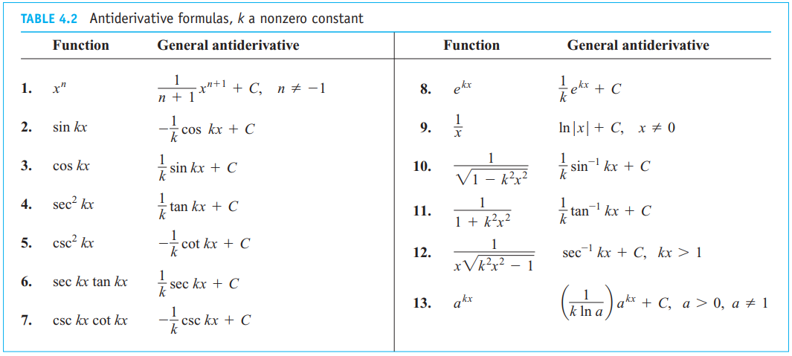
We can also add and subtract antiderivatives and multiply them by constants leading to the following general rules.

## Indefinite Integrals
A special symbol is used to denote the collection of all antiderivatives of a function *f*. After the integral sign the integrand function is always followed by a differential to indicate the variable of integration.

## Area

We can estimate the area _R_ under a function _f_ by using rectangles. The number of intervals (the more the better) and the height of the rectangles determine the accuracy of our estimate. There are three general ways to estimate the area using different heights for the rectangles.

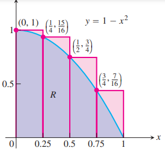
The above illustrates the **upper sum**, this estimate is larger than the true area *A* since the rectangles contain *R*. It is obtained by taking the height of each rectangle as the maximum (uppermost) value of ƒ(x) for a point x in the base interval of the rectangle.

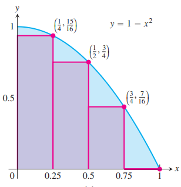
The above illustrates the **lower sum**, this estimate is lower than the true area *A* since the rectangles undershoot *R*. It is obtained by taking the height of each rectangle as the
the value of ƒ(x) at the right endpoint of the subinterval forming its base.

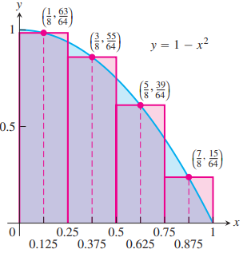
The last and most accurate way of estimating the area is called the **midpoint rule**. The midpoint rule gives an estimate that is between a lower sum and an upper sum, but it is not quite so clear whether it overestimates or underestimates the true area.

The area under the graph of a positive function over an interval can be approximated by finite sums. First we subdivide the interval into subintervals, treating the appropriate function ƒ as if it were constant over each particular subinterval. Then we multiply the width of each subinterval by the value of ƒ at some point within it, and add these products together. If the interval [a, b] is subdivided into _n_ subintervals of equal widths $\Delta x = \frac{(b - a)}{n}$ and if f($c_k$) is the value of ƒ at the chosen point $c_k$ in the kth subinterval, this process gives a finite sum of the form

$f(c_1) \Delta x + f(c_2) \Delta x + f(c_3) Delta x + … + f(c_n) \Delta x$

The choices for the $c_k$ could maximize or minimize the value of ƒ in the kth subinterval, or give some value in between. The true value lies somewhere between the approximations given by upper sums and lower sums. The finite sum approximations we looked at improved as we took more subintervals of thinner width.

## Summations

Sigma notation enables us to write a sum with many terms in the compact form:

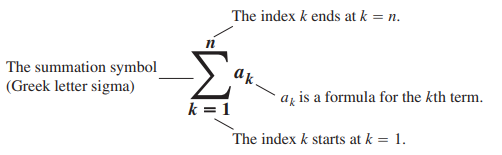

We can also add, subtract and multiply sums, the following rules apply:

Several other formulas related to finite sums have appeared of the years, most notably the Gauss sums which give formulas for sums on integers:
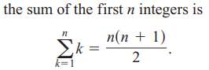

### Rieman sums
We begin with an arbitrary bounded function ƒ defined on a closed interval [a, b]. We subdivide the interval [a, b] into subintervals, not necessarily of equal widths (or lengths), and form sums in the same way as for the finite approximations. To do so, we choose n-1 points $\{x_1, x_2, … x_{n -1}\}$ between a and b and satisfying *$a < x_1 < x_2 < … < x_{n - 1} < b$* To make the notation consistent we denote a by $x_0$and b by $x_n$. This results in a set which is called a partition of [a,b]
$P = {x_0, x_1, ...., x_{n -1}, x_n$
This set is divided into n closed subintervals 
$[X_0, X_1], [X_1, X_2], … ,[X_{n-1}, X_n]$
The **kth subinterval of** P is $[X_{k-1}, X_k]$, for an integer between 1 and n. The width of each interval is denoted with Δcorresponding interval see bellow:

Using this we select a point in each subinterval (point chosen in the kth subinterval is called $c_k$), then on each subinterval we can make a vertical rectangle that stretches from the x-axis to touch the curve at ($c_k, f(c_k)$).

Finally we sum all these products to get:

The sum Sp is called a **Riemann sum for ƒ on the interval [a, b]**. There are many such sums, depending on the partition P we choose, and the choices of the points ck in the subintervals. For instance, we could choose n subintervals all having equal width $\Delta x = \frac{(b - a)}{n$to partition [a,b] and then choose the point $c_k$ to be the right-hand endpoint of each subinterval when forming the Riemann sum. This choice leads to the Riemann sum formula

## Definite integral

The definition of the definite integral is based on the idea that for certain functions, as the norm of the partitions of [a, b] approaches zero, the values of the corresponding Riemann sums approach a limiting value:

In which:

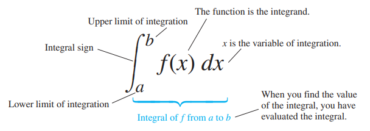

Not all functions are integrable: If a function ƒ is continuous over the interval [a, b], or if ƒ has at most finitely many jump discontinuities there, then the definite integral $\int_{a}^{b} f(x) dx$
exists and ƒ is integrable over [a, b].

Definite integrals have several important properties which should be remembered:
$\int_{b}^{a} f(x) dx = - \int_{a}^{b} f(x) dx$
$\int_{a}^{a} f(x) dx = 0$
Several rules are stratified by definite integrals, that means that when a function f and g are integrable over the interval [a,b], the definite integral satisfies the following rules:

A visualization of the rules:
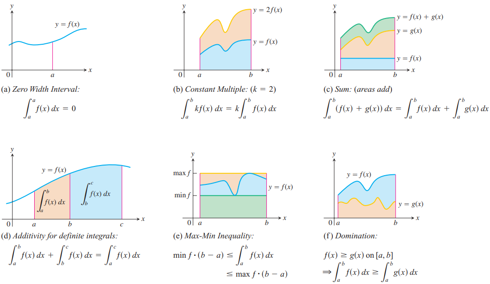

These integrals give the area under a curve, if f(x) is nonnegative and integrable over a closed interval [a,b], then the area under the curve f(x) over [a,b] is the integral of f from a to b,

Integrals are also useful for calculating the average value (also called mean) on a certain interval

## Fundamental theorem of calculus

The above discussed average value is _always_ taken on at least once by the function f in the interval according to the **Mean value theorem for definite integrals**. The function f must be continuous on that interval as well.
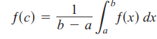

**The Fundamental Theorem of Calculus** states that if f is continuous on [a,b] then

$F(x)= \int_{a}^{x} f(t) dt$ is continuous on [a,b] and differentiable on (a,b) and its derivative is f(x)=
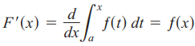
Also if f is continuous at every point in [a,b] and F is any antiderivative of f on [a,b] then
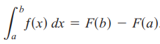
Using this theorem we can see that integration of a function f and then differentiating the result gives f back again, also differentiating F and the integrating gives back F gain.
Example:
The following can easily be calculated using the fundamental theorem of calculus:

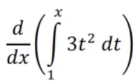
First we set $f(t) = 3t^2$(the function inside the integral)
Then that function is integrated and using the fundamental theorem of calculus we can write it as 
$\frac{d}{dx}(F(x) - F(1)) = F’(x) - F’(1) = f(x) - f(1) = 3x^2 - 3$

This can be done for more complex functions inside the integral as well, using the fundamental theorem of calculus u can save yourself from integrating and differentiating function when it’s not necessary!

Written By: Daniël Lizarazo Fuentes

