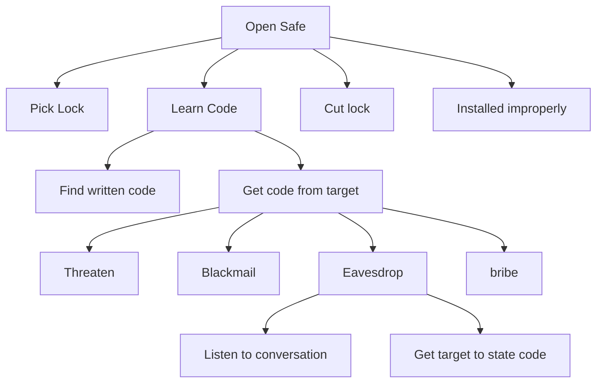

# Security

## Security Properties

There are three security properties that specify
what security aims to protect:
**C**onfidentiality, **I**ntegrity, **A**vailability.

### Confidentiality
::: theorem Confidentiality
The property that information is not made available or disclosed to unauthorized individuals, entities, or processes.
:::

#### Examples:
+ Users should not be able to see the balance of other users.
+ Someone who finds a phone should not be able to see the content.

#### Measures:
+ encryption.
+ authentication.
+ access control.

### Integrity
::: theorem Integrity
The property that data has not been changed,
destroyed, or lost in an unauthorized or accidental manner.
:::

#### Examples:
+ Manipulation of bank records.
+ Manipulation of access logs.
+ Removal of access logs.

#### Measures:
+ Digital signatures.
+ Message Authentication Code.
+ Hash functions.

### Availability
::: theorem Availability
Ability to use the required information or resource.
:::

#### Examples:
+ DDoS: Distributed Denial of Service attacks.
+ Badly designed code

## Terminology:
+ `Threat`: potential violation of security.
+ `Vulnerability`: Security relevant software defect that can be exploited to cause an undesired behavior
    + `Flaw`: defect in design.
    + `Bug`: defect in implementation.
+ `Exploit`: method (software) that allows attacker to use a threat to attack.

## Threat Modeling
approach to identify, quantify and address security risks in an application. Done during the high-level design phase in the waterfall model.

High-level steps for threat modeling:
1. Understanding the application.
2. Identifying and categorizing threats.
    + Entry / Exit points
    + Assets
    + Trust levels
3. Countermeasures and mitigation.

### Categorizing Threats
+ `Spoofing`: posing as someone or something else.
+ `Tampering`: malicious modification of data or code.
+ `Repudiation`: participating in a transaction and later claiming that it never took place.
+ `Information Disclosure`: exposure of private information.
+ `Denial of Service`: render a service unusable.
+ `Privilege Escalation`: gaining increased capabilities.

### Threat / Attack Trees.
To understand threats an attack tree can be made.

An attack tree can be extended with:
+ probabilities.
+ equipment needed.
+ money required.

## Mitigation:
+ Implementation of security features.
+ Prevention of bugs.
+ Detection, audits.
+ Recovery and response.

## Security Design Principles.
+ Favor simplicity.
    + Use fail-safe defaults.
    + Do not expect expert users.
+ Trust with reluctance.
    + employ a small trusted computing base.
    + grant the least privilege possible.
        + promote privacy.
        + compartmentalize.
+ Defend in depth.
+ Monitor and trace.

## Balancing Security:
security must be balanced with:
+ development cost.
+ performance of the application.
+ usability of the application.
+ acceptance by the client/users.

## Authentication
Authentication is proving that you are you.
Authentication can be done with three different factors, or a combination of them.
The factors are:

+ Something the user **knows**:
+ Something the user **has**
+ Something the user **is**

### Something the user knows:
examples of this factor are passwords, pincodes etc.
It is very common and easy.

Cons:
+ domino effect when a database is leaked.
+ Passwords are too simple.
+ Managing passwords is hard.
+ Passwords are easily stolen by phishing or sniffing.

### Something the user has.
Based on having access to a secret.
It has variants based on the type of secret.
+ Shared symetric key
+ Private key of a asymetric key pair.
and based on additional protection:
+ separate device.
+ tamper proof hardware (token).
+ pin/password protected.

example: RSA securID token

### Something the user is:
Based on using unique personal attributes for authentication. (biometrics)

example: iris scan, voice, fingerprint, face scan.

Cons:
+ Intrusive
+ Hard to replace
+ false positives/ false negatives.
+ complex and expensive.