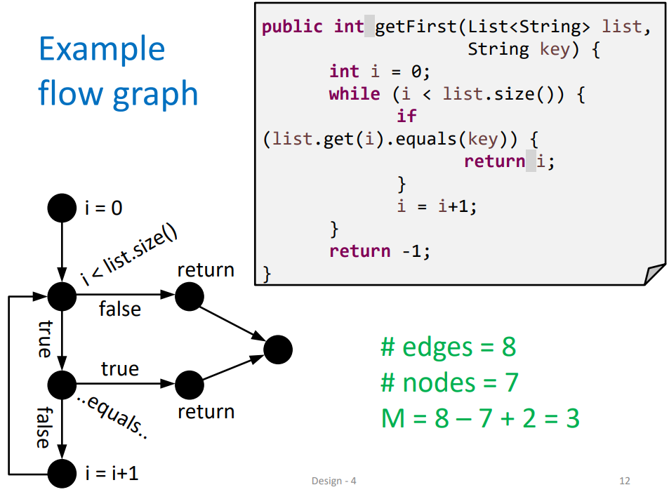
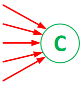
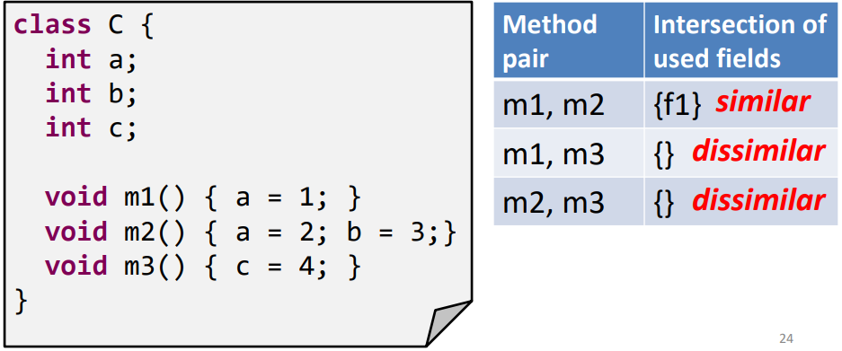
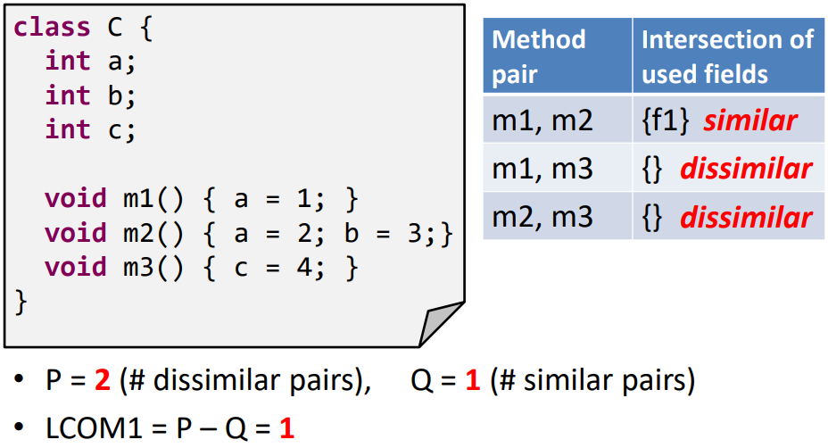

# Maintainable Software and Software Metrics
Did you know that most of a programmers working life is spent doing maintenance? That's why it's important to build maintainable software. We'll look into what makes software unmaintainable. If you follow everything in here you should be able to prevent your systems from turning into legacy systems (systems which are hard to maintain/replace).

## Maintainability
Software maintainability is decided by mutiple factors, the most important one being complexity. But aside from complexity the following things may have an impact on the maintainability of your program:

+ Having Duplicate code (having the same or very similar code in mutiple places)
+ Not refactoring your code can also reduce maintainability as it leads to technical debt (postponing refactoring).
+ Having a class excessively uses methods of another class
+ Splitting a single responsibility among a large number of classes (i.e. Modifications require that you make many small changes to many different classes) 
+ Having one class use attributes and methods of another class that should be private

::: tip
Refactoring: Improving the structure of a system, package or class without changing its functionality
:::

Now let's actually look at the complexity, a measure for how difficult it is to maintain a system. Complexity is expressed through several software metrics.

## Software Metrics
Complexity is measured in multiple ways, mainly:
+ Size and complexity of methods
    + LOC: # Lines Of Code per method (less than 15 is ideal)
    + CC: Cyclomatic Complexity, complexity of control flow (conditionals) within a method
    + WMC: weighted methods per class
+ Coupling and cohesion of classes/packages (instability)
    + CA/CE: coupling between classes (packages)
    + LCOM: Lack Of Cohesion in Methods
+ Other
    + DIT: depth of inheritance tree
    + PAR: # of parameters of a method (constructor also counts as method)

### Size and complexity of methods
#### Cyclomatic Complexity 
The Cyclomatic Complexity of a method is expressed as **M**. To calculate it we first need to visualize the control flows (conditionals, loops). 

::: tip
+ A node/vertex is a circle in the image (start node needed, end node added if necessary)
+ An edge is an arrow
:::

::: tip
Cyclomatic complexity (M) = #edges - #nodes+2 = (#edges - #nodes+1)+1 = #branch nodes + 1
:::

In a connected graph with one start node, one end node and only binary decisions (i.e. decision nodes have 2 outgoing branches), the latter part is used. An example:

If cyclomatic complexity is low then testability and maintainability is improved. Guideline is that Cyclomatic complexity should be 5 or lower.
 

#### Possible execution paths 
When testing it’s important to know how many possible execution paths there are, these are possible ways to go through leading to different outcomes. The amount of possible execution paths is equal to the amount of required rest cases, see illustration below in which each colored line is a different execution path.

#### Weighted methods per class 
The weighted methods (**WMC**) per class describes the overall complexity of all methods in a class.
It does this by summing all CC values of the methods in a class. 
Example: class has 2 methods (doesn’t matter as it’s summed either way) with CC values 5 and 3, then the WMC=8.

### Instability
The instability of a class is an important metric of its complexity. But to calculate it we first need to discuss the coupling between classes.
#### Coupling between classes
To understand instability we’ll take a look at an example. Say there are two classes A and B with their own variables and methods (see image below).

In this case Class A is coupled to class B because Class A is dependent on class B. That holds true because:
+ Methods in A invoke methods declared in B
+ Methods in A access attributes of B
This coupled relationship is different for the classes as the methods/attributes of B are accessed/invoked by A.

::: tip
For B this is called afferent (incoming) coupling.
For A this is called efferent (outgoing) coupling .
:::

**CA: Afferent (incoming) coupling**
Afferent coupling (written as **CA**) of a class C = the number of classes that call methods (and/or access attributes) of C.
Or: the number of classes that depend on C. In a visualisation

**CE: Efferent (outgoing) coupling**
Efferent coupling (written as **CE**) of a class C = the number of classes with methods that are called by C (or have attributes accessed by C).
Or: the number of classes on which C is dependent. In a visualisation: 

With this information we can calculate the instability (**I**):

::: tip
I=CE/(CA+CE) 

With:
+ CA = # classes outside this package that depend on classes within this package.
+ CE = # classes inside this package that depend on classes outside this package.
:::

**Fan-in of a class**
Not only the classes are coupled but the methods are coupled as well.
::: tip
+ Fan in of a method: #classes calling this method
+ Fan in of a class: sum of the fan-in of its methods.
:::

#### Lack of Cohesion in Methods
To discuss the lack of cohesion (**LCOM**) we first look at how cohesion is defined. Cohesion in a class is related to how similar it’s methods are. Methods are *similar* when they access common fields. 

::: tip
High cohesion in a class:
    + Different methods access the same class variables
Low cohesion in a class:
    + Different class variables each have their own set of methods that access them
:::

An example:

##### LCOM1
LCOM is equal to the surplus of dissimilar pairs. There are two ways LCOM can be calculated, LCOM1 and LCOM2. Let’s quickly look at LCOM1:
P = number of dissimilar methods pairs
Q = number of similar method pairs
So that:

::: tip
+ LCOM1=P-Q (if P>Q).
+ LCOM1 = 0 (if P<=Q)
:::

Example:

So to improve the LCOM on the basis of LCOM1 the result would be:

##### LCOM2 (used by Eclipse)
The other method, LCOM2 is calculated differently, so we take a different approach. Let a class have:
+ a attributes A1…Aa
+ m methods M1…Mm (only methods which access attributes, others don’t count)
+ mAk = # methods that access Ak
+ avg(mA) = average mAk for k=1…a = <insert latex stuff>
 
::: tip
So LCOM2=(m-avg(mA))/(m-1)
:::

Examples:

Other metrics that can be looked at are the Depth of Inheritance Tree (DIT) and Number of Parameters of a Method (PAR).

Written By: Daniël Lizarazo Fuentes
