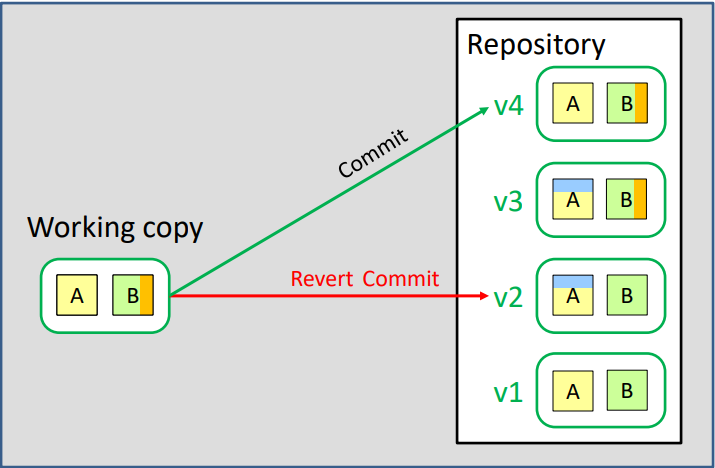

# Version Control
### Why was version control created?
Version control was created to make it possible to orderly store multiple versions of your (and your friends) files, resulting in the abilities to roll back history, combining files and storing files safely.

### What types of version control are there and how do they work?
#### Local version control
This method stores versions of your files in a **repository** (folder), while the latest version of the version you’re currently working on (**working copy**) is separately stored on your computer.


#### Central version control
There’s a central server which contains the repository, it communicates with multiple other computers which all have their own working copies (they do share the same repository). 


#### Distributed version control
Just like in central version control this method also has a central server containing a central repository. But this same repository is also copied onto the local computers, meaning everyone is continually **cloning** (copying) this central repository to their computers. The local computers still have a working copy which can be stored (**committed**) to the local repository which in turn can be saved to the central repository. An example of distributed version control is git.


### Tools of git
#### Roll back
With version control it's easy to undo earlier changes without affecting other changes. When a commit (save to repository) is reverted, a new version without the reverted change but still containing all the other changes will be the working copy. The working copy can then be committed to the repository.



#### Push and pull
To save the local repository to the central repository we use ```git push```. To save the central repository to the local repository we use ```git pull```. This process ensures that the copies of a repository are synchronized.


When u and your friend make changes in the same part of the same file a push and pull conflict could arise. Git can’t combine the changes in the same part, so the changes have to be manually corrected by first pulling the others changes and pushing the combined version. 


#### Branching
Branching means you diverge from the main line of development and continue to do work without messing with the main line. This separate line of development can be combined (**merged**) with the other lines of development. The working copy on a local computer can easily switch between branches. The main branch is normally called master.


#### Staging
Stage and Commit: A commit in git is performed in two steps: staging and actual commit. **Staging** informs the repository about the existence of a file that is to be committed. Committing is saving the changes in the working copy to the local repository.

### Gitflow conventions
::: tip
+ Master branch contains releases.
+ Hotfix branch contains urgent changes.
+ Release branch contains a release for testing
+ Develop branch is always the latest version.
+ Feature branch contains unfinished features.
:::

Conventions are that releases are kept on main (testing of releases is done on release), Hotfixes are sprung off from master and merged where necessary. New parts of releases are worked on in the develop branch while new features for the develop branch are done in their own separate branches.


