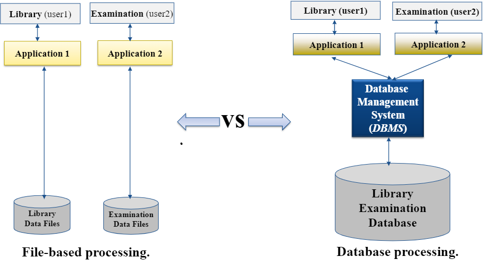

#Database introduction and design
## File-based system and Database system
In a system we store data to get information out of it, we define it as:
::: tip Data vs Information
Data:
No contextual meaning (just number and text)
Individual unit of information
Raw facts of things

Information
Data with exact meaning
Processed data and organized text
Is knowledge about a particular subject
:::
Data can be stored in a file, a file is an object on a computer that stores data or a resource on the computer for recording data.

We can store data and display information in two main ways:
File-Based System
Database System

### File-Based System
In a **File-Based System** data is stored in files which each has its specific format. It has several programmes which also define and manage their own data. 

::: theorem File-Based System
A collection of application programs that perform services for the end users (such as production or sales)
:::

Problems with this traditional approach for storing data are:
::: warning Limitations
+Data redundancy: is the repetition or superfluity of data
+Data inconsistency: matching of data must be done between files (data could be changed in one place but not updated in the other place)
+ Program data dependency: the close relationship between data stored in files and the software programs that update and maintain those files
+ Lack of flexibility/fixed queries
+ Poor data security: the data stored in the flat files can be easily accessible
+ Limited data sharing
:::

### Database System
Instead of a file based system a database system could be used. It serves many applications by centralizing data and controlling redundant data.
::: theorem Database System
+Organized collection of related data (dataset is centralized in database)
+Shared collection of related data
+Models a particular real-world system in the computer in the form of data.
+A collection of data arranged for ease and speed of search and retrieval.

:::

A database environment consists of 4 main components:
+Hardware
+Data
+Users
+Software

#### Hardware
A database server runs on a computer, just like it’s clients so it has processors, hard disks etc.
#### Data
A database environment contains two types of data:
::: tip 
+ Operational data
+ System catalog (contains the information about the database objects)
::: 
Operational data is for example data on an employee like name and salary. 
The system catalog stores:
+ Names, types, and sizes of data items;
+ Names of relationships;
+ Integrity constraints on the data;
+ Names of authorized users who have access to the data;
+ External, conceptual, and internal schemas and the mappings between the schemas

#### Users
::: theorem Users
+ Database Administrator (DBA): Designs & manages the database system
+ Database Designer user: writes the database software itself
+Application developer: writes software to allow end users to interface with the database system
+ End user: uses the database system to achieve some goal
:::
#### Software
::: theorem Software
+ management system (DBMS): MySQL, Oracle etc.
+ Operations system
+ Application programs: computer program that a user can interact with the database (java, c++ C# etc.)
:::
## DataBase Management System (DBMS)
A DBMS is a software system that enables users to define, create, maintain, and control access to the database. It consists of software that organizes the storage of data and Interfaces between applications and physical data files. 

A DBMS is divided into multiple Database Management System Facilities.
+ Data definition language (DDL).
+ Data manipulation language (DML).
+ Data control language (DCL).

DBMS has multiple advantages like:
+ data consistency
+ sharing of data
+ improved data integrity
+ improved security

Disadvantages:
+ Complexity
+ Size
+ Cost of DBMS
+ Cost of conversion
+ Performance
+ Greater impact of a failure
