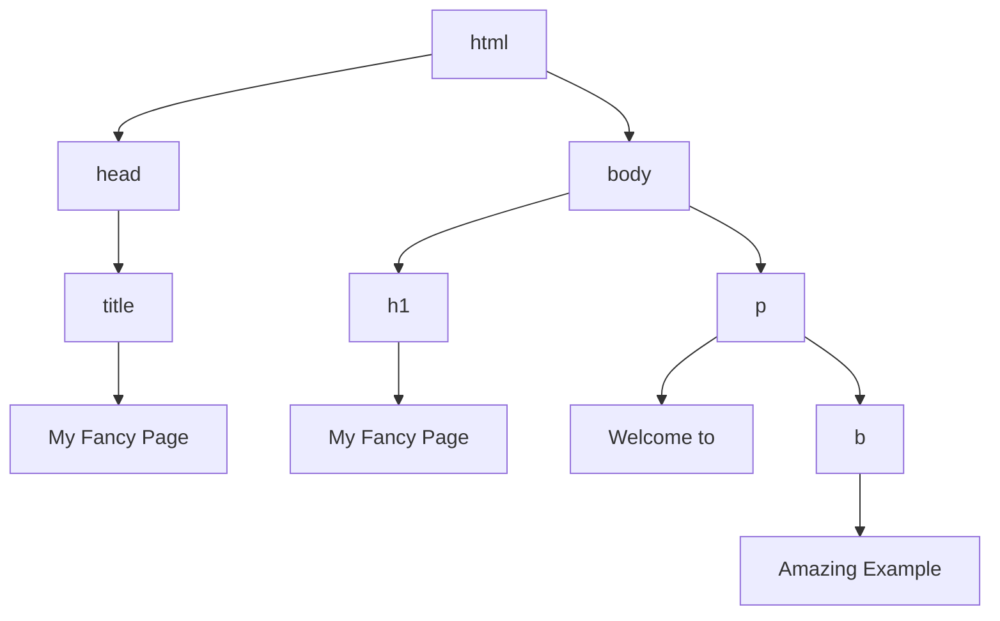

# Lecture 2

The first part of the lecture is concerning
REST APIs and is summarized [here](./REST)

## Frontend Technologies <Badge text="html"/> <Badge text="css"/> <Badge text="javascript"/> 

::: theorem HTML
HTML (HyperText Markup Language): standard markup language for documents designed to be displayed in a web browser.

used to structure and give meaning to our web content, for example defining paragraphs, headings, and data tables, or embedding images and videos in the page.
:::

::: theorem CSS
CSS (Cascading Style Sheets): language that describes how markdown pages like HTML should be displayed in a web browser.

Language of style rules that we use to apply styling to our HTML content, for example setting background colors and fonts, and laying out our content in multiple columns.
:::

::: theorem JavaScript
a scripting language that enables you to create dynamically updating content, control multimedia, animate images, and make http requests...
:::

## Document Object Model
::: theorem DOM
The Document Object Model (DOM) is a programming interface for HTML and XML documents. It represents the page so that programs can change the document structure, style, and content. The DOM represents the document as nodes and objects. That way, programming languages can connect to the page.
:::

When a browser retrieves an HTML page it builds a model of a page structure.

**Example:**

Given the browser receives this html document:
```html
<!doctype html>
<html>
    <head>
        <title>My Fancy Page</title>
    </head>
    <body>
        <h1>My Fancy Page</h1>
        <p>Welcome to
        <b>Amazing Example</b>
        </p>
    </body>
</html>
```

The browser will generate this Document Object Model.


### DOM Elements

Each html element in the page is an object.
Using javascript you can read data or make changes to the html element. Document elements are `nodes` which can have `child nodes`.

In javascript the dom can be accessed via the `document` object.

#### Examples

##### Selecting and printing elements
```javascript
// print link of first anchor tag:
let link = document.body.getElementsByTagName("a")[0];
console.log(link.href);
```

```javascript
// we select all <p> tags:
const paragraphs = document.querySelectorAll("p");
// paragraphs[0] is the first <p> element
// paragraphs[1] is the second <p> element, etc.

// this makes an alert with the content of the first paragraph in the dom.
alert(paragraphs[0].innerHTML);

/*
More complex queries are possible with
querySelectorAll and it's counterpart querySelector which only selects one element.
For example "p.myClass" will only select paragraph tags with the class myClass
*/
```

##### Searching the DOM
```javascript
/*
This function goes through a provided node (html element) and searches through it's contents to find if it has a reference to a provided string
*/
function talksAbout(node, string) {
    if (node.nodeType == document.ELEMENT_NODE) {
        for (let i = 0; i < node.childNodes.length; i++) {
            if (talksAbout(node.childNodes[i]), string) {
                return true;
            }
        }

        return false;
    }

    if (node.nodeType == document.TEXT_NODE) {
        return node.nodeValue.indexOf(string) > -1;
    }
}
```

##### Changing the DOM
This function creates a new H1 element, adds text to that element, and then adds the H1 to the tree for this document:
```html
<html>
  <head>
    <script>
       // run this function when the document is loaded
       window.onload = function() {

         // create a couple of elements in an otherwise empty HTML page
         const heading = document.createElement("h1");
         const heading_text = document.createTextNode("Big Head!");
         heading.appendChild(heading_text);
         document.body.appendChild(heading);
      }
    </script>
  </head>
  <body>
  </body>
</html>
```

## Event Handlers
Event handlers can react to user input (keyboard and mouse actions) and can be registered for different objects.

Example:
```html
<button>Click Me</button>

<script>
let button = document.querySelector("button");
button.addEventListener("click", () => {
    alert("Button clicked.");
})
</script>


/*
() => {} this syntax is the same as:

function() {

}
*/
```

## Restful Service Calls with javascript

### Making Calls to RESTful methods

1. create an `XMLHttpRequest()` object
2. register a function.
3. issue the command.

```html
<button onclick="myFunction()">Click me</button>
<p id="result"></p>

<script>
    function myFunction() {
        let result = document.getElementById("result");
        var xhr = new XMLHttpRequest();
        xhr.onreadystatechange = function() {
            if (this.readyState == 4 && this.status == 200) {
                result.innerHTML = "The server returned: " + this.responseText;
            }
        }

        xhr.open("GET", "http://httpbin.org/get", true);
        xhr.send();
    }
</script>
```

### XML HTTP Request Object States

| Value | State | Description |
| ----- | ----- | ----------- |
| 0     | UNSENT | Client has been created.open()not called yet. |
| 1     | OPENED | open()has been called |
| 2     | HEADERS_RECEIVED | send()has been called, and headers and status are available. |
| 3     | LOADING | Downloading;responseText holds partial data. |
| 4     | DONE | Operation is complete |


## Complete Example:

First let's write the HTML for the
JSON API test:
```html
<html>
    <title>Simple script to test JSON<title>
    <body>
        <p>JSON message was:</p>
        <p id="raw"></p>

        <p>Parsed values:</p>
        <table>
        <tr>
            <th>ID</th>
            <th>Title</th>
            <th>Body</th>
            <th>User ID</th>
        </tr>
        <tr>
            <td id="id"><i>0</i></td>
            <td id="title"><i>null</i></td>
            <td id="body"><i>null</i></td>
            <td id="userId"><i>null</i></td>
        </tr>
        </table>

        <button onclick="theFunction()">GET DATA</button>
    </body>
</html>
```

**Result of the Code:**

Note that that the function has not been defined, and if you click the button. you will see an error message in the console...

::: theorem RESULT
<p>JSON message was:</p>

<p>Parsed values:</p>
<table>
<tr>
    <th>ID</th>
    <th>Title</th>
    <th>Body</th>
    <th>User ID</th>
</tr>
<tr>
    <td><i>0</i></td>
    <td><i>null</i></td>
    <td><i>null</i></td>
    <td><i>null</i></td>
</tr>
</table>

<button onclick="theFunction()">GET DATA</button>
:::

Now let's add the javascript to actually
make the API call and obtain the json.

```javascript
function myFunction() {
    var xmlHttp = new XMLHttpRequest();
    xmlHttp.onreadystatechange = function () {
        if (this.readyState == 4 && this.status == 200) {
            console.log("Call returned");
            var response = this.responseText;
            document.getElementById("raw").innerHTML = response;

            var myObj = JSON.parse(response);
            document.getElementById("id").innerHTML = myObj.id;
            document.getElementById("contents").innerHTML = myOBj.contents;
            document.getElementById("created").innerHTML = myObj.created;
            document.getElementById("author").innerHTML = myObj.author;
        } else {
            console.log(this.status);
            console.log(this.statusText);
        }
    }
    xmlHttp.open("GET", "https://pastebin.com/raw/AHmG2k69", true)
}
```

::: theorem RESULT
<p>JSON message was:</p>

<div class="language- extra-class" style="color:#fff;">
<pre id="raw">

</pre>
</div>

<p>Parsed values:</p>
<table>
<tr>
    <th>ID</th>
    <th>Title</th>
    <th>Body</th>
    <th>User ID</th>
</tr>
<tr>
    <td id="id"><i>0</i></td>
    <td id="title"><i>null</i></td>
    <td id="body"><i>null</i></td>
    <td id="userId"><i>null</i></td>
</tr>
</table>

<button v-on:click="test">GET DATA</button>
:::

<script>
export default {
  data () {
      return {
      }
  },
  methods: {
    test: function () {
        var xmlHttp = new XMLHttpRequest();
        xmlHttp.onreadystatechange = function () {
            if (this.readyState == 4 && this.status == 200) {
                console.log("Call returned");
                var response = this.responseText;
                document.getElementById("raw").innerHTML = response;
                var myObj = JSON.parse(response);
                document.getElementById("id").innerHTML = myObj.id;
                document.getElementById("title").innerHTML = myObj.title;
                document.getElementById("body").innerHTML = myObj.body;
                document.getElementById("userId").innerHTML = myObj.userId;
            }
        }

        xmlHttp.open("GET", "https://jsonplaceholder.typicode.com/posts/1", true);
        xmlHttp.send();
    }
  }
}
</script>