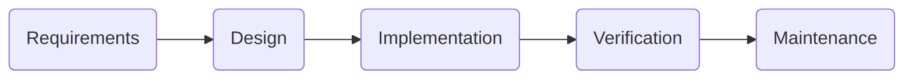
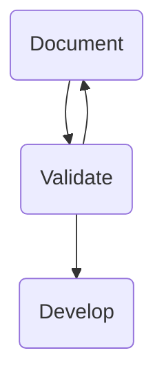

# Lecture 1

## Waterfall Model
The waterfall model is an approach to the process
of a software project, it can be broken down into the following sequential steps:

The waterfall model is characterized by being:
+ Very structured (sequential)
+ Emphasis is placed on the documentation in every software development step.

::: tip Advantages
+ Requirements are known before starting the design.
+ The design of the whole system is known before building the components.
+ There are reviews at the end of each phase to enhance customer involvement.
+ Extensive Documentation. (may be an advantage)
:::

::: danger Disadvantages
+ Requirements must be clear and consistent.
+ Prone to delays.
+ Too much documentation.
+ Hard to estimate the progress in the project.+ Milestones based on documentation
+ Large efforts on integration and testing at the end.
+ We can’t demonstrate system features until the end.
+ Unfriendly to changes in the requirements.
+ Unfriendly to customer involvement.
:::

## Agile
Agile is a Philosophy or Paradigm of software development.
Various Models fall under agile:
+ RAD
+ UP
+ SCRUM
+ XP

Agile has sprints of fixed durations. At the end of each sprint a new version of the product can be deployed.

### Values
The values of agile software development are:
+ Individuals and interactions over processes and tools. :man: > :wrench:
+ Working software over comprehensive documentation. :minidisc: > :blue_book:
+ Customer collaboration over contract negotiation. :arrows_clockwise: > :page_with_curl:
+ Responding to change over following a plan. :loop: > :arrow_right:

### Principles
The principles of agile software development are:
+ Customer satisfaction by early and continuous delivery of valuable software.
+ Welcome changing requirements, even in late development.
+ Deliver working software frequently (weeks rather than months)
+ Close, daily cooperation between business people and developers
+ Face-to-face conversation is the best form of communication (co-location)
+ Working software is the primary measure of progress

## Requirements Engineering

### Requirements Analysis
Difficult Because:
+ It is not clear what the system should do, or what the stakeholders want.
+ It is not clear what technical challenges will come up and how to address these.
+ It is difficult for the developer to understand the customer if they do not share *domain knowledge*.

::: warning
Impossible to do correctly if essential stakeholders are not involved.
:::

### The Inquiry Cycle

### Agile Requirements

Between `Sprint n-1` and `Sprint n` requirements are reconsidered.

1. Evaluate the current version.
2. Requirement discovery activity.
3. Adapt and re-prioritize requirements.
4. Freeze Requirements for next sprint.

### Levels of Requirements
+ Goal Level
    + Example: "The system shall allow the hotel to handle an increase of 15 % in bookings without adding staff"
+ Business Level
    + Example: "The system will support the receptionist to prepare for the arrival of a tourist bus"
+ System Level
    + Example: "The system shall be able to record that a room is occupied for repair in a specific period"
+ Design Level:
    + "The system shall implement the information model defined by the class diagram in appendix X"

### Types of Requirements

+ Constraints
    + Example: budget, due date, etc...
+ Functional Requirements
    + Typically user stories.
+ Quality Requirements

### User Stories

::: tip User Story Syntax
+ As a `role` I want `goal|desire`
+ As a `role` I want `goal|desire`, so that `benefit`
:::

Example:

As a customer I want to buy a theatre ticket online with my credit card.

#### Components of a user story:
+ A short piece of text describing and representing the user story.
+ Conversations between stakeholders to exchange perspectives on the user story.
+ Acceptance criteria.

#### User Stories vs. Use Cases:
They describe roughly the same thing: an end user interacting with
the system. Use cases are higher level, because user stories can be decomposed.

+ Use Case is UML
+ User Story is Agile
+ Purposes:
    + Use case: give high level overview of system functionalities.
    + User story: describe a specific interaction from the perspective of a user.

#### Decomposing user stories:
A way to get user stories is to start with a high level story
and decompose it:

For example Starting with:
+ As a customer I want to buy a theatre ticket online with my credit card.
Can be refined or decomposed a more detailed user stories:
+ As a customer I want to log in to the theatre system.
+ As a customer I want to select places for a performance.
+ As a customer I want to buy selected tickets with my credit card.  

#### Acceptance Criteria
+ Acceptance criteria are formulated as tests, specifying
cases the function should allow or not allow.
+ It is **Not** a list of tests describing whether the implementation was done correctly.

Example:
+ As a customer I want to buy the tickets with my credit card:
    + Test with valid visa card `(pass)` meets criteria
    + Test with expired visa card `(fail)` because expired
    + Test with ING bank pass `(fail)` because not a credit card

#### User Story Examples
Good:
+ As a cashier I want to sell a set of tickets at the box office
+ As administrative staff, I want to process an order form for theatre tickets
+ As a cashier I want to print a duplicate ticket, so that customers who forgot to bring their tickets still can visit the performance 

Bad:
+ As a theatre director I want the administrative staff to process order forms for theatre tickets
+ As a cashier, I want the printing of duplicate tickets to be simple and self-explanatory
+ As a customer I want to pay with my credit card only if it is a real credit card (nota bank pass) and it has not expired

#### User Stories Evaluation
INVEST is an acronym for a set of guidelines to follow to
create good user stories:
+ **Independent**: the stories can be developed in any order.
+ **Negotiable**: the details can be negotiated between the team and user or client.
+ **Valuable**: the story should provide value to the "user" in the user story. If the story does not have discernable value it should not be done.
+ **Estimable**: The time needed to implement should be roughly estimable.
+ **Small**: The story should be small enough to be implemented in one sprint.
+ **Testable**: the development team should be able to write acceptance criteria which can be used to determine when the story is "done".

### Scenarios, Personas
Useful tools when the focus is on requirements discovery, rather than requirements specification.

::: theorem Persona
an imaginary person (could be based on real people) who is a prototypical user of the system to be designed.
:::

Persona example:
::: tip Jessica Brown
+ age 26
+ Born in Guatemala, lives in Groningen
+ No Partner, No kids
+ Marketing manager at LifeRips
+ Speaks English, Spanish, Dutch
+ Likes travelling
:::

::: theorem DILO
*Day-in-the-life-of*
A DILO scenario shows how the use of the system is incorporated
in a persona's daily activities.
:::

### Requirements discovery techniques:
+ Brainstorming
+ Interview
+ Workshop
+ Focus Group
+ Documents
+ Observation
+ Studying similar companies or products
+ Prototyping