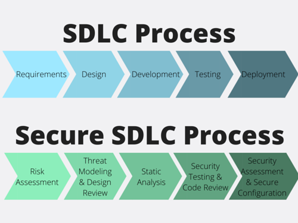

# Lecture 2

## Quality Requirements

::: theorem Non-Functional Requirements
Non-functional requirements define the overall
qualities or attributes of a system.

non-functional requirements are the criteria for evaluating *how* a software system should perform rather than *what* it should do. An example would be a requirement for a web API endpoint response time to be under 200ms.
:::

### Ambiguity

There is no clear distinction between functional and non-functional requirements.

**Example:**

+ Formulated as quality requirement: The system shall ensure that data is protected from unauthorized access.*

+ Formulated as functional requirement: As a registered user, I want to log in with my username and password so I that the system can authenticate me and I can trust it.

Consider the usability of Non functional requirements.

It is hard to specify testable requirements.

## Soft Goals

If a particular quality is important
but you do not know how to define it:
writing an untestable requirement is better that writing no requirement or guessing specific values.

These are called *soft goals*.
At some point in the future these should be made into *hard goals* (testable requirement).

## Quality Characteristics

Quality characteristics can be a trade off of another characteristic.
Examples:
+ usablity vs. security
+ reliablility vs. performance efficiency
+ cost vs. most other qualityies.

There are various standards for quality characteristics. 

### *ISO 25010* Standard

The ISO 25010 standard is made out of 8
quality characteristics, which are themselves composed out of sub-characteristics:

**System Qualities:**

| Functional Suitability | Performance Efficiency | Compatibility | Usability | Reliablility | Security | Maintainability | Portability |
| ---- | ---- | ---- | ---- | ---- | ---- | ---- | ---- |
| Functional Completeness | Time Behavior | Co Existence | Appropriateness Recognizability | Maturity | Confidentiality | Modularity | Adaptability |
| Functional Correctness | Resource Utilization | Interoperability | Learnability | Availability | Integrity | Reusability | Installability |
| Functional Appropriatness | Capacity | | Operability | Fault Tolerance | Non-repudiation | Analysability | Replaceablity |
| | | | User Error Protection | Recoverability | Authenticity | Modifiability | |
| | | | User Interface Aesthetics | | Accountability | Testability | |
| | | | Accessibility | | | | |

**Qualities from user's perspective:**

| Effectivness | Efficiency | Freedom from risk | Satisfaction | Context Coverage |
| ---- | ---- | ---- | ---- | ---- |
| | | Economic risk mitigation | Usefulness | Context Completeness |
| | | Health and safety risk mitigation | Trust | Flexibility |
| | | Environmental risk mitigation | Pleasure | |
| | | | Comfort | |

The *system quality* vs the *quality in use* (from a user's perspective) focus on different characteristics, but there can be an overlap.

This can be compared to system-level vs. business-level (functional) requirements.

### System Quality: Detailed

#### Functional Suitability

This characteristic represents the degree to which a product or system provides functions that meet stated and implied needs when used under specified conditions.

sub-characteristics:

+ **Functional Completeness**: Degree to which the set of functions covers all the specified tasks and user objectives.
+ **Functional Correctness**: Degree to which a product or system provides the correct results with the needed degree of precision.
+ **Functional Appropriateness:** Degree to which the functions facilitate the accomplishment of specified tasks and objectives.

#### Performance Efficiency

This characteristic represents the performance relative to the amount of resources used under stated conditions.

sub-characteristics:

+ **Time behaviour** - Degree to which the response and processing times and throughput rates of a product or system, when performing its functions, meet requirements.
+ **Resource utilization** - Degree to which the amounts and types of resources used by a product or system, when performing its functions, meet requirements.
+ **Capacity** - Degree to which the maximum limits of a product or system parameter meet requirements.

#### Compatibility

Degree to which a product, system or component can exchange information with other products, systems or components, and/or perform its required functions while sharing the same hardware or software environment. 

sub-characteristics:

+ **Co-existence**: Degree to which a product can perform its required functions efficiently while sharing a common environment and resources with other products, without detrimental impact on any other product.
+ **Interoperability**: Degree to which two or more systems, products or components can exchange information and use the information that has been exchanged.

#### Usability

Degree to which a product or system can be used by specified users to achieve specified goals with effectiveness, efficiency and satisfaction in a specified context of use.

sub-characteristics:

+ **Appropriateness recognizability**: Degree to which users can recognize whether a product or system is appropriate for their needs.
+ **Learnability**: Degree to which a product or system can be used by specified users to achieve specified goals of learning to use the product or system with effectiveness, efficiency, freedom from risk and satisfaction in a specified context of use.
+ **Operability**: Degree to which a product or system has attributes that make it easy to operate and control.
+ **User error protection**: Degree to which a system protects users against making errors.
+ **User interface aesthetics**: Degree to which a user interface enables pleasing and satisfying interaction for the user.
+ **Accessibility**: Degree to which a product or system can be used by people with the widest range of characteristics and capabilities to achieve a specified goal in a specified context of use.

#### Reliability

Degree to which a system, product or component performs specified functions under specified conditions for a specified period of time.

sub-characteristics:

+ **Maturity**: Degree to which a system, product or component meets needs for reliability under normal operation.
+ **Availability**: Degree to which a system, product or component is operational and accessible when required for use.
**Fault tolerance**: Degree to which a system, product or component operates as intended despite the presence of hardware or software faults.
+ **Recoverability**: Degree to which, in the event of an interruption or a failure, a product or system can recover the data directly affected and re-establish the desired state of the system.

#### Security

Degree to which a product or system protects information and data so that persons or other products or systems have the degree of data access appropriate to their types and levels of authorization.

sub-characteristics:

+ **Confidentiality**: Degree to which a product or system ensures that data are accessible only to those authorized to have access.
+ **Integrity**: Degree to which a system, product or component prevents unauthorized access to, or modification of, computer programs or data.
+ **Non-repudiation**: Degree to which actions or events can be proven to have taken place so that the events or actions cannot be repudiated later.
+ **Accountability**: Degree to which the actions of an entity can be traced uniquely to the entity.
+ **Authenticity**: Degree to which the identity of a subject or resource can be proved to be the one claimed.

::: tip development process
Security is a quality requirement that governs
not only your software architecture but your whole software development model.

:::

#### Maintainability

This characteristic represents the degree of effectiveness and efficiency with which a product or system can be modified to improve it, correct it or adapt it to changes in environment, and in requirements.

sub-characteristics:

+ **Modularity**: Degree to which a system or computer program is composed of discrete components such that a change to one component has minimal impact on other components.
+ **Reusability**: Degree to which an asset can be used in more than one system, or in building other assets.
+ **Analysability**: Degree of effectiveness and efficiency with which it is possible to assess the impact on a product or system of an intended change to one or more of its parts, or to diagnose a product for deficiencies or causes of failures, or to identify parts to be modified.
+ **Modifiability**: Degree to which a product or system can be effectively and efficiently modified without introducing defects or degrading existing product quality.
+ **Testability**: Degree of effectiveness and efficiency with which test criteria can be established for a system, product or component and tests can be performed to determine whether those criteria have been met.

#### Portability

Degree of effectiveness and efficiency with which a system, product or component can be transferred from one hardware, software or other operational or usage environment to another.

sub-characteristics:

+ **Adaptability**: Degree to which a product or system can effectively and efficiently be adapted for different or evolving hardware, software or other operational or usage environments.
+ **Installability**: Degree of effectiveness and efficiency with which a product or system can be successfully installed and/or uninstalled in a specified environment.
+ **Replaceability**: Degree to which a product can replace another specified software product for the same purpose in the same environment.

## Details on using quality requirements

+ Quality requirements are to be taken into account prior to the "Architectural Design" phase.

+ Depending on the context some Non-Functional Requirements are more relevant than others, you need to prioritize them.

::: tip agile context
+ Discuss what the most important qualities are.
+ Define quality requirements where meaningful.
+ Don't over-specify the quality requirements.
:::