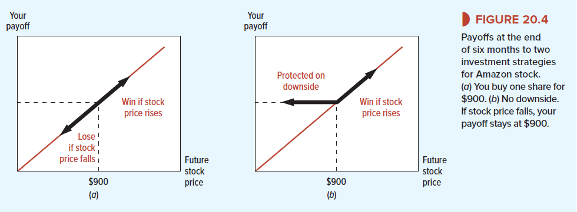
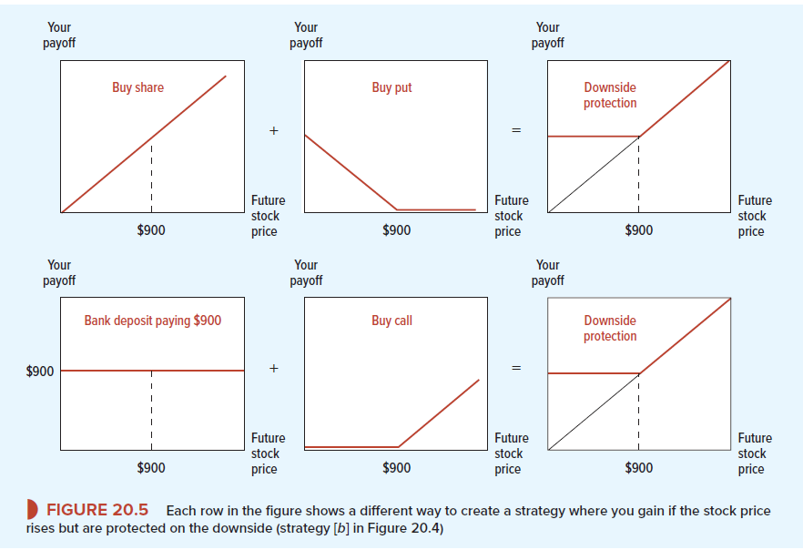

# 20-2 Financial-Alchemy with Options
Options can be a really powerful financial instrument if you know how to use them.  Let's take a look at an example:

You can see that if Amazon’s stock price rises above $900, your put option is valueless, so you simply receive the gains from your investment in the share. However, if the stock price falls below $900, you can exercise your put option and sell your stock  for $900. Thus, by adding a put option to your investment in the stock, you have protected
yourself against loss. Of course, there is no gain without pain. The cost of insuring yourself against loss is the amount that you pay for a put option on Amazon stock with an exercise price of $900. In April 2017, the price of this put was $59.55. This was the going rate for financial alchemists.

The same result can be achieved with call options. Imagine this situation: 
You put in the bank 900$ and then you buy the call option Notice that if the price of Amazon stock falls, your call is worthless, but you still have your $900 in the bank. For every dollar that Amazon stock price rises above $900, your investment in the call option pays off an extra dollar. For example, if the stock price rises to $980, you will have $900 in the bank and a call worth $80. Thus you participate fully in any rise in the price of the stock, while being fully protected against any fall.

These two rows of Figure 20.5 tell us something about the relationship between a call option and a put option. Here we are going to introduce a new term: put–call parity. In short it means that regardless future stock price both strategies should provide similar payoff.

Value of call + present value of exercise price = value of put + share price

We can also put it another way around: buy put is identical to -> buy call, invest present value of exercise price in safe asset, sell share.

If two investments offer identical payoffs, then they should sell for the same price today. If the law of one price is violated, you have a potential arbitrage opportunity. So let’s check whether there are any arbitrage profits to be made from our Amazon calls and puts. In April 2017, the price of a six-month call with a $900 exercise price was $64.30, the interest rate was about .5% for 6 months, and the price of Amazon stock was $900. Therefore the cost of a homemade put was: 

:::tip
Buy call + present value of exercise price − share price = cost of homemade put

            64.30    +    900/1.005    −   900 =     $59.82
:::
            