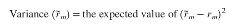
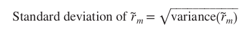

# 7-2 Diversification and Portfolio Risk
Discount rate for safe projects are known, rate for average-risk projects is known. But you **don't** know how to estimate discount rates for assets that do not fit these simple cases. You will need to learn:
1. How to measure risk
2. The relationship between risks borne and risk premiums demanded.

## 🎲 Variance and Standard Deviation

+ ~Rm = actual return
+ Rm = expected return
+ $σ^2$ = variance

+ $σ$ = standard deviation

:::theorem EXAMPLE
Game:
+ invest 100$
+ two coins are flipped:
    + head -> starting balance + 20%
    + tails -> starting balance - 10%
    + equally likely outcomes:
        + head + head : gain 40%
        + head + tail : gain 10%
        + tail + head : gain 10%
        + tail + tail : lose 20%
+ expected return = (.25 x 40) + (0.50 x 10) + (.25 x -20) = 10%
+ variance = 450
+ standard deviation = 21 -> so the game's variability is 21%
:::

These measures are natural indexes of risk. Because if the coin-tossing game had a certain outcome. Then the standard deviation (variability) would have been 0. The actual variability is > 0 because we don't know what will happen.

## 📏 Measuring Variability
You could describe the variability of any portfolio of stocks or bonds by the procedure described above. But the probabilities for each outcome do not just fall out of the sky. You can start by observing past variability.

:::tip Portfolio based on past numbers
+ Treasury bills        $σ$ = 2.9   $σ^2$ = 8.1
+ Government bonds      $σ$ = 9.0   $σ^2$ = 80.6
+ Common stocks         $σ$ = 19.7  $σ^2$ = 388.7
:::

## How Diversification Reduces Risk
You can also calculate measures of variability for individual securities and portfolios of securities. However, the level of variability over the last 100 years is less interesting for specific companies than for the stock market portfolio.

A portfolio consisting of individual stocks with a high standard deviation does not reflect the average variability of the complete portfolio. This is because **diversification reduces variability**.

:::tip Practical example
Selling umbrellas will make you a fortune when it rains, but close to nothing when there is a heat wave. Selling ice cream will do you big business in the case of a heat wave, but business will not be booming when the weather is poor. When you invest in both an umbrella shop and an ice cream shop, you diversify your business. This way you will make an average profit raining or shining.
:::

Even **little** diversification can provide **substantial** reduction in variability.