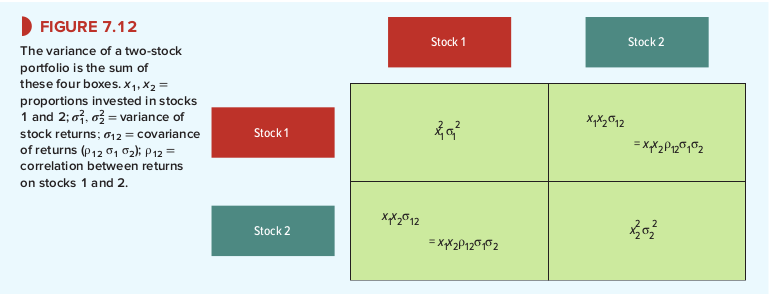

# 7-3 Calculating Portfolio Risk
:::tip portfolio risk <-> risk individual shares
to fully understand the effect of diversification you need to know how the risk of portfolio depends on the risk of the individual shares
:::

The expected return of your portfolio is a weighted average of the expected returns on the individual stocks.

:::theorem Expected portfolio return
+ 60% of portfolio -> Amazon
+ 40% of portfolio -> Southwest Airlines
+ expected return Amazon -> 10.0%
+ expected return Southwest Airlines -> 15.0%
    + Expected portfolio return = (.60 x 15) + (.40 x 10) = 13%
:::

Finding the risk of your portfolio is the hard part. In the past, standard deviation of returns was:
+ 26.6%: Amazon
+ 27.9%: Southwest Airlines

To calculate the risk of a two-stock portfolio you need to fill in four boxes.

1. (top-left) variance of the return on stock 1 x *square* of the proportion invested in it.
2. (bottom-right) variance of the return on stock 2 x *square* of the proportion invested in it.
3. (diagonal boxes) $​ x_1*x_2*σ_{12} ​​=  x_1*x_2*​ρ_{​12} * σ_1 *​ σ_2$

Add all four boxes together to obtain portfolio variance:

$Portfolio variance = {x_1}^2 * {σ_1}^2 + {x_2}^2 * {σ_2}^2 + 2(x_1*x_2*ρ​_{12}*σ_1*σ_2)$

