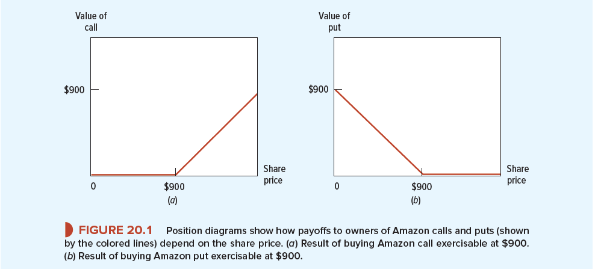
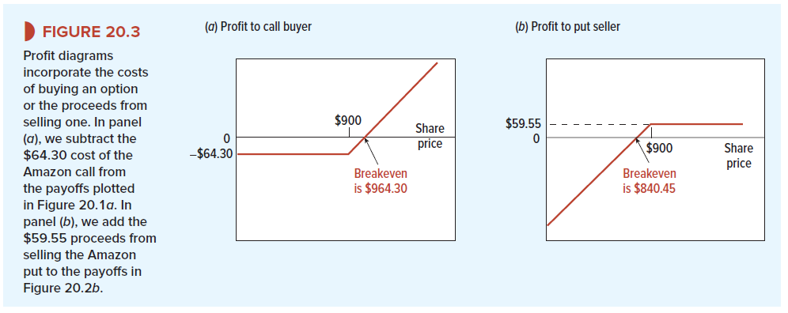

# 20-1 Calls, Puts and Shares
The options are one of the fincancial instruments which you can use on the stock. It takes some time to digest and understand it, but dont worry, we got you covered.

## Call Options and Position Diagrams

A call option gives its owner the right to buy stock at a specified exercise or strike price on or before a specified maturity date. If the option can be exercised only at maturity, it is conventionally known as a European call; in other cases (such as the Amazon options shown in Table 20.1), the option can be exercised on or at any time before maturity, and it is then known as an American call.

What does option consist of? 
1. Maturity Date - it refers to the moment to the moment in time when the principal of a fixed income instrument must be repaid to an investor.
2. Exercise Price - is the price the underlying security can be either bought or sold for.
3. Price of Call/Put Option- it is the price for which you purchase the right (not obligation) to buy/sell the a share for a specified exercise price

Option analysts often draw a position diagram to illustrate the possible payoffs from an option. Below you find some: 

The outcome from investing in the company calls depends on the stock price. 

Example: 

Let's say that you have a call option to buy the share for 900$ in 6 months. However, if in that time the stock price is going to be less than 900$ it does not make sense to pay the exercise the price to obtain the share. 

The situations looks differently when it comes to put options. If the stock price turns out to be less than 900% it will be profitable to you to sell it for 900$. 

## Selling calls and puts
Now let's take a look at the positon of the investor who sells these investments. If you sell, or “write,” a call, you promise to deliver shares if asked to do so by the call buyer. In other words, the buyer’s asset is the seller’s liability. If the share price is below the exercise price when the option matures, the buyer will not exercise the call and the seller’s liability will be zero. If it rises above the exercise price, the buyer will exercise and the seller must give up the shares.

Example: 
Suppose that the price of Amazon stock turns out to be $980, which is above the option’s exercise price of $900. In this case, the buyer will exercise the call. The seller is forced to sell stock worth $980 for only $900 and so has a payoff of – $80.4 Of course, that $80 loss is the buyer’s gain.

## Position diagrams are not the same as profit diagrams

Position diagrams show only the payoffs at option exercise; they do not account for the initial cost of buying the option or the initial proceeds from selling it. Therefore, in order to get a full picture, it is worth taking a look at the position diagrams. You can find one below:

