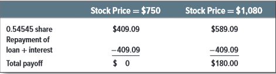

# 21-1 A Simple Option-Valuation Model

## 🤝 Why Discount Cash Flow Won't Work for Options
Procedure for valuing an asset:
1. Figure out expected cash flows.
2. Discount them at the opportunity cost of capital.

This method does not work for options because the opportunity cost of capital is impossible because the risk of an option changes every time the stock price changes.

An option has a higher beta and a higher standard deviation of returns. The amount of risk is depends on the stock price relative to the exercise price.
+ A call option that is in the money (stock price greater than exercise price) is _safer than_ one that is out of the money (stock price less than exercise price).
  + **option in the money** = stock price greater than exercise price
  + **option at the money** = stock price equal to exercise price
  + **option out of the money** = stock price lower than exercise pice

-> So stock price increase raises the the option's expected payoff **and** reduces its risk. When the stock price falls, the option's payoff falls **and** its risk increases.

:::tip Method does not work
This is why the expected rate of return investors demand from an option changes everytime the stock price moves.
:::

**The higher the stock price is relative to the exercise price, the safer is the call option, although the option is always riskier than the stock. The option's risk changes every time the stock price changes.**

## 👷🏻 Constructing Option Equivalents from Common Stocks and Borrowing
The trick to valuing options is to set up an **option equivalent** by combining stock investment and borrowing. -> The net cost of buying the option equivalent must equal the value of the option.

+ Call option on Amazon
+ Exercise price: \$900
+ Pick a day when this stock was trading at \$900 (option at the money)
+ Short-term, risk-free interest rate was _r_ = 0.5% for 6 months, about 1% a year.
+ Two possibilities for the option in 6 months:
  + Price rise by 20% to \$1080 -> upward move = _u_ = 1.2
  + Price fall by 20% to \$750 -> downward move = _d_ = 1 / 1.2
  + When stock price falls to \$750, call option will be worthless
  + When stock price rises to \$1080, call option will be worth $180.
+ Compare these payoffs what you would get if you bought .54545 Amazon share and borrowed the PV = \$409,09 from the bank.

Payoffs from the levered investment == Payoffs from the call option -> Therefore, the law of one price tells us that both investments have the same value:

Value of call = value of .54545 shares - value of bank loan = .54545 * \$900 - 409,99/1.005 = \$83,85

You valued a call option.
:::theorem Terms
**replicating portfolio** = borrowed money and bought stock in such a way that exactly replicated the payoff from a call option

**hedge ration _or_ option delta** = the number of shares needed to replicate one call

$option delta = \dfrac{spread of possible option price}{spread of possible share price} = \dfrac{180-0}{1080-750} = .54545$
:::
