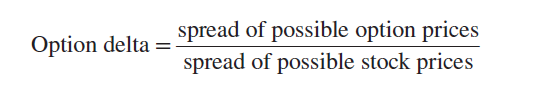
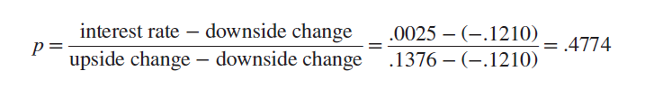
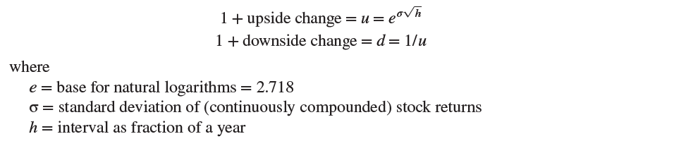

# 21-2 The Binomial Method for Valuing Options

The essential trick in pricing any option is to set up a package of investments in the stock and the loan that will exactly replicate the payoffs from the option. If we can price the stock and the loan, then we can also price the option.

These concepts are completely general, but the example in the last section used a simplified version of what is known as the binomial method. The method starts by reducing the possible changes in the next period’s stock price to two, an “up” move and a “down” move. So let's take a look at the concrete example: 
The Amazon stock price can either grow or shrink down. So, we start in one point and then we have two options of the price change. Then again, in some time interval the price can either grow or shrink down. We could continue in this way to chop the period into shorter and shorter intervals, until eventually we would reach a situation in which the stock price is changing continuously and there is a continuum of possible future stock prices.

## The Two-Step Binomial Method

The value of the option must be equal to the value of this replicating portfolio. Alternatively, we can pretend that investors are risk-neutral and expect to earn the interest rate on all their investments. We then calculate at each point the expected future value of the option and discount it at the risk-free interest rate. Both methods give the same answer.

Let's take a look at the example:

Say a call option has a value of $10, and the underlying asset has a price of $20. The underlying asset increases in price to $23, and the option value corresponds by increasing to $11. The delta is equal to: ($11-$10)/($23-$20) = 0.33.

For example, if Amazon’s stock price turns out to be $695.45 in month 6, the call option will be worthless; at the other extreme, if the stock value is $1,164.72,
the call will be worth $1,164.72 – $900 = $264.72. We haven’t worked out yet what the option will be worth before maturity, so we will just put question marks there for now. We continue to assume an interest rate of .5% for 6 months, which is equivalent to about .25% a quarter. We now ask: If investors demand a return of .25% a quarter, what is the probability (p) at each stage that the stock price will rise?

 ## Option Value in Month 3
 Now we can find the possible option values in month 3. Suppose that by the end of three months, the stock price has risen to $1,023.84. In that case, investors know that when the option finally matures in month 6, the option value will be either $0 or $264.72. We can therefore use our risk-neutral probabilities to calculate the expected option value at month 6:

Expected value of call in month 6 = (probability of rise × 264.72)  + ​(probability of fall × 0) = (.4774 × 264.72)  + ​(.5226 × 0)  = $126.39 
And the value in month 3 is 126.39/1.0025 = $126.08.

## Option Value Today

The picture above shows that if the stock price in month 3 is $1,023.84, the option value is $126.08, and if the stock price is $791.14, the option value is zero. It only remains to work back to the option value today. There is a 47.74% chance that the  option will be worth $126.08 and a 52.26% chance that it will be valueless. So the expected value in month 3 is:
(.4774 × 126.08)  + ​(.5626 × 0)  = $60.19
And the value today is 60.19/1.0025 = $60.05.

## The General Binomial Method
Why did we pick figures of +13.76% and –12.1% when we revalued Amazon’s option with two subperiods? Fortunately, there is a neat little formula that relates the up and down changes to the standard deviation of stock returns:

Lets continue with the example with Amazon:
When we said that Amazon’s stock price could either rise by 20% or fall by 16.667% over six months (h = .5), our figures were consistent with a figure of 25.784% for the standard deviation of annual returns

