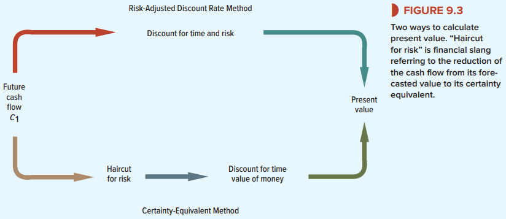

# 9-4 Certainty Equivalents—Another Way to Adjust for Risk
In practical capital budgeting, a single risk-adjusted rate is used to discount all future cash
flows. The risks that companies are exposed to are constantly shifting so assuming that project risk does not change over time cannot be fully true.

:::tip Certinaty Equivalents
The certainty equivalent is a guaranteed return that someone would accept now, rather than taking a chance on a higher, but uncertain, return in the future. Put another way, the certainty equivalent is the guaranteed amount of cash that a person would consider as having the same amount of desirability as a risky asset.
:::

There are two main ways of valuing a risky cash flow:
- Method 1: Discount the risky cash flow at a risk-adjusted discount rate r that is greater than $r_f$ (The discount rate $r$ can be less than $r_f$ for assets with negative betas. But actual betas are almost always positive). The risk-adjusted discount rate adjusts for both time and risk. 
- Method 2: Find the certainty-equivalent cash flow and discount at the risk-free interest rate $r_f$. When you use this method, you need to ask, What is the smallest certain payoff for which I would exchange the risky cash flow? This is called the certainty equivalent, denoted by *CEQ*. Since *CEQ* is the value equivalent of a safe cash flow, it is discounted at the risk-free rate. The certainty-equivalent method makes separate adjustments for risk and time.

We now have two identical expressions for the PV of a cash flow in period 1:
$$\mathrm{PV}=\frac{C_{1}}{1+r}=\frac{\mathrm{CEQ}_{1}}{1+r_{f}}$$

For cash flows two, three, or t years away,
$\mathrm{PV}=\frac{C_{t}}{(1+r)^{t}}=\frac{\mathrm{CEQ}_{t}}{\left(1+r_{f}\right)^{t}}$

## When to Use a Single Risk-Adjusted Discount Rate for Long-Lived Assets
Use of a constant risk-adjusted discount rate for a stream of cash flows assumes that risk accumulates at a constant rate as you look farther out into the future. That will be the case if the project’s beta remains constant.

:::warning
You sometimes hear people say that because distant cash flows are riskier, they should be discounted at a higher rate than earlier cash flows. That is quite wrong: We have just seen that using the same risk-adjusted discount rate for each year’s cash flow implies a larger deduction for risk from the later cash flows. The reason is that the discount rate compensates for the risk borne per period. The more distant the cash flows, the greater the number of periods and the larger the total risk adjustment
:::

## When You Cannot Use a Single Risk-Adjusted Discount Rate for Long-Lived Assets
Sometimes you will encounter problems where the use of a single risk-adjusted discount rate will get you into trouble. For example, later in the book, we look at how options are valued. Because an option’s risk is continually changing, the certainty-equivalent method needs to be used.