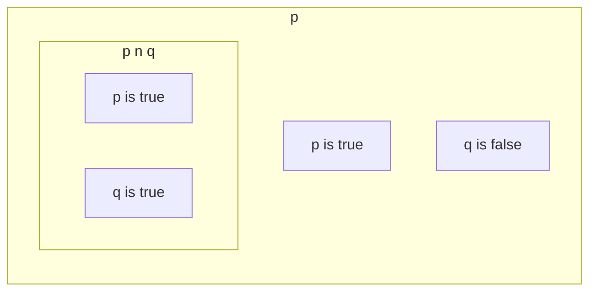

# Propositional Logic

[Summary of the basic stuff](./cookbook.md);

## Semantics

The truth value of a sentence is based on the truth value of atoms, and for complex sentences how the truth values are combined.

::: tip Basic Example
+ p is true.
+ q is true.
+ $p \wedge q$ is true.
:::

Truth tables are used to easily determine the truth values of complex sentences.

::: tip Truth Table
| p | q | $p \wedge q$ |
| - | - | ------------ |
| true | true | true   |
| false | true | false |
| true | false | false |
| false | false | false|
:::

::: theorem model
A **model** in propositional logic is simply ann assignment of truth values for the atoms of a sentence.
For example if the set of atoms is `{p, q}`, a model might be `{ p = true, q = true }`.
Some models can satisfy the entire proposition others may not.
(I remember this as each row in a truth table is a model.)

A model can be thought of as an abstract representation of the state of a real or abstract world.
:::

The model M **satisfies** $\alpha$, if $\alpha$ is true in m.
+ Notation: $m \models \alpha$
+ $M(\alpha)$ the set of models that satisfy $\alpha$

For example `{p: true, q: true}` satisfies $p \wedge q$.

:::theorem Entailment
$KB \alpha$ means that knowledge base KB,
consisting of a set of propositional formulas *entails* $\alpha$.
Meaning that in all models in which KB is true, i.e, $M(KB) \subseteq M(\alpha)$

For Example:
$p \wedge q \models p$
Because:
+ $M(KB) = `{(p is true, q is true)}`
+ $M(\alpha) =`{(p is true, q is true), (p is true, q is false)}`
:::

### Terminology

+ **Logical Equivalence**: $\alpha \equiv \beta \text{ if } M(\alpha) = M(\beta)$.
    + Example: $p \wedge q \equiv q \wedge p$
+ **Validity**: A sentence $\alpha$ is valid if it is true in all models (tautology)
    + Example: $p \implies p$
+ **Satisfiability**: a sentence $\alpha$ is satisfiable if it is true in some model, i.e. $M(\alpha) \neq \emptyset$

$KB \models \alpha \text{ if } M(KB \wedge \neg \alpha) = \emptyset$
Which means that if KB entails alpha all the models that satisfy KB also satisfy alpha.
Makes sense if you look at the drawing because the models of KB are "inside" of the set of the models of alpha.

## Reasoning

Reasoning is the use of propositional logic by the agent to select is actions.
The approach to doing this is to model the environment of the agent with a knowledge base.
Then inference or reasoning is done on the knowledge base to determine the agent's next action.

### Theorem Proving

Theorem proving: applying rules to derive a proof of $KB \models \alpha$ without model checking.
Notation $KB \vdash \alpha$.

::: tip Example: Modus Ponens:

$$\frac{\alpha \implies \beta, \alpha}{\beta}$$.
:::

The main challenge is to find which rule needs to be applied to which formulas in order to arrive at the desired conclusion.

### Resolution Rule

Eliminate opposite literals of two disjuncts.
reminder: disjunction == or.

Simple Resolution Rule:

$$\frac{p \vee q, \neg q}{p}$$

Example:
$$\frac{tea \vee coffee, \neg coffee}{tea}$$

Simple Resolution Rule With Disjunction.

$$\frac{p \vee q, \neg q \vee r}{p \vee r}$$

Example:
$$\frac{tea \vee coffee, \neg  \vee coffee \vee \neg biscuits}{tea \vee \neg biscuits}$$

::: theorem Resolution Rule
$$\frac{i_1 \vee \dots \vee i_k, m_i \vee \dots \vee m_k}{i_1 \vee \dots i_{k-1} \dots \vee i_k \vee m_1 \vee \dots \vee \dots \vee m_{j-1} \vee m_{j+1} \dots \vee m_n}$$

Where ik and mj are complementary literals:
1. $i_k = \neg m_j$
2. $\neg i_k = m_j$

basically the literals cancel out in the derived disjunction.
:::

To be able to use the resolution rule we need to write our formulas
in **CNF** (conjunctive normal form).
The resolution rule can then be applied to the conjuncts.

#### Proof by Resolution

Goal is to prove $KB \vdash \alpha$

Steps:
1. add $\neg \alpha$ to KB and try to prove $KB \wedge \neg \alpha \vdash \bot$ (proof by contradiction)
2. Write $KB \wedge \neg \alpha$ in CNF
3. Apply resolution rule until no new clause can be added anymore or false is derived.

## Soundness & Completeness

+ Logical consequence
    + $KB \models \alpha$ : semantic entailment, defined through models
    + $KB \vDash \alpha$ : a proof exists showing that by applying syntactic rules, $\alpha$ follows from KB.
+ It is **sound** if it is proven by resolution that $\alpha$ follows from KB then $KB \models \alpha$
+ It is **complete** if $KB \models \alpha$ then it can be proven by resolution that $\alpha$ follows from KB.