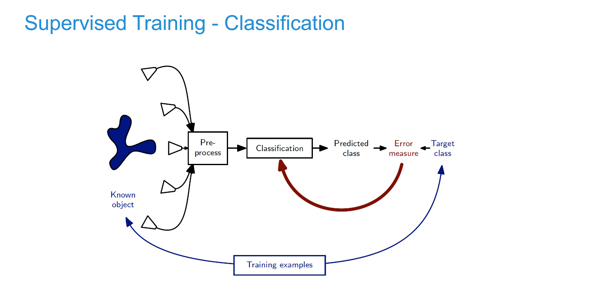
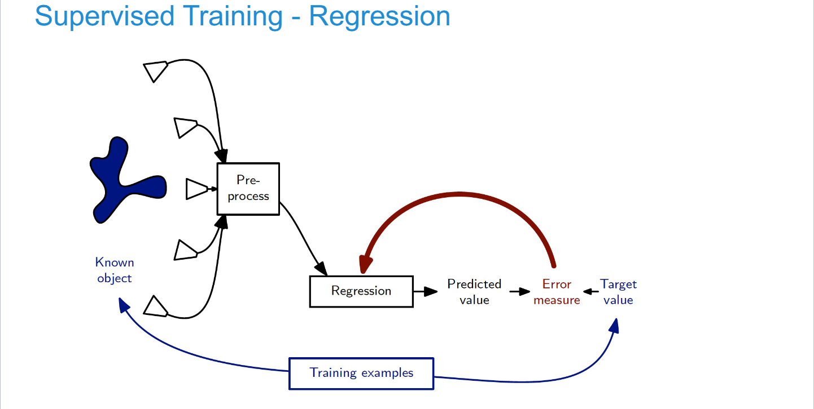

# Intelligent Systems in Computer Science

### Perception
Interaction with environment requires cognitive processes, e.g.  computer vision, speech recognition, motion detection, scene analysis, object classification 

### Decision making
**Processing** of incoming information, **analysis** of a situation, selection of possible **actions** in order to  achieve a **goal**, e.g. path finding, sorting of objects 

### Learning
Data driven **adaptation** of the system based on observations only (unsupervised) or together with **feedback** from the environment (supervised), e.g. classification, regression.

## Types of machine learning problems

+ Unsupervised Learning: input data, no labels
    + Clustering: group similar data points
    + Density estimation
    + Dimensionality reduction
    + Outlier/novelty detection

+ Supervised Learning: labels are provided
    + Classification
    + Regression

+ Semi-Supervised learning
    + labels for just part of the data

+ Reinforcement learning
    + find a sequence of actions (policy) that reaches a target

## Classification vs Regression

### Classification: Predict a discrete label from features

Examples:

- Medicine: classify X-rays as \cancer" or \healthy"
- SPAM detection: classify emails as spam or not
- Face recognition, speech recognition,

Remark the picture of from the lecture slides

### Regression: Predict a continuous value

Examples:  
- Weather forecasting (wind speed, mm, rainall)
- In financial markets: predict tomorrow's stock price from past evolution and external factors
- A robot learning its loccartion in an environment

## Semi-supervised Training
partially labelled data sets, first training based on labelled subset, extend by making predictions for unlabeled data, accept examples with high confidence for next training ...  iterative procedure

## Unsupervised Training

### Clustering
_Given a set of data points: partition it into groups such that points within each group are similar (low inter-group variability) and groups are  dissimilar (high intra-group variability)_
