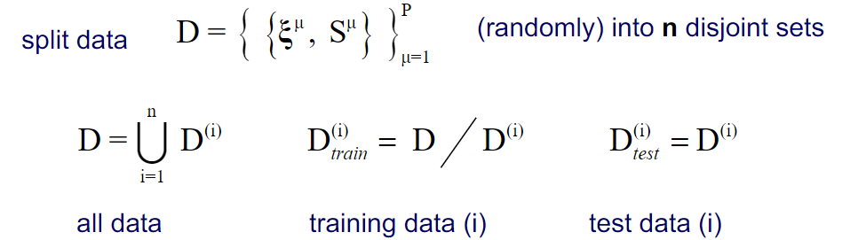

# Supervised learning - generalisation

## Key problems in  supervised learning
- model selection:: Neural Networks, Decision trees?
-  data representation: coding, normalization, transformation
-  algorithm, parameters: which training prescription? how many training epochs, which learning rate?

## Validation procedures

## Problems
- lack of data: can we afford to waste example data _only_ for validation?
- representative results: _lucky/unlucky_ set composition can give misleading outcome
-  variation of results: how safe is the prediction? Error bars of the estimates

## An example strategy: "n-fold cross-validation"

- repeat training n times
- calculate average training / test errors (variances)
- repeat cross-validation for different models, parameter settings etc
- select the best system with respect to test errors (model, number of units, learning rate ect)

- which n in n-fold cross-validation?
    - larger n
            -> larger fraction of D used in each training run
            -> more estimates of E-test/
            -> higher computational effort
    extreme case: n=P: use all but one examples for training, test on single example,
    repeat P times  **leave-one-out estimate** 
- statistics: n results are not statistically independent (since we iterate through the train set n times, it it means that when we take one fraction of the dataset for training, we have x-1 fractions left)

### Over-fitting 
test/training erros (e.g observed in cross validation)
vs. complesxity of the model (e.g # of prototypes, neurons, ...)

### the bias / variance dilemma  (qualitative discussion)

competing aims in training:
    + low **bias** = small **systematic deviation** from the "true solution" on average over all possible data sets of the same size
    + low **variance** = weak dependence on the actual training set, **robustness** of the hypothesis

 dilemma: 
-  small variance: simple model _under-fitting_ -> large bias
- small bias: complex model, over-fitting -> large variance

### Over-fitting

**Remarks**
- in a potentially overfitting learning system, we can use **algorithm** parameters to control **effective complexity** i.e. the degree to which the training error can be minimized e.g. number of training epochs learning rates
- validation procedures can overfit!
    - example: selection of parameters based on Etest by cross-validation
    - does depend on the entire data set D 
    - unclear performance with respect to entirely new data 

- In practice, available training data is often limited  

- Splitting the data in sets further reduces this   

- N-fold cross-validation reduces this. It repeatedly splits the data and average the results (here, n = 4)
