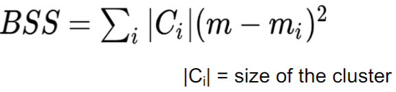

# Validation

Different problems require different types of _Error Functions_

### Supervised Learning
_Classiication_ Some form of counting misclassified datapoints  

_Regression_ Average distance between predicted and target output

### Unsupervised learning 
Within-class and between-class distances

### Errors for Supervised Learning - Classification

The primary source for performance estimation is the confusion matrix TP, TN, FP, FN

### Errors for Supervised Learning - Regression

Assess the difference between predicted output and target output

Sum of squared errors (SSE)
Which we want to minimise 

Propability of the predicted outputs given the target outputs
Which we want to maximise

### Errors for Supervised Learning - Clustering

Internal measures - Cohesion vs Separation

_Cohesion:_ how closely related are samples in a cluster

**Within sum squared errors (WSS)**

_Separation:_ how well separated is one cluster from other clusters

**Between cluster sum of squares (BSS)**

