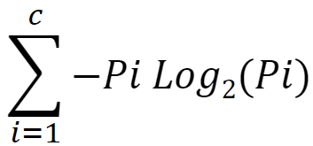

# Entropy

To build (induce) a decision tree we need;
+ Data
+ An algorithmic method to select the best attribute at the root of the tree
+ Repeat the process recursively

Algorithmic method 
+ Several methods to select the best attribute/feature exist
+ We will work with **information gain**
+ Information gain is based on the **entropy** of a dataset
+ Entropy is a measure of chaos in the dataset. The less chaos, the better. The more chaos, the more information needed to tell the class of a datapoint/example.
+ In case of binary classification problems, max entropy is 1

