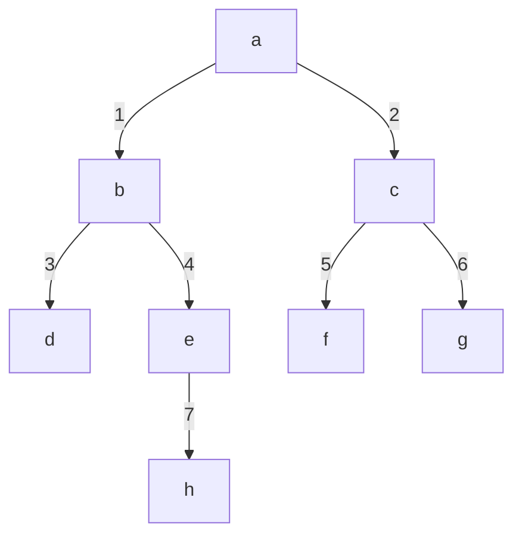

# Search

## Path Finding :round_pushpin:
+ Search space: set of all reachable states from the initial state.
+ Search tree or graph: possible action sequences from the initial state.
+ Search strategy: the process of how nodes are traversed.

Evaluation measures:
+ time complexity
+ space complexity
+ completeness: does it find a solution if there is one.
+ optimality: does it find the optimal solution.


## Search Strategies :evergreen_tree:

### Breadth first search

+ Layer by layer
+ Fist In First Out (Queue)



```java
/**
    * Breadth first search performed in a iterative approach
    * @param adj - adjacency list for given graph
    * @param visited - array marking nodes that were already visited or not
    * @param source - source node to start traversal from
    */
public static void bfs(ArrayList<ArrayList<Integer>> adj, boolean[] visited, int source) {
    Queue<Integer> que = new LinkedList<>(); // data structure used for bfs
    que.add(source); // add starting vertex to queue
    visited[source] = true; // mark starting vertex as being visited

    while (!que.isEmpty()) {
        int v = que.poll();

        for (Integer u : adj.get(v)) {
            if (!visited[u]) {
                que.add(u);
                visited[u] = true;
            }
        }
    }
}
```

### Depth first search

+ 


```java
/**
    * Depth first search performed in a iterative approach
    * @param adj - adjacency list for given graph
    * @param visited - array marking nodes that were already visited or not      
    * @param source - source node to start traversal from
    */
public static void dfs(ArrayList<ArrayList<Integer>> adj, boolean[] visited, int source) {
    Stack<Integer> stack = new Stack<>();
    stack.push(source); // push starting vertex to stack
    visited[source] = true; // mark starting vertex as visited

    while (!stack.isEmpty()) {
        int v = stack.pop();

        for (Integer u : adj.get(v)) {
            if (!visited[u]) {
                stack.push(u);
                visited[u] = true;
            }
        }
    }
}
```

### Tree Search vs Graph Search

| term | Action space | Execution | closed list | search strategy |
| ---- | ------------ | --------- | ----------- | --------------- |
| Tree Search | Graph or Tree | Search tree | no | BFS or DFS |
| Graph Search | Graph or Tree | Search tree | yes | BFS or DFS |

+ The difference between tree search and graph search is the use of a *closed list*

when the `action space` is tree-shaped, no loops occur so we can use tree search. However
if the graph is not a tree (loops in some way) we need to check if nodes were already visited
by means of a `closed list` or `explored set`.

## Sources:
+ [alemoraru's algorithms pages :raised_hands:](https://alemoraru.github.io/algorithms)