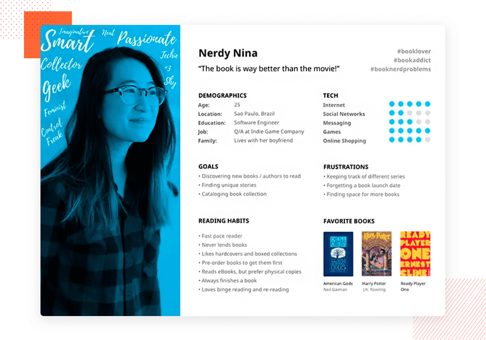
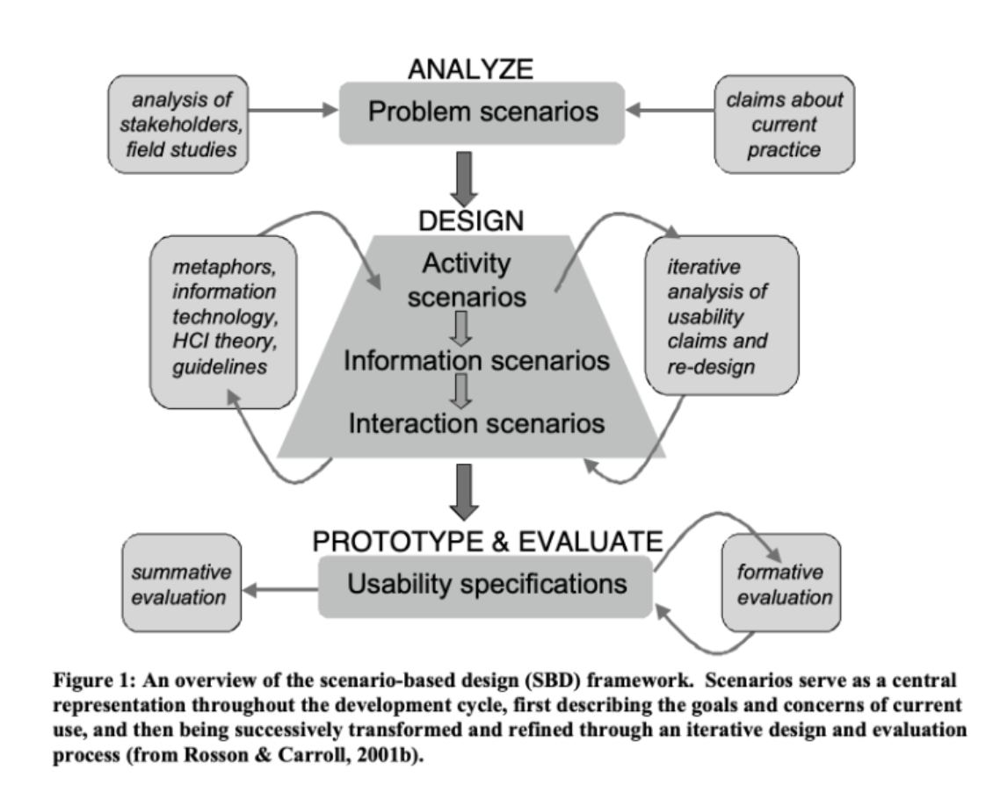

# Lecture 2

## Personas

+ Reliable and realistic representations of key audience segments.
+ Represent major user groups
+ major needs and expectations of the most important user groups
+ user expectations
+ aid in uncovering universal features and functionality
+ describe real people with backgrounds goals and values

:::tip Persona Example

:::

### benefits:
+ personas help focus decisions on application components.
+ quick and inexpensive way to test and propritize features throughout the development processs.
+ Stakeholders and leaders evaluate new features.
+ useful for designers, developers, information architects to guide their work.

## Scenarios

A set of techniques used before the product exists to define the use of a future system.

Narrative description (story) of the envisioned use.

Not looking at it from the perspective of the solution but how people interact with the system.

Scenario Based Design

Should be done at the beginning to avoid costs of wrong/bad design.

Why:
+ develop further alternatives
+ raise questions about assumptions behind the scenarios.
+ analyse software requirements
+ specifications of functionality
+ guide ui layouts and ui control
+ rapid communication.