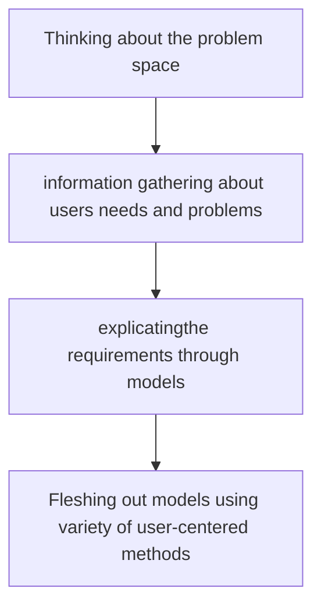

# Preece Chapter 2

## Understanding the Problem Space

::: theorem Problem Space
= The problem + everything associated with the user's problem, such as:
+ the history of the problem.
+ the stakeholders in the problem.
+ ...
:::

+ The design of a system is best done AFTER understanding the *problem space*.
+ To understand the problem space write down:
    + usability goals.
    + user experience goals.

## Conceptual Models

::: theorem Conceptual Model
A description of the proposed system based on ideas and concepts about what the system should do, behave and look like.
:::

:::tip To Develop a Conceptual Model:
+ Envision the product as a user.
+ Do iterative testing. (change product iterativley based on feedback)
:::

Two types of conceptual models are: models centered on activities(done by the user) and models centered on objects.

## Interface Metaphors

::: theorem Interface Metaphor
a set of user interface visuals, actions and procedures that exploit specific knowledge that users already have of other domains. The purpose of the interface metaphor is to give the user instantaneous knowledge about how to interact with the user interface.
:::

## Paradigms of HCI:
+ ubiquitous or pervasive computing (IoT) :battery:
+ wearable computing :watch:
+ augmented reality (AR) :nerd_face:
+ attentive environments :film_projector:

## From Conceptual Models to Physical Design

Interaction design is an **iterative process**, involving:
+ cycling through various design processes and different levels of detail.
+ thinking through a design problem.
+ understanding users needs.
+ coming up with possible models.
+ prototyping models and evaluating them.
+ thinking about design implications.
+ making changes.

### Steps of interaction design:

## Issues in testing prototypes:

+ Way in which information is to be presented and interacted with
+ What combinations of media
+ Kinds of feedback
+ What combinations of input and output devices to use
+ Whether to provide agents and in what format
+ Whether to design operations to be hardwired or through physical objects or software
+ What kinds of help to provide and in what format
+ Physical design decisions come out of conceptual decisions (i.e. what information, how to structure graphical objects, what feedback navigation and mechanisms, what kinds of icons…).

These kinds of design decisions need user testing to ensure usability goals.
