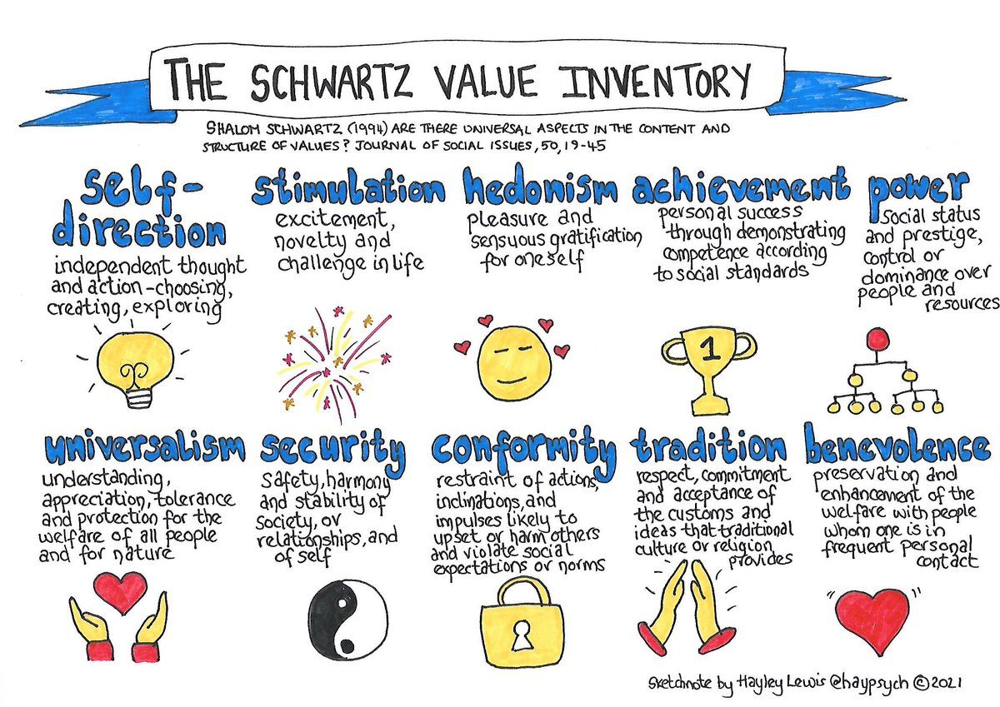

# Value Sensitive Design.

accounts for human values throughout the technical design process.

value: what a person or a group consider important in life.

value examples: comfort, privacy, achievement.

## Lists of values

### Schwartz values

### Rokeach values

| Instrumental | Terminal |
| ------------ | -------- |
| Cheerfulness   | True Friendship |
| Ambition       |Mature Love |
| Love | Self-Respect |
| Cleanliness |Happiness |
| Self-Control |Inner Harmony |
| Capability | Equality |
| Courage | Freedom |
| Politeness | Pleasure |
| Honesty | Social Recognition |
|Imagination | Wisdom |
|Independence | Salvation |
|Intellect |  Family Security |
|Broad-Mindedness |  National Security |
|Logic |  A Sense of Accomplishment |
|Obedience |  A World of Beauty |
|Helpfulness |  A World at Peace |
|Responsibility |  A Comfortable Life |
|Forgiveness |  An Exciting Life |

### Friedman et al values

+ human welfare
+ ownership & property
+ privacy
+ freedom from bias
+ universal usability
+ trust
+ informed consent
+ accountability
+ courtesy
+ identity
+ calmness
+ environmental sustainability

## Why VSD

Greater impact of technology means greater responsibility.
Then the lecture goes into ethics which is ok but long as hell This is my summary:
+ treat others as you would like to be treated.
+ business goals are not more important than the well being of someone.
+ leave the world a better place than you found it.

## Applying VSD

+ VSD is used together with other HCI approaches.
    + VSD is not a standalone methodology.
    + it is a framework that can be applied differently depending on the context.
+ VSD is concerned with moral values
+ The values of the designer the stakeholders and society.

1. Start with a value, tech or context.
2. identify direct and indirect stakeholders.
3. Identify benefits and harms for each stakeholder group.
4. Map benefits and harms onto corresponding values.
5. Develop working definitions of Key Values.
6. Identify potential value tensions.

### What happens if conflicting values?

Options and techniques:
+ Bring light to the value tensions.
+ Prioritize values.
+ Find a trade-off
+ Creatively mitigate tension.
+ pause.
+ stop the project.