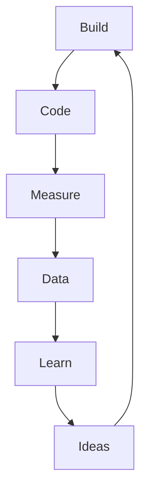

# PODB 2

## Innovation Methods
+ Process
+ Tools
+ Mindset

## Lean Startup

### Lean Principles
+ Based on lean manufacturing principles (Toyota)
+ Eliminate waste
+ Amplify learning
+ Decide as late as possible
+ Deliver as fast as possible
+ Empower the team
+ Build integrity in
+ See the whole

### Startup

> A human institution designed to create new products and services under conditions of extreme uncertainty.

### Elements of an innovation

:::theorem Lean Startup
business approach that 
relies on validated learning, 
scientific experimentation, 
and iterative product 
releases to shorten product 
development cycles, 
measure progress, and gain 
customer feedback
:::

### Lean Learning Cycle

### Minimum Viable Product (MVP)

:::theorem MVP
An MVP is a version of the product that enables a full turn of the **build-measure-data-learn** loop.
:::

+ Prototypes (Test how customers feel about the product)
+ Landing pages (test if customers want to buy it)
+ wizard of oz (simulate how the product will work if implemented)

## Design Thinking

:::theorem Design Thinking
User-centered approach 
with multi-disciplinary 
teams with the goal to 
develop innovative 
solutions to wicked 
problems
:::

### Simplified Process Model

After test you return to any step where you received negative feedback to reevaluate.

Empathy: put yourself in the shoes of the customer.

Thinking:
+ Divergent: Create Choices
+ Convergent: Make Choices

