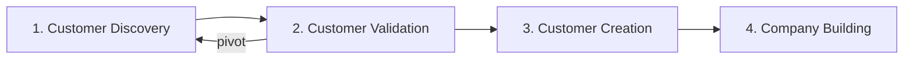

# Lean Startup

Lean startup makes the process of starting a company less risky.

| lean startup favors | lean startup discourages |
| ------------------- | ------------------------ |
| experimentation | elaborate planning |
| customer feedback | intuition |
| iterative design | big upfront design |

## Business Model Canvas

The business model canvas lets you look at all nine
building blocks of your business on one page. Each component of the business model contains a series of hypotheses that you need to test.

## Listening to Customers

1. Founders translate company ideas into business model hypotheses, test assumptions about customers' needs and then create a "minimum viable product" to try out their proposed solution on customers.
2. Start up continues to test all other hypotheses and tries to validate customers' interest through early orders or product usage. If there's no interest the startup can "pivot" by changing one or more of their hypotheses.
3. The product is refined enough to sell. Using its proven hypotheses the start-up builds demand by rapidly ramping up marketing and sales spending and scales up the business.
4. Business transitions from startup mode with a customer development team searching for answers to functional departments executing its model.

## Agile

In contrast to traditional product development in which each stage occurs in linear order and lasts for months, agile development builds products in short, repeated cycles. A start up produces a `minimal viable product` containing only critical features. gathers feedback on it from customers and then starts over with a revised minimum viable product.

[See module 4 requirements](docs/Study-Notes/Module-4/Requirements/Lecture-1.md)