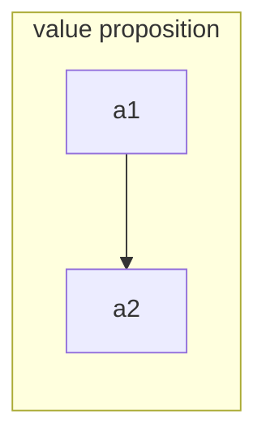

# PODB 4

:::theorem Strategy
Strategy is the creation of a unique and valuable position, that is, to gain a sustainable advantage over rivals by creating or preserving what is unique about your company.

A company's strategic position hinges on performing different activities from competitors or performing similar activities but in different ways.
:::

## How To Focus?

+ Product: what are you selling?
+ Customer: who are you selling it to?
+ Region: where are you selling it?

