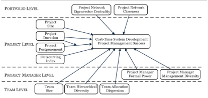
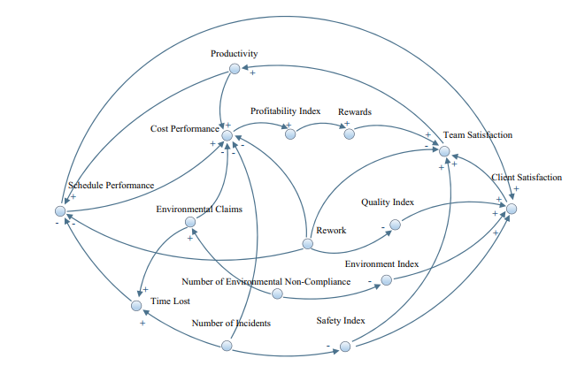
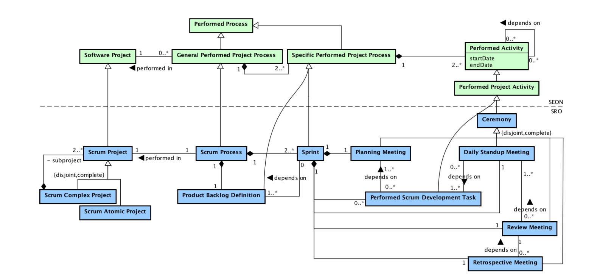
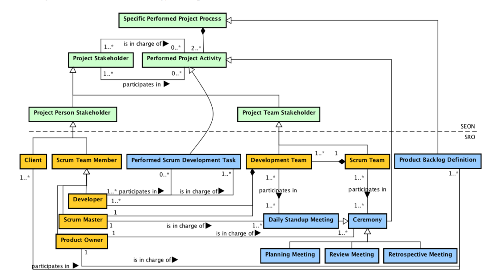
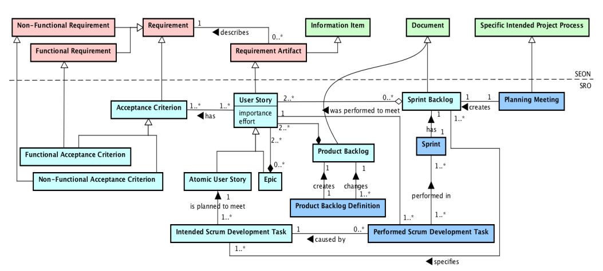

# Exam 2: Project performance (management & execution)

## Agile vs Traditional Paper.

Agile comes from software development, but is applicable to other types of projects. 

**Agile PM advantages:**
+ accelerating project/product delivery
+ enhancing ability to manage changing priorities.

**Agile PM challenges:**
+ work prioritization.
+ alignment among stakeholders on what to build next.
+ insufficient time for testing.
+ long feedback loops.
+ incompatibility of agile with the organizational processes and functions.

`Ciric, D., Lalic, B., Gracanin, D., Tasic, N.,Delic, M., & Medic, N. (2019). Agile vs. Traditional approach in project management: Strategies, challenges and reasons to introduce agile. Procedia Manufacturing, 39, 1407-1414.`

## Agile vs Structured software development paper
Study of the distributed project of both Agile and Structured development teams. The study shows no significant difference between the two types of processes.

Study evaluates correlation between: **process type**, **success**.

For globally distributed projects: 
+ choosing agile or structured does not appear to be crucial
+ agile and structured processes equally effective for globally distributed software
+ Take home lesson: 
  + development process is not an independent variable: success of agile or structured depends on other variables.
  + its choice cannot single handedly determine the successful or unsuccessful outcome of a project

Major dimensions being impacted by usage of agile/ structured in processes:
+ importance for customers
+ team motivation 
+ cost effectiveness
+ amount of real time
+ asynchronous communication
+ communication difficulties
+ cultural differences
+ ineffective project management
+ loss or fluctuation of know-how
+ shortage of labor skills
+ ineffective reading or writing of documentations 
+ interpersonal conflict
+ difficulties in keeping to the project schedule
+ protecting intellectual property

### Near-shore vs Off-shore
*Nearshore development (ND) and Offshore development (OD)*
+ documentation, difficult when cultural differences OD
+ ND team coordination and collaboration with customers easier
+ ND more expensive but not necessarily
+ ND main reason not cost reduction but do for legal reasons: travels reduced 
+ OF more fluctuation
+ OF can protect Intellectual Property best 

major sources of problems and difficulties with OD:
+ unqualified personnel
+ cultural communication difficulties
+ deficiencies of the infrastructure
+ insufficient interaction among units
+ personnel fluctuation (changing teams)

major sources of success with OD:
+ skilled personnel
+ effective team building
+ effective communication
+ Intellectual properties

No difference between globally distributed projects and outsourced projects found.
Flexibility is the central skill for distributed software development

`Estler, H._C., Nordio, M., Furia, C., Meyer, B., & Schnieder, J. (2013) Agile vs. structured distributed software development: A case study. Empirical Software Engineering, 19 (5): 1197-1224`

## Does Agile Work ?
Study tested `efficiency` and `stakeholder satisfaction` shows positive impact of Agile.

Bell curve relationship, between planning and project success:
+ too little planning is bad
+ too much planning is also bad

Agile depends on continuous customer involvement
+ for establishing goals
+ to provide feedback to progressive prototypes

Customers believe that daily meetings kept them up to date and helped to "reduce the confusion about what should be developed"

Scrum Poker was found to have a positive impact, because it gives insight into the development process

:::theorem Extreme Programming (XP)
Agile methodology for software development based on scenario-based requirements, testing happening as early as possible and pair programming.
:::

In XP customer time is spent on:
1. planning poker sessions
2. acceptance testing
3. retrospective sessions

Study suggests Agile has a positive impact on efficiency, stakeholder satisfaction and perception of overall project performance.

`Serrador, P., and Pinto, J. (2015) Does Agile work? A quantitative analysis of agile project success. International Journal of Project Management, 33 (5): 1040-1051`

## Cost and time project management success paper.

The goal of the paper is to identify the project management practices through which an organization can optimize the **CTPMS = Time Project Management Success** of IT development projects.

### Which factors influence project management success:

+ Positive Factors :+1:
  + project size
  + duration
  + postponement (close to risk management until resources are mostly available)
  + project manager

+ Negative Factors :thumbsdown:
  + team allocation
  + team allocation dispersion

### Project Management Success from two perspectives:

project manager must deliver project outputs on time, within budget and with required features. (time, budget, scope)

Project Managment Success shortened to (PMS)

These are the measures on the iron triangle (time, budget, scope) they are considered independent.

However if cost and time would be considered dependent, you can just focus on doing scope well then time and budget will follow from how well you did scoping.

:::tip Cost Formula
You can grade your project's performance by dividing the prediction of cost and time by the actual cost and time.
The larger the number the better score.

:::

### Information System Development:

How to get *scope* right?
+ many small changes expected during project execution
+ constant negotiations in scope = agile approach

Apply multilevel perspective to understand project problems and interdependencies between data

Risk Management contributes to project success

### 4 levels of elements influencing Project Management Success:
Portfolio Network Level (project network closeness and eigenvector)
+ describe patterns of interactions among people using a graph of connections
+ people are nodes
+ relationships between actors are ties
+ eigenvector centrality: how close node is to popular node
+ closeness centrality: how close node is to all other nodes
+ Project Level Effects (project size, duration, outsourcing,..)
+ Project Manager Level (project manager diversity and power)
+ Team Project Level Effects (team size, group diversity,..)

:::theorem Project Portfolio Management
Process to ensure that correct project will be done to 
achieve goals desired by the organization
+ controls costs and human resources constantly
:::

Other findings of the study:
+ larger projects with long duration positively influence PMS.
+ larger projects are usually strategic and prioritized by an executive committee
+ postponing the start of a project has a positive effect on PMS
+  outsourcing projects has no positive effect on project cost and time since the internal IT resources are more trained and specialized than are outsourced resources.
+ project manager as the formal authority that is given to the project manager based on his/her role no longer influences team members due to the more empowered agile teams and their familiarity with new technologies, products and agile methodologies.
+ high levels of project manager diversity have a positive effect on PMS.
+ Specialization is not valid for an IT project manager. A project manager who can be exposed to projects of different sizes and types during his/her career is better prepared to address unexpected situations that could affect PMS.
+ focussed and less-disperse teams can present better results than multiple, larger and sparse teams addressing a multiplicity of projects.
+ The team allocation into the portfolio: Two networks types: leading to opposite effects: 
  + Having individuals originally allocated in central projects sharing hours with multiple projects reduces PMS
  + having individuals sharing hours with other central projects increases PMS
  + central projects are usually strategic projects that are better controlled and have the best technical teams. Thus, team members are naturally more worried about the project's results when working on central projects than when working on peripheral projects.

`Sanchez, O., Terlizzi, M. & De Oliveira, H. (2017) Cost and time project management success factors for information systems development projects. International Journal of Project Management, 35: 1608-1626`

## To Continue or Discontinue the Project, That is the Question.

Goal of paper is to prevent *equivocal situations*.

:::theorem Equivocal Situations
When in a project, the project manager has two or more competing or contradictory options to take.
Equivocal situations make decision making hard in projects
:::

Equivocal vs Unequivocal Situation:
> situations where the decision maker(s) have or are able to construct and commit themselves to credible criteria which can be fully and satisfactorily compared to available data, versus situations where the decision maker(s) do not have or are unable to create such criteria 
or do not have sufficient data to fully compare against the standards.

*examples are related to the development of a web app*
Paper shows influence of the following antecedents on equivocal situations:
+ **Content**: what?
  example: not clear about: html, css, js
+ **Context**:
  + example: not clear about the the client's requirements
+ **Process**: how?
  + example: not clear about when to do meetings with the client.

hardest question in evaluation of projects whether to continue or abandon a project in trouble
Traditional capital budgeting techniques are antecedents of equivocal situations.

**Equivocality vs Ambiguity:**

Equivocality: having several competing or contradictory conceptual frameworks
Ambiguity: not having a conceptual framework for interpreting information

common denominator is knowledge, need for information

**Evaluation**:
> evaluation is conceived as a purposeful study of some evaluation object (evaluant) comprising: the generation of data of and from this object the selection and formulation of appropriate criteria to be used as yardsticks the matching of data and criteria in order to formulate evaluative statements and conclusions about the evaluation object

 Strongest sources of equivocal situations:
+ **Content**
  + Challenges of project management:
    + inadequate senior management control over project execution
    + the vagueness of the project charter as the basis for managing the project 

+ **Context**
  + Different frames of reference:
    + difficulty in gaining mutual perception due to different backgrounds
    + the lack of complementary skills & abilities among decision-makers to proceed with effective evaluation 

+ **Process**
  + Lack of evaluation data:
    + unavailability of data to support the evaluation

`Arviansyah, A., Spil, T., & Hillegersberg, J. van (2015). To Continue or Discontinue the Project, That is the Question, International Conference of Information Systems`

## System Dynamics Approach for Forecasting Performance of Construction Projects

Paper is focused on performance forecasting too assist in obtaining warnings about potential problems.

:::theorem System Dynamics
System Dynamics is a computer-based mathematical modeling approach for strategy development and better decision making in complex systems. This approach uses computer-aided simulation methodology based on feedback systems theory which complements the other Systems Thinking approaches.
:::

Performance forecasting is a complex and dynamic process that includes many indices that are interdependent. Therefore a System Dynamics model was created which can forecast the performance of (construction) projects based on the contractor's perspective.

Model was developed with the performance variables:
1. cost
2. schedule
3. quality
4. profitability
5. safety
6. environment
7. team satisfaction
8. client satisfaction

:::theorem Causal Loop Diagram
A causal loop diagram consists of four basic elements: the variables, the links between them, the signs on the links (which show how the variables are interconnected), and the sign of the loop (which shows what type of behavior the system will produce). By representing a problem or issue from a causal perspective, you can become more aware of the structural forces that produce puzzling behavior.
:::

> Project Management Casual Loop Diagram

`Leon H, Osman H, Georgy M, et al. (2018) System Dynamics Approach for Forecasting Performance of Construction Projects. Journal of Management in Engineering 34(1): 04017049. DOI: 10.1061/(ASCE)ME.1943-5479.0000575`

## Dashboards

:::theorem Dashboard
A data dashboard is any visual display of data used to monitor conditions and or facilitate understanding. **key indicators** need to be understood at a glance.
:::

An analytical process is only as good as how it is *communicated* and *deployed*.
+ who receives the reports ?
+ how are the workflows deployed to production ?
+ can data insights be turned into useful policies?

Today it is common for reports to be **automated**

### Dashboards
**Purpose**
+ communicate data
+ report data
#### Dashboard Foundation
+ who is the target audience?
  + role (what decisions do they make)
  + workflow (dashboard used on daily basis vs weekly)
  + data expertise level
+ what value does the dashboard add?
  + to help managers make decisions
  + to educate people
  + to set goals and expectations
  + to evaluate and communicate progress
+ what type of dashboard is being created?
  + scope: specific to broad
  + time horizon:
    + historical
    + real time
    + snapshot
    + predictive
  + level of detail
    + high level: only critical data
    + drill down: allow the user to gain more context by looking at more data.
  + point of view:
    + prescriptive: gives a solution to problem using data as proof.
    + exploratory: allows to explotre to find possible issues.

> The foundation of good dashboards comes down to deciding what information is most important to the given audience in the context of interest; they should have a core theme based on the essence of either a problem or data story, while removing extraneous information from the process.
#### Dashboard Structure
+ Form: format in which the dashboard is delivered
  + paper
  + slides
  + web or mobile app
+ Layout: physical look of the dashboard
  + distributions => bar chart, scatter plots
  + compositions => pie chart, bar chart, tree map
  + comparisons => bubble chart, bullet plots
  + trends => line chart, area plot
  + use of icons, colors and fonts can guide the viewer attention.
+ design principles: fundamental objectives to guide design
+ functionality: capabilities of the dashboard
  + filters is a good way to customize the scope of a dashboard.

#### Dashboard Design
Critical components:
+ grids: makes data clean and readable
+ white space: helps with clutter.
+ color: provides meaning
+ visuals.

`Pelletier, Maia, and Patrick Boily. 2019. “Dashboards and Data Visualization, with Examples.”`

## From a Scrum Reference Ontology to the Integration of Applications for Data-Driven Software Development

Tools are used to support Scrum, For example:
+ Project management tools.
+ Git Repositories.
+ Quality assessment tools.

These tools all have useful data stored, but the data is spread over all the applications. The consequence of this is that there are **missing opportunity for data-driven decision making**

:::tip Example
Merge requests are in gitlab repository. (git repository)
User stories are in trello. (project management tool)
Code quality reports are stored locally (quality assessment tools)
:::

**Goal of the study**: *create a model of scrum for software development*. (called ontology or SRO *scrum reference ontology*) The model of scrum can then be used by the developers of the tools that support scrum to integrate all the applications. When all the applications are integrated, this will enable better decision making.

**Result of the study**: the integrated tools improved the software development unit it was tested in:
+ improved estimates
+ helped allocate teams
+ helped manage productivity
+ enabled to identify and fix problems with the Scrum process.

The model created (**SRO**) was made using the *Software Ontology Network* which is a collection of base models for software development, so it has has a box with some entities already linked together, which the study uses to have less work and to ensure that it's not fragmented from other models.

:::theorem Ontology
Ontology is a Model for something in the real world. It has entities, relationships and properties. (Like an Entity Relationship Diagram from databases).

It can be split into:
+ foundational ontologies: models about the basics of the world.
+ core ontologies: more detailed models, depends on foundational. 
+ domain ontologies: even more detailed, depends on core.
:::

The models that the study borrows from the *software ontology network* are:
+ enterprise ontology: core ontology that roles in organizations.
+ software process ontology: core ontology that models software development processes.
+ software requrirements ontology: domain ontology that models software requirements.

### Scrum Reference Ontology

It is organized into 5 sub-models:
+ **Scrum Process**: about events that occur during a project.
+ **Scrum Stakeholders**: about the teams and roles in a project.
+ **Scrum Stakeholder Participation**: about the participation of stakeholders in events.
+ **Product and Sprint Backlog**: about the requirements of a project.
+ **Scrum Deliverables**: about the results produced by a project.

#### Scrum Process

#### Scrum Stakeholders

#### Scrum Stakeholder Participation

#### Product and Sprint Backlog

#### Scrum Deliverables

### Application
To integrate two platforms that support Scrum you need to:
1. convert the Scrum reference ontology into an actual data model. (convert it to a structure more suitable for a database)
2. retrieve the data model of all applications you wish to integrate.
3. identify mappings between the applications and with the **SRO**.
4. Implementation
  + Use an ORM to map the scrum classes to the database.
  + Build an CRUD API
  + Access Scrum apps with a secret token.
  + Create a Dashboard to view the aggregated data.

**SRO adapted to a ERD**

`Paulo Sergio Santos Júnior, Monalessa Perini Barcellos, Ricardo de Almeida Falbo, Joao Paulo A. Almeida (2021). From a Scrum Reference Ontology to the Integration of Applications for Data-Driven Software Development. Information and Software Technology, 136 (2021) 106570`

## European Digital Single Market

Digital Single Market is a goal of the European Union.

:::theorem European Digital Single Market
A single market is a type of trade bloc in which most trade barriers have been removed (for goods) with some common policies on product regulation, and freedom of movement of the factors of production (capital and labour) and of enterprise and services.
The EU divides the single market into fields:
+ e-commerce
+ e-governance
+ data & ai
+ security
+ consumer protection
+ electronic communication networks.
:::

In 2019 the EU agreed to do implement the following policies to promote an EU Digital Single Market:
+ Ecommerce Policies
  + cross border portability of some digital content
  + prohibition of unjustified geo-locking
  + simplification of VAT declaration and collection
  + improvement of the `.eu` top level domain
  + new copyright rules facilitating online content
  + national rules regarding platforms harmonized
+ E Gov Policies
  + best practices suggested.
+ Data & AI
  + data location requirements have been reduced.
  + national rules harmonized for better cross border data movement
  + new European Data Protection Board
  + funds allocated for AI
+ Security
  + collaboration between cybersec agencies
  + funds allocated
+ Consumer Protection
  + adaptation of existing rules for the digital sector
    + explain functioning of "algorithms"
    + rules about monetary prices not shown
+ Electronic communication networks and services
  + roaming calls rules
  + rules for frequency spectrums eased
  + funds allocated for 5G

**Future Potential**
1. Implement agreed upon policies
2. Evaluate the performance of the policies

Priorities:
+ Make the EU a tech powerhouse for emerging and important tech.
+ Stimulate the development of online platforms
+ Stimulate E-Gov
  + Adapt blockchain tech

For Policy techniques to be used by the EU, the study recommends:
+ principles based regulation: because it can be adapted to quickly changing environment.
+ code of conduct
+ rules enforced by EU (not the country) through a EU regulator.
+ recommends authorities to "automate enforcement" through IT.
+ non regulatory initiatives:
  + funds
  + monitoring
  + best practices

`De  Streele,  A.  (2019) Contribution  to  Growth:  European  Digital  Single Market. European Parliament.`

## GDPR Summary

:::tip GDPR Aim
+ protects individuals' data from private and public sector.
+ allows individuals to better control their personal data.
+ establishes a system of independent authorities in charge of monitoring compliance.
:::

:::tip GDPR Key Points
+ **individuals rights**:
  + easier access to an individual's own data.
    + provide info on how data is processed.
  + new right to data portability.
    + ability to transmit data between service providers.
  + a clearer right to erasure.
    + *right to be forgotten*
    + data must be deleted if the individual no longer wants their data processed.
  + the right to know when a person's data has been breached.
    + companies must notify the relevant data protection authority.
    + in serious cases also notify individuals.
+ **rules for businesses**:
  + a set of EU wide rules for data protection.
  + a data protection officer: must be designated by organizations who process large amounts of data or special categories of data like health-related data.
  + one stop shop: businesses only deal with the authority in their country.
  + EU rules for non EU companies: companies outside the EU must follow GDPR rules when offering services in the EU.
  + Innovation friendly rules: data protection by design & default.
  + Privacy friendly techniques:
    + Pseudonymisation: field names are replaced with an fake name.
    + Encryption
  + Removal of notifications
    + Scraped most notification obligations (i.e when a company needs to report that something happened)
  + Data protection impact assessments
    + Organizations will need to carry out impact assessments when processing is at high risk of affecting individuals.
  + Record keeping.
    + small and medium companies do not need to keep records of processing activities (except if data is high risk)
  + A modern toolbox for international data transfers.
    + GDPR offers legal tools to allow companies to transfer personal data to companies outside the EU.
:::

## Summary, EU Cybersecurity Act

[Link](https://eur/lex.europa.eu/legalcontent/EN/LSU/?uri=CELEX:32019R0881)

### KEY TERMS

+ **Cybersecurity**: the activities necessary for the protection of network and information systems, their users and others affected by cyber threats.
+ **Cyber threat**: a potential circumstance, event or action that could damage, disrupt or adversely affect network and information systems, their users and others

:::tip Aim of Regulation: 
+ Achieve high level cyber security resilience and trust in the European Union
+ objectives, tasks, organizational matters for a strengthened and renamed European Union Agency for Cyber Security with a new permanent mandate
+ a framework for voluntary European cyber security certification schemes for Information and communication technology (ICT) products, services and processes
:::

### ENISA:
+ should achieve high level of cyber security.
+ operates according to a single programming document containing its annual and multiannual programming complies with EU measures

### EINSA tasks
+ raise public awareness of cybersecurity risks and provide good practices guidance for individual users and promote cybersecurity awareness and education in general
+ reduce fragmentation of internal market (for certification of cybersecurity per State)
+ act independently, avoid duplicating national activities and take account of national expertise
+ support EU operational cooperation among all actors involved
+ ENISA regulation establishes a European Cyber Security Regulation Framework:
+ improve the functioning of the internal market by increasing the level of cybersecurity in the EU and enabling a harmonized approach at EU level to + European cybersecurity certification schemes with a view to creating a digital single market for ICT products, services and processes set up a + mechanism to establish certification schemes that confirm ICT products, services and processes that have been evaluated in accordance with such schemes comply with specified security requirements to protect the availability, authenticity, integrity or confidentiality of stored, transmitted or processed data or functions or services offered by, or accessible via, those products, services and processes throughout their life cycle
+ evaluates each adopted certification scheme every 5 years, taking account of the feedback received

### The voluntary cybersecurity certification scheme:
+ aims to protect stored, transitted, processes data
+ classify ICT product security level into: basic, substantial, high
+ allow conformity self-assessment for ICT products for low risk organizations
+ must have such as clear descriptions of purpose, subject matter and scope and the evaluation criteria and methods used 
+ replace similar national ones, although all remain valid until their expiry date
Manufacturers and providers of certified ICT products, services or processes must make publicly available:

+ guidance and recommendations to help end users install, apply and maintain their products or services
+ the duration they offer security support;
+ their contact details;
+ references to online repositories with information on known cybersecurity issues affecting their products or service
+ Individuals and legal entities have the right to lodge a complaint with the issuer of a European cybersecurity certificate and to seek effective judicial remedy
+ The regulation does not affect EU countries’ responsibilities for public security, defence, national security and criminal law
