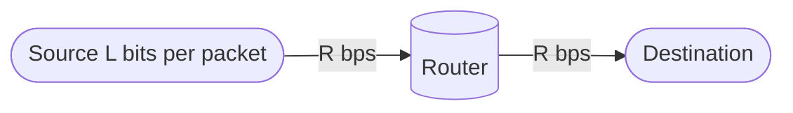

# Computer Networks

## What is the internet?
The internet is a collection of networks with billions of connected computing devices.

+ Devices
    + Hosts run network apps.
+ Packet switches
    + Forward packets (chunks of data) to their destination.
    + Done by routers and link-layer switches.
+ Communication links
    + Fiber, copper, radio spectrum (WiFi, 4G, satelite)
    + Transmission rate: *bits per second* (bandwith)

### Network of networks
+ Home networks, enterprise networks, mobile networks
+ Internet Service Provider (ISP)
    + hosts connect to the internet via access ISPs
    + most ISPs own part of the physical network (fiber, cables, etc)
+ Interconnected ISPs
    + Regional, National, Global ISPs
    + resulting network is very complex
    + evolution driven by economics, national policies
    

### Protocols and standards
*A protocol defines the format and the order of messages exchanged between two or more communicating entities, as well as the actions taken on the transmission and/or receipt of a message or other event*

+ TCP, IP, HTTP etc.
+ Internet Standards
    + Request for comments (RFC)
    + IETF: Internet Engineering Task Force

### How ISPs are connected
Access networks connect to global ISPs.
Global ISPs are connected either by `Interent exchange points` or by `peering`.

#### Peering:
+ two or more ISPs interconnect with each other to exchange internet tracfic for mutual benefit.
+ public peering (at IXP) or private peering (direct interconnects)

### Content providers networks
Big content delivery networks CDNs may run their own networks for better control and service.

## Operation principles:

### Packet Switching:
Network forwards `packets` from one router to the next across links on path from source to destination.

`Packets`:
+ data from application is broken into smaller chunks, `packets`, of length L bits.
+ Length is typically is variable but upper bounded.
+ A packet contains data and a header.
+ The header contains control information e.g. the destination of the packet.

#### store and forward:
Entire packet must arrive at router before it can be transmitted to the next link.

+ `packet transmission delay`: takes `L/R` seconds to transmit (push out) L-bit
packet into link at R bps

packet transmission delay = time needed to transmit L-bit packet into link = L (bits) / R (bits/sec)

#### Queueing

If the arrival rate (in bps) to a link exceeds the
transmission rate (bps) of link for some period of time:
+ packets will queue, waiting to be transmitted on output link
+ packets can be dropped (lost) if memory (buffer) in router fills up

#### Circuit switching - Alternatice to packet switching
*end-end resources allocated to, reserved for “call” between source and destination*

dedicated resources: no sharing
+ circuit-like (guaranteed) performance
+ circuit segment idle if not used by call (no
sharing)

##### FDM
*Frequency Division Multiplexing*
+ optical, electromagnetic frequencies divided
into (narrow) frequency bands
+ each call allocated its own band, can
transmit at max rate of that narrow band 

##### TDM
*Time Division Multiplexing*
+ time divided into slots
+ each call allocated periodic slot(s),
can transmit at maximum rate of
(wider) frequency band (only) during
its time slot(s)

### Packets vs. Circuits
Two methods for organizing communication in a network:
1. **circuit-switching**:
    + for each connection between two endpoints a part of the link speed is reserved
    + very suitable if the users need a constant number of bits per second; e.g telephony
    + circuit establishment overhead
2. **packet-switching**:
    + information flows through the network as packets, which one after the other are sent at the full link speed
    + very suitable if the users’ needs are very variable; e.g., Internet traffic 

### Layering

Networked systems often use a layered design
Because, layering provides conceptual and
structural advantages
+ a structured way to discuss system components
+ modularity makes it easier to update system
components
Each layer uses the service from the layer below it, to
provide a better, more useful, more complete service
to the layer above it
+ Each layer may introduce its own header
“One layer’s header is (part of) another layer’s data.” 

| Layer        | Responsability | Example | Message Name | Addressing |
| ------------- | ------------ | ------- | ------------ | ---------- |
| Application Layer | User applications such as web browsing, email | HTTP, SMTP, etc| Message | |
| Transport Layer |  End to end delivery of segments |  TCP (reliable, connection-oriented, flow control), UDP (unreliable, connectionless, no flow control) | Segment | Port # |
| Network Layer | Routing of packets from a source to destination | IP | Datagram | IP address |
| Link Layer | Unreliable delivery of frames to a neighbour node | WiFi, Ethernet | Frame | MAC address |
| Physical Layer | Unreliable delivery of bits | wireless, wired (optical links, coaxial cable, copper) | | |

### Hourglass Model

Thin waist of the Internet is IP:
+ Multiple application, transport
protocols above IP
+ Multiple link layer and physical layer
below IP

### Addressing in the Internet
IP address: Unique address showing the recipient

Computers on the Internet are identified by IP
addresses:
+ a 32-bit number, for example:
10000010 01011001 00000011
11111001
+ For convenience, octets are
usually written down in decimal,
for example 130.89.3.249.

IP addresses are assigned systematically;
+ For example, all addresses starting with 130.89 are on the University of
Twente (IP = Network ID + Host ID). 

For human convenience, many hosts also have a name, for example
+ www.utwente.nl.
+ Converting names to IP addresses and vice versa is done by the Domain
Name System (DNS)
47

+ Each sub-network has a subset
of the UT's full address range.
+ Routers outside the UT only
need 1 entry in their
forwarding tables for the
entire UT; subnetworks are
handled within the UT.

#### IPv4
32-bit addresses
2^32 ~ 4 Billion

But, shortage of IP addresses.

Domains:
+ For human convenience, many hosts also have a name, for
example www.utwente.nl
+ Converting names to IP addresses and vice versa is done by the
Domain Name System (DNS)

### Routing and Forwarding
**Routing**: Finding a path between a source and a
destination over the most appropriate routers
**Forwarding**: local action, moving incoming
packet to appropriate outgoing link of the router

## Performance metrics: loss, delay, throughput

How do packet delay and loss occur?

+ packet **queue** in router buffers, waiting for turn for transmission.
    + queue length grows when arrival rate to link (temporarily) exeeds output link
    capacity
+ packet **loss** occurs when memory for the queue if full.

### Best-effort service:

+ Internet provides best effort service: no guarantees
+ lost packet may be retransmitted by previous node, by source end system, or not at all

### packet delay: four sources:
+ $d_{nodal}$: total delay at a node e.g, router
+ $d_{proc}$: processing delay
    + check bit errors
    + determine output link
    + typically < microsecs
+ $d_{queue}$: queue delay
    + time waiting at output link for transmission
    + depends on congestion level of the router.
+ $d_{trans}$: transmission delay
    + L: packet length (bits)
    + R: link transmisson rate (bps)
    + $d_{trans} = \frac{L}{R}$
+ $d_{prop}$: propagation delay
    + d: length of physical link
    + s: propagation speed (~$2*10^8$ m/sec)
    + $d_{prop} = \frac{d}{s}$

$d_{nodal} = d_{proc} + d_{queue} + d_{trans} + d_{prop}$

### Delays for multiple packets:
When considering the delay of multiple packets:
+ Some delays add up: e.g., next packet can only be transmitted
after previous packet's transmission delay has ended.
+ Others don't: e.g., several packets can be propagating on the line
simultaneously.

### Throughput
Throughput is the rate (bits/time) unit at which bits are being sent from sender to receiver

The average end to end throughput is the bottleneck link: the link with the lowest capacity.

## TCP
Connection-oriented protocol

+ A logical connection is established between the two ends before data transfer
+ Connection establishment via three-way handshake
+ Bidirectional connection, data flow in two directions
+ Reliable delivery
+ reliable: every transmission of data is acknowledged by the receiver.
+ packet loss and corruption might happen but TCP finds it out.
+ retransmission of lost packets:
+ If the sender does not receive acknowledgement within a specified amount
of time, the sender retransmits the data
+ Flow control, congestion control

### TCP segment:
Source and destination ports (distinguish between multiple
connections)
• Sequence number (used to order packets)
• the first byte of data included in the segment
• Acknowledgement number (used to verify packets are received)
• indicates the byte number of the next data that is expected to
be received
• All bytes up through this number have already been received

### Connection establishment

Threee way handshake:
1. Host_A: **SYN:** I want to connect and I will send my data starting with sequence number Initial Sequence Number (ISN) X.
2. Server_B: **SYN, ACK:** Yes you can connect, I will send my data starting with sequence number (ISN) Y, and expect X+1 from you,
3. Host_A: **ACK:** Sounds good, I expect Y+1 from you.

### Problems:
What TCP does in case:
+ Channel results in bit errors and corruption of the message.
    1. Receiver receives all data but detects errors
    2. Receiver tells the sender: “please repeat that”
    3. Sender retransmits the data that were corrupted
+ Packet loss and corruption.
    1. Receiver receives some data, some is lost, and some is corrupted
    2. Receiver detects errors but cannot always detect loss
    3. Sender must wait for acknowledgment (“ACK” or “OK”)
    4. and retransmit data after some time if no ACK arrives

### TCP header fields:
+ **Seq** is the sequence number of the first byte of application-layer data in this
packet; or, if this packet does not contain any application-layer data, it is the
sequence number that such a first byte "would have" had if it were there. 
+ **Ack** is the sequence number of the next byte expected by the sender of this
packet; it acknowledges all bytes with lower sequence numbers (therefore it is
called a "cumulative" acknowledgement). 
+ **Len** is the number of application-layer bytes in this packet (only in Wireshark). 
+ **SYN** begin connection.
+ **FIN** end connection.

## User Datagram Protocol (UDP):
+ Conectionless
+ Unreliable
+ Packets may or may not arrive at destination
+ no handshaking before sending a segment
+ best-effort approach

### UDP pros:
+ small overhead, no need to establish a connection.
+ no need to keep a state at sender and receiver.
+ video streaming used UDP, nowadays it uses TCP/HTTP video streaming.
