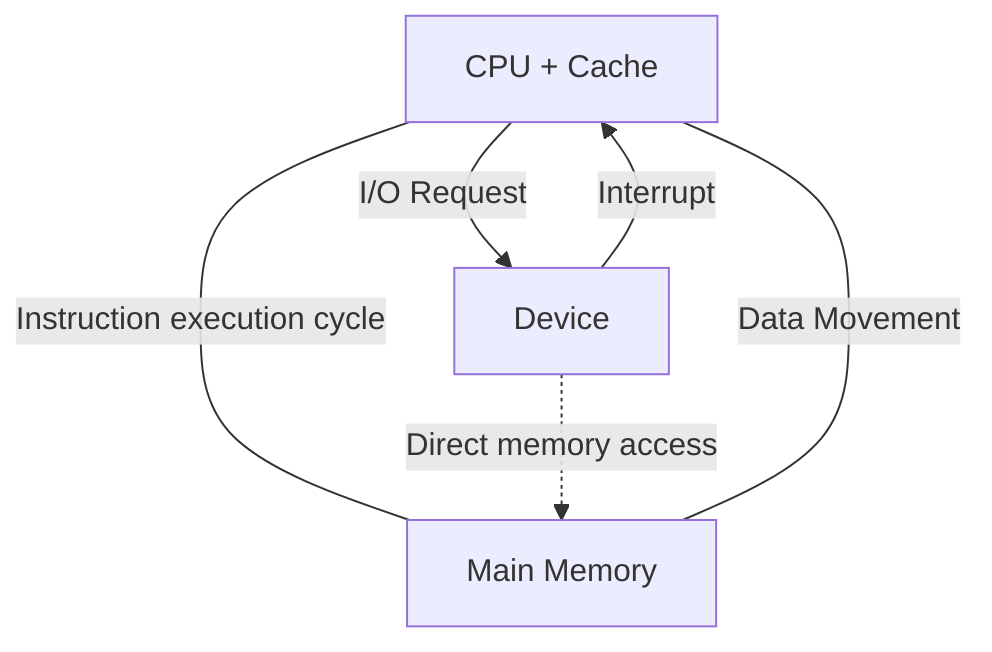
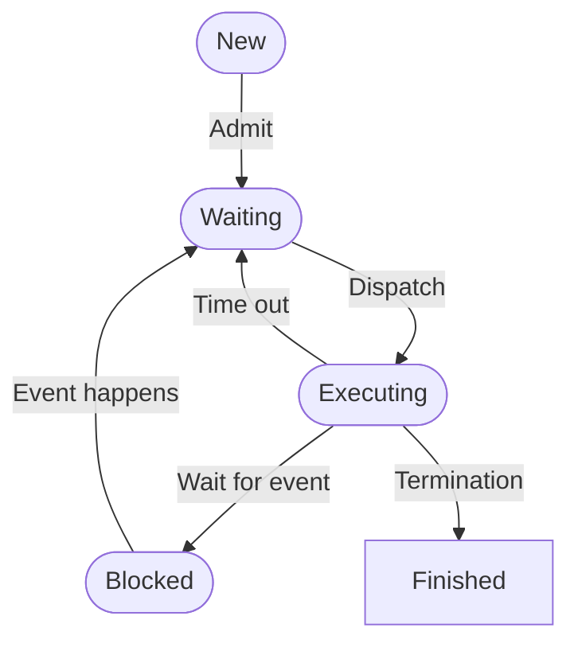

# Operating Systems

## What is an operating system ?

+ Bridge between users and computer hardware.
+ A program controlling the execution of all other programs

---

+ It *allocates resources* for apps considering fairness and efficiency.
+ It *controls* all execution of programs.
+ It *abstracts* to eliminate complexity.

---

1. Switch on computer
2. Bootstrap Program
3. OS starts

### Design goals of an OS:

+ User goals:
    + convenient
    + easy to learn
    + safe
    + fast
+ System goals:
    + easy to design, implement, maintain.
    + flexible.
    + reliable.
    + efficient.
    + prevent malicious or accidental bad behavior.
    + protection between apps, users (isolation is key)
    + Reliable
    + Portable (runs on small devices)
    + Security
    + Energy efficient.

## Running multiple programs at the same time:
+ the OS manages switching processes from execution.
+ It is possible with multiple cores.
+ Not possible with one core.
alternative: switch between process 1 and 2.

## Tasks Of an OS
+ Managing computer hardware and connected peripherial equipment.
+ Need for access to shared resources.
+ OS enables sharing resources in two different ways:
    + In time: CPU time
    + In space: memory space, permanent storage

## How a modern computer works

### CPU
*Central processing unit / Processor*
+ `Fetch` the instructions of a
program from memory 
+ `Decode` the instruction (e.g.,
add two numbers) 
+ `Execute` the instruction

### Main Memory
*Random Access Memory or RAM*

A large array of bytes that CPU can access directly:
+ instructions must be in main memory
+ Temporary (volatile) storage of the processes
+ Program is static, process is active = in execution

### Storage devices
1. Registers
2. Cache
3. Main Memory
4. Non volatile memory
5. Hard-disk drives
6. Optical disk
7. Magnetic tapes

|Key-Word|Definition|
| -- | -------- |
| Speed or access time | time it takes to access the stored information  |
| Cost per bit | monetary cost per bit |
| Size | storage capacity in bits |
| Volatility | if data can be stored permanently, if it is volatile it is not permanent |

|Key-Word|Definition|
| -- | -------- |
| process | program in execution, a unit of work within the system |
| program counter | the status of the current activity of a process (memory address of the next instruction to be executed |
| | |
| | |

### IO (Input/Output)

controlling the peripheral hardware:
• keyboard, mouse, screen, hard disk,
printer, etc.
•Interrupts (processor temporarily stops to
execute OS code according to the
interrupt’s type)
• Hardware interrupts vs. software-generated
interrupts (called trap or exception)
• Some peripherals can access the memory
directly without needing to interrupt the
CPU
•Direct memory access (DMA) 

## Main tasks of an OS:

### Process managment

### Memory Managment

Assigning parts of memory resources among competing processes
Deciding which processes (or parts thereof) and data to move into
and out of memory
Keeping track of which parts of memory are currently being used and
by whom
Provide isolation among processes
Allocating and deallocating memory space as needed

swapping:
storing the contents of memory which momentarily is not needed
(because its process is currently not running) on hard disk, so the
memory can be used by another process

virtual memory:
using the hard disk to pretend that there is more memory than there
physically is
it enables users to run programs that are larger than actual physical
memory

### File Managment
**files**: long sequences of bits or (usually)
bytes with meta-information: name, size, owner, creation date.

+ How to find information?
+ Bookkeeping to keep track of which part of which file is stored in which sector of the hard
disk
+ Files are organized hierarchically into “directories” (popularly also called “folders”)
+ How to monitor the free blocks?
+ How to ensure that one user cannot read another user’s data?
+ Protection among users via different access rights to files

File system examples:
+ NTFS on Windows
+ ext2, ext3, ext4: filesystem on Linux systems, ext4: also on Android 

## Protection

**isolation** of processes

+ Each process has its own memory space.
+ Not allowed to access outside its address space.
+ If it attempts to access, an **exeption** is raised.

+ Proper authorization from the operating system (kernel vs user mode)
+ A process can execute only within its own address space!
+ Timer to ensure that no process can gain control of the CPU without eventually
relinquishing control
+ Distinguish between users (authentication of users, which user can do what
with what? e.g., reading/writing files, accessing I/O equipment)

## Two modes of operation: user vs. kernel mode
How to prevent buggy or malicious applications to
harm the computer?

+ Hardware support to distinguish between the
execution of operating-system code and userdefined code (a protection mechanism)
**Kernel mode (mode bit: 0)**
+ executing on behalf of the OS, privileged
instructions (e.g., setting the mode bit)

**User mode (mode bit:1)**
+ executing on behalf of the user, some actions are
not possible to execute
+ raise a trap to the OS if attempted to execute
such actions
+ System call: user program asks the OS to perform
some tasks on the user program’s behalf via system
calls

## Virtual Machines
*software that simulates an entire computer.*

• An entire operating system can be run within a VM.
• Multiple VMs can run on a single "real" machine.
• sharing the processor efficiently is done by *hypervisor* software.

VMs are useful for:
+ Developing/Testing apps for multiple OSes
without having multiple systems