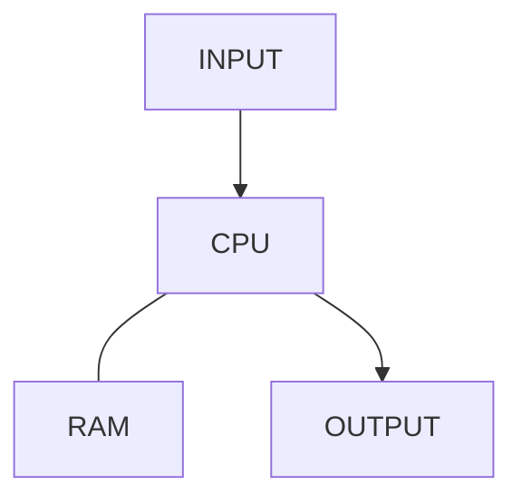

# Python

python has an interpreter, instead of a compiler

graph.png

## basic computer architecture | von neumann diagrams

```mermaid
graph TD;
    INPUT-->CPU;
    CPU---RAM;
    CPU-->OUTPUT;
```

## Pycharm IDE

## Print statements

## Debugger