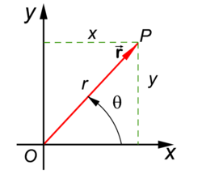

# Functions of several variables

## Visualization:
the n-dimensional real space $\mathbb{R}^n$ is defined as the set:
$$\mathbb{R}^n = \{(x_1, x_2, ... x_n)| x_i \in \mathbb{R}\}$$

::: theorem Definition
Let D be a subset of $\mathbb{R}^n$. A **real valued function** f on D is a rule that assigns a unique real number $f(x_1, x_2, ... x_n)$ to each point $(x_1, x_2, ... x_n) \in D$
:::

## The graph of a function on $\mathbb{R}^2$

::: theorem Definition
Let $f: D \subseteq \mathbb{R}^n \to \mathbb{R}$ be a real valued function.
The graph of f is defined as the set:
$$\{(x_1, ..., x_n, f(x_1, ..., x_n)) \in \mathbb{R}^{n+1} | (x_1, ... x_n) \in D\}$$
:::

+ The graph of a function of n variables is a subset of (n + 1) dimensional real space $\mathbb{R}^{n+1}$
+ The graph of a function of 2 variables is a surface in $\mathbb{R}^3$

### Level curves

::: theorem Definition
Let $f: D \to \mathbb{R}$ be a function with domain $D \subseteq \mathbb{R}^2$, and let c be a real number. The **level curve** at level c is the set.
$$\{(x,y) \in \mathbb{R}^2 | f(x, y) = c\}$$
:::

+ the level curve can also be called a contour line

## Limits of functions on $\mathbb{R}^2$
+ limit laws work the same way.
+ The replacement rules are similar (instead of an interval surrounding c, use an open circular disc with center c)
+ there is a sandwich theorem.
+ definition and properties of continuity are automatically inferred.

### Continuity:
::: theorem Definition
Let $f: D \to \mathbb{R}$ be a function of n variables and let $c \in D$
The function f is continuous at c if:
$$\lim_{x \to c} f(x) = f(c)$$
:::

Practical approach:
1. f(c) exists (c lies in the domain of f)
2. $\lim_{x \to c} f(x)$ exists (f has a limit as x approaches c)
3. (check that the limit equals the function value)

### Path limits
+ Difference to functions of one variable: there are no one sided limits.

::: theorem Definition
A path limit is the limit of f(x) where x approaches c along a
continuous path ending in c.
:::

::: theorem Theorem
The following statements are equivalent:
+ (i) The limit $\lim_{x \to c} f(x)$ exists
+ (ii) All path limits of f(x) along continuous paths ending in c exist, and have the same value.
:::

::: warning
In order to conclude i from ii you must show that path limits exist.
and are the same along every possible path.
:::

#### Showing that a limit does not exist:
::: theorem Theorem
1. If a path limit along a continuous path ending at c does not exist, then $\lim_{x \to c}f(x)$ does not exist.
2. If two paths limits along continuous paths ending at c do exist, but they are not the same then $\lim_{x \to c}f(x)$ does not exist.
:::

## Polar coordinates:

+ Every point (x, y) is described by two polar coordinates r and $\theta$
+ The number r is called the radius, and is defined as the distance to (0, 0)
+ the number $\theta$ is called the polar angle, and is defined as the angle between the vector **r** and the positive x-axis.

### Coordinate transformation:
+ From polar coordinates to Cartesian coordinates:
$$x = r \cos \theta,\, y = r \sin \theta$$
+ From Cartesian coordinates to polar coordinates:
$$r = \sqrt{x^2 + y^2},\, \theta = \arctan{x, y}$$

### Limits and polar coordinates:
::: theorem Theorem
Let f be a function of two variables.

If, after transformation to
polar coordinates, f(x, y) can be written in the form:
$$f(r\cos{\theta}, r\sin{\theta}) = r^{\alpha}g(\theta)$$
with:
+ $\alpha \gt 0$
+ $g(\theta)$ bounded function.

then:

$$\lim_{(x,y) \to (0,0)} f(x, y) = 0$$

+ If the two requirements are not satisfied the limit most likely does not exist.
:::

## Partial Derivatives

::: theorem Definition
+ The partial derivative of f with respect to x at (x0, y0) is:
$$\frac{d}{dx}f(x_0, y_0) = \lim_{h \to 0} \frac{f(x_0 + h, y_0) - f(x_0, y_0)}{h}$$
+ The partial derivative of f with respect to y at (x0, y0) is:
$$\frac{d}{dy}f(x_0, y_0) = \lim_{h \to 0} \frac{f(x_0, y_0 + h) - f(x_0, y_0)}{h}$$
:::

### How to calculate partial derivatives:
+ The partial derivative with respect to x is the derivative of the function f(x, y) where y behaves like a constant.
+ The partial derivative with respect to y is the derivative of the function f(x, y) where x behaves like a constant.

### Higher Order Partial derivatives of f:
+ $f_{xx}(x,y)$
+ $f_{xy}(x,y)$
+ $f_{yx}(x,y)$
+ $f_{yy}(x,y)$

### Mixed higher order partial derivatives:
::: theorem Mixed Derivative Theorem
If f(x,y) and it's [partial derivatives](#higher-order-partial-derivatives-of-f) exist and are continuous on an open environment of (a, b) then

$$f_{xy}(a,b)  = f_{yx}(a,b)$$
:::

## Linearization

### The tangent plane

+ The tangent plane V at $p = (x_0, y_0, f(x_0, y_0))$ is spanned by the vectors $u = (1, 0, f_x(x_0, y_0))$ and $v = (0, 1, f_y(x_0, y_0))$

+ A normal vector is $n = v \cdot u$
+ $n = (-f_x(x_0, y_0), -f_y(x_0, y_0))$

+ A normal equation for V is $n \cdot (x - p)$ or

$$z - f(x_0, y_0) = f_x(x_0, y_0) \cdot (x - x_0) + f_y(x_0, y_0) \cdot (y - y_0)$$

::: theorem Definition
The tangent plane is the graph of the linear function $L: \mathbb{R}^2 \to \mathbb{R}$ defined by

$$L(x, y) = f(x_0, y_0) + f_x(x_0, y_0) \cdot (x - x_0) + f_y(x_0, y_0) \cdot (y - y_0)$$

+ this function is the linearization of f at (x0, y0)
+ The function L is an approximation of f in the neighborhood
of (x0, y0)
:::