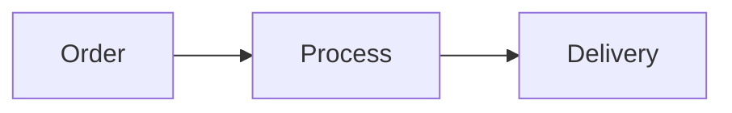
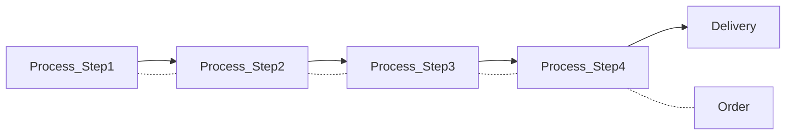
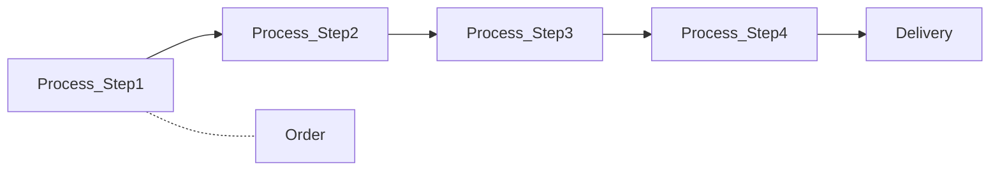

# Proccess Optimization

## How to optimize processes ?

- bottom up:
create an atmosphere of continous improvement.

- top down:
optimize planning and control.

example: Toyota.

### Continous Improvement
- singlaling problems is rewarded
- find causes first, then look for solutions.

## Logistical Paradigms

### 3 principles of Operations Managment:

Main goal:
+ maximize value adding (eliminate non value adding activities)

---

Internal goals:
+ reduce variablility (eliminate disturbances, mistakes variations)
+ reduce complexity (less is more, the easiest solution that works is the best)

what is the optimal balance between reducing variability / complexity

### TOC (Theory of Constraints)

+ Focus on the bottleneck.
+ Focus on non bottleneck is wasted effort.

### Benchmarking

+ Learn by performance comparision.
+ Often results in naminng/shaming/blaming

### ConWIP (Constant work-in-progress)

Strive for continous workload:
- reduces leadtime
- improves quality

Advantages:
+ simple principles
+ simple planning and control
+ process wide orientation

Disadvantages:
+ not suitable when there is high variablility
in the process.

### Push vs. Pull vs. ConWIP

**Push:**

**Pull:**

**ConWIP:**

### Total Access
*Planning is a weakness, do todays work today! Strive for
maximal flexibility*
+ Organize on a “walk-in” basis where possible

Advantages:
+ Simple planning and control
+ No access time

Disadvantages:
+ Possible a lot of waiting time
+ Often not realistic

### LEAN
Eliminate all waste (*Muda*)
focus on efficiency and quality.

Eliminate:
+ Defects
+ Overproduction
+ Transport
+ Waiting
+ Storage (buffers)
+ Movements
+ Doing more than necessary
+ Unused capacities / creativity

Example Lean Instuments:
+ `Kaizen` Plan-Do-Check-Act
+ `Pull Production` demand controlled production
+ `Line balancing` workload control
+ `Just-in-Time` deliver as late as possible (reduce inventory)
+ `Two-Bin` *bin 1* is used for production, *bin 2* is used as reserve, if 1 is empty switch the bins.
+ `Poka Yoke` "mistake proof" production (originally called idiot-proof, for example if you open the door of a microwave it will stop)
+ `Learn by doing` productivity improvment by experience
+ `Single Minute Exchange of Die` leadtime reduction (change production from one product to another in less than 10 minutes)
+ `1:3 and 3:1` 1 person can do 3 tasks, 3 persons can do 1 task

#### Single Minute Exchange of Die
(Shingeo, Shingo) Reduction of setup times
+ Perform steps in parallel
+ Create a standarized and optimized process.

### Just-In-Time
*High volume output, with little (intermediate) inventory of
materials and parts, by:*
+ Group technology: make group of employees responsible for (part of) product.
+ JIT production: working without inventories
+ Quality at the source: quality control in every production step
+ Uniform plant loading: workload and work composition the same every day
+ Focused factory: it is easier to manage small specialized units

### Focused Factory
*Standarize working methods through protocols:
efficient, improved quality.*

+ Focus first on large customer groups.
+ Reserve capacity for these customers.

Advantages:
+ "repetiton may lead to effeciency"
+ Rapid access for patient

Disadvantages:
+ Block access to other patients.

### Six Sigma
*(3,4 mistakes per milllion)*
+ Strive for perfect process: focus on quality.
+ Statistical analyses of processes:
eliminate all variations, mistakes etc.

DMAIC cycle:
+ Define: define the problem.
+ Measure: mesure performance.
+ Analyse: find the causes.
+ Improve: design validate and select solutions.
+ Control: implement solutions.

## How should planning and control be designed ?

+ Who ?, what ?, where ?, when ?

Every organization designs this based on:

+ Mission, strategy, vision
+ characteristics of the org. and environment