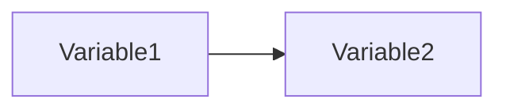

# Managerial Problem Solving Method

## Phases
1. Problem Identification
2. Solution planning.
3. Problem analysis.
4. Solution generation.
5. Solution choice.
6. Solution implementation.
7. Solution evaluation.

## Phase 1: Problem Identification
Find the problem.

### What is an action problem
An action problem is a discrepancy between a norm and reality, a problem owner experiences this problem.

+ norm (variable, value)
+ reality (variable, value)
+ problem owner(s).

you need to choose one of the problem owners.

### Indicators:
variables that are measurable.
+ should be specific.
+ should be close to core problem.
+ take 2-3 indicators per variable
+ take consequences of variable not causes.

### Problem Cluster
1. List problems
2. make a problem cluster. (causal relationships between problems).

### How to find a core problem:
+ Leave out what you don't know.
+ Apply the pneumonia rule: if cause is not relevant for the solution leave it out.
+ Go to a root problem, only relationships going out in the problem cluster.
+ Leave out what you cannot influence.
    + External factors.
    + Internal factors.
+ Relevance rule (cost/benefit analysis.)

## Phase 2: Solution planning.
Plan the path to the solution of the problem.

categories of things to do.
+ Do: take action. (activities)
+ Know: get knowledge.
+ Choose: choices for the solution.

Reasons to make a plan:
+ chart course.
+ monitor course.
+ convince others.
+ to motivate.
+ to commit.
+ to justify.

## Phase 3: Problem analysis.
Find all we need to know about the problem.
+ exact nature of the problem.
+ causes.
+ barriers to solutions.

differences to Phase 1:

| identification phase | analysis |
| -------------------- | -------- |
| context, problem cluster | core problem |
| broad | deep |
| quick scan | research |
| making choices | measuring |
| knowledge that already exists | creating new knowledge |
| action problem | knowledge problem |

knowledge problems:
+ Variable(s).
+ Research population.
+ Relationships.

Descriptive Problem:
You want to find the value of a variable.
is the variable 1, 2 or 3?

Explanatory Problem:
You want tof find the relationship between two variables. how does x influence y ?.

A Model Is a graph with variables:

## Phase 4: Solution generation.
Activities:
+ set requirements for a solution.
+ generate alternative solutions.
+ asses attractiveness of alternative solutions.

Requirements:
+ user: ex. drive on highway.
+ technical: ex. drive at 120 kph
+ Requirement weight: how important is the requirement.
+ min / max score for the requirement.

Generating new solutions:
+ common sense (logical reasoning).
+ creativity
    + brainstorming.
    + synectics.
    + enlarging the search space.
    + morphological forced connections.

assessing the attractiveness of alternative solutions:
+ measuring requirement scores.
+

## Phase 5: Solution choice.
choose a solution for the problem.

Take into consideration the opinions of the problem owner. but keep in mind they can be irrational.

in this phase only discussion is done,
research is no longer performed.

## Phase 6: Solution implementation.
specific to the problem you want to solve.

implementation is shaped by design strategy.

**Design Strategies**:
+ Instrumental approach.
    + master plan.
    + implemented at once.
    + individual.
+ Pragmatic approach.
    + design quick solutions.
    + evaluate them, and make better versions.
+ Communication approach.
    + communicate, and hope that the solution will grow organically from the communication.
+ Artistic approach.
    + everyone is different so we cannot define a solution

## Phase 7: Solution evaluation.
Check if solution was successful.

Sub-Phases:
+ Research
    + to what extent was the problem solved.
    + what were the factors that influenced success.
+ Judgment
    + are we satisfied with the results.
+ Choice
    + can we accept the results.
    + start again with another problem or try again with the same problem.

Evaluation often not done.