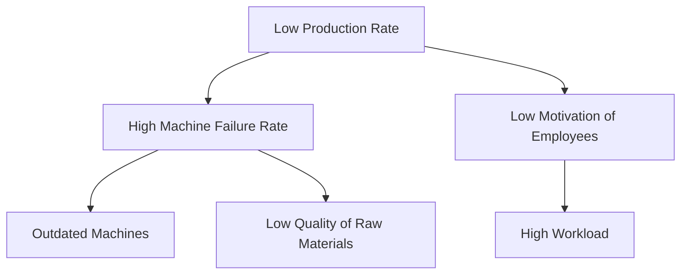

# Problem Identification
*Problem identification* = first part of research.

::: theorem Structure
+ Introduction
    + Justification. (ex. revenue is down)
    + Context
        + Problem Cluster
    + Problem or challenge
:::

## Data gathering

The client or employer you are working with will report gaps between expectation and reality.

You should search for related problems to the problems reported.

### data gathering methods:
+ communication approach
+ analysis of primary sources
+ observation
+ literature study
+ ask questions: convo with client

### cleanup:
+ stakeholder analysis
+ problem cluster

Identify problems that cause other problems: *Core Problem*. Choose one to research.

following these guidelines for choosing a core problem:
+ leave out what you can't influence
    + external factors
    + internal factors (management choices)
+ Take the most relevant remaining candidate:
    + Prioritization.
    + Cost-Benefit analysis.

