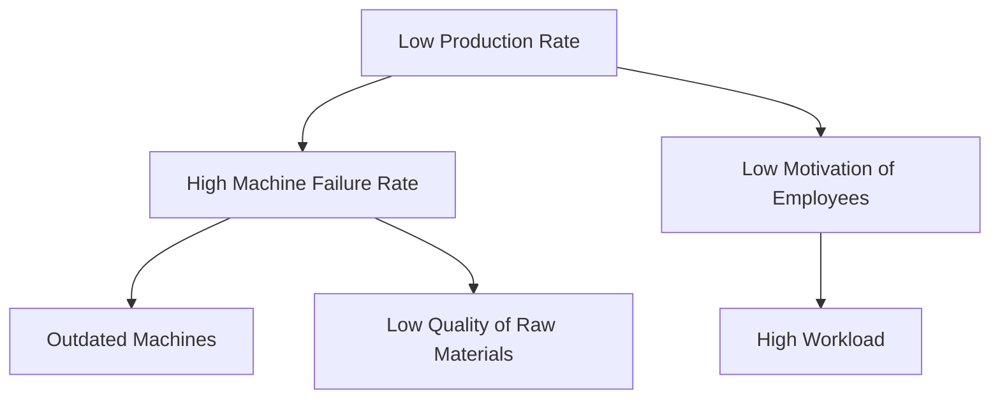

# Problem Inventory
*Problem identification* = first part of research.

+ Introduction
    + Justification. (revenue is down)
    + Context
        + Problem Cluster
    + Problem or challenge

## Data gathering

The client or employer you are working with will report gaps between expectation and reality.

You should search for related problems to the problems reported.

### data gathering methods:
+ communication approach
+ analysis of primary sources
+ observation
+ literature study
+ ask questions: convo with client

### cleanup:
+ stakeholder analysis
+ problem cluster

Identify problems that cause other problems: *Core Problem*

