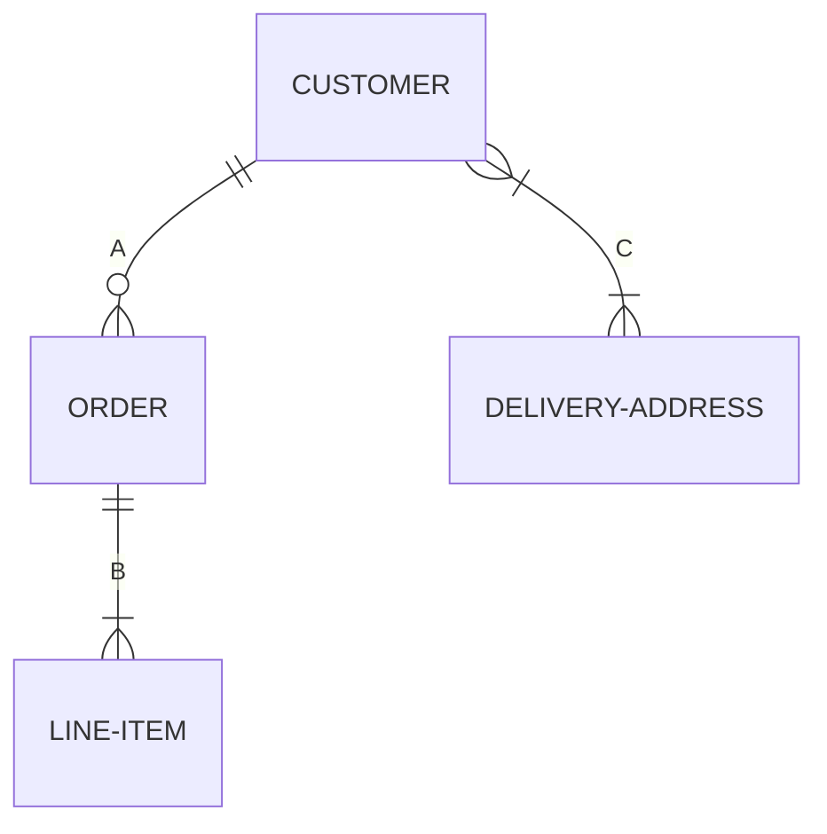

# Data Modeling

+ Businesses assume the creation and manipulation of data.
+ Data = corporte wide resource: transctional data, oricess data, external data.
+ Data = value
+ The types of data used within an organization does not change much.
+ Data has certain inherent properties.
+ If we structure data according to their inherent properties, the structure (i.e models will be stable)
+ Data @ the core of database technologies.

## ERD
*entity-relationship diagram*
+ invented by Peter Chen 1976
    + A conceptual / logical data modeling tool
    + A user-oriented approach
    + A graphic-based method

### Entity
An entitiy is an object / phenomenon, real or abstract about which we would like to store data.

An entity is described by a set of atributes
How to select entities ?
Information required by your buisness process.
Things that are of interest to the business that need to be remembered in order or manage and track them.

### Relationship
+ A relationship type is an association between two entities.
+ Relationship membership is the participation of an entity in a relationship.
+ A relationship can involve only two entities.

#### Relationship cardinality
+ One-to-One 1:1

*Countries - Capital cities*
+ One-to-Many 1:M

*Books - Pages*
+ Many-to-Many M:N

*Authors - Books*

#### Crow foot notation

##### Legend:
**A:**
+ A customer has 0 or more orders. (modeled next to the order)
+ An order has at least and at most 1 customer (modeled next to the customer)

**B:**
+ An order has least one or more line Items.
+ a line item has at least and at most 1 order.

**C:**
+ A delivery address has at least 1 or more customers. (two customers live at the same address)
+ A customer has one or more addresses. (two different homes)

#### Many-To-Many Relationships - Junction table:
If you want to have a many to many relationship you need an extra table

For example:
If you want to have a relationship between table 1 and table 2:

| primary key | foreign key (table 1) | foreign key (table 2) |
| ----------- | --------------------- | --------------------- |
|      1      |           30          |          40           |

Notations:
+ Crow's Foot
+ Chen notation
+ Bachman
+ Min-Max
+ UML