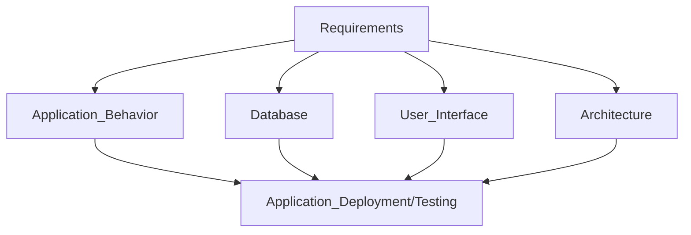

# Information Managment
full name = *information systems managment*

## What is information mangment ?
+ managment process
+ IT systems that help to deal with data

## 3-Tier Architecture 
+ Presentation Layer
+ Application Layer
+ Database Layer

Steps of design:
1. Conceptual Design
2. Logical Design
3. Physical Design

Requirements:
+ Specification Documents
+ Use Cases
+ Business Models

Types of models:
+ Requirements Models (BMC)
+ Process models (BPMN)
+ Data models (class diagrams, ER diagrams)
+ Architecture models 
+ Interface Models

### Business model
*A business model describes the rationale of how an organization creates, delivers, and captures value, in an economic, social, cultural or other context.*

#### Key Words:
+ `Activity`
+ `Structure`
+ `Sequence`
+ `Beginning`
+ `Input`
+ `Output`
+ `Beginning`
+ `End`
+ `Time`
+ `Customer`
+ `Result`

Modelling for business models:
+ BMC
+ 3EM

### Business processes
*a specific ordering of activities that has recevies an input and produces output that is of value to a customer*

Modelling for buisness processes:
+ informal models: textual descriptions / free form
+ formal models: BPMN, EPC, BuissDesigner

Why should you model this?
+ You know how the business works.
+ it's explicit, so it is better for
    + Analysis
    + Optimization
    + Managment
+ Identifies automatization possibilities.

## BPMN

| Flow Objects | Connecting Object | Swimlanes | Artifacts |
| ---------- | --------------- | -------  | -------  |
| Events | Sequence Flow | Pool | Data Object |
| Activities | Message Flow | Lanes | Text Annotations |
| Gateways | Association | | Group |