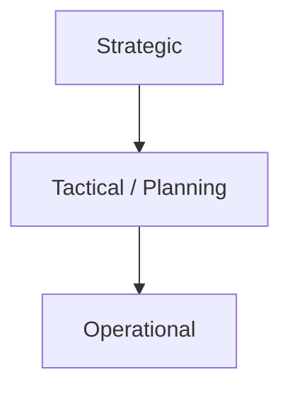
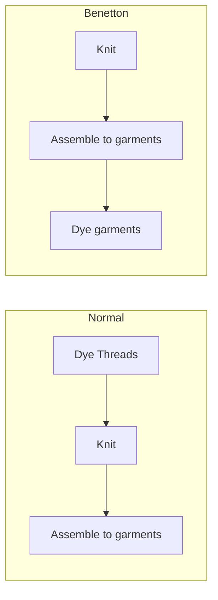

# Supply Chain Management
*Consists of all parties involved, directly or indirectly in fulfilling a customer request*

*In fact not a chain but a network*

Includes:
+ retailers
+ wholesalers
+ manufacturers
+ customers

### Objectives of Supply Chain Management:
+ Effectively managing assets and products, inventories, information, and fund flows (in both directions)
    + SC(supply chain) costs include information, storage, transportation, components, assembly, etc.
+ Maximize overall value created:
    + $Supply Chain Surplus = Customer Value - Supply Chain Cost$ 
    + Success should be measured by the total supply chain surplus, not by profits at an individual stage.

### Examples of SCM (Supply Chain Management):

+ Wall Mart: Supply chain win :chart_with_upwards_trend:
    + Invested heavily in transportation and information sharing 
    + Cluster of stores around DCs (*Distribution Centers*) for frequent store replenishment
    + Match supply and demand more effectively
    + Information sharing and supplier collaboration to improve product availability and bring down costs
    + Sales increase between 1980 and 2010: $1 billion => $408 billion (22% growth per year)
+ Borders: Supply chain fail :chart_with_downwards_trend:
    + Superstore for books sales
    + was offering greater variety far more titles than local book stores, dominating the market along with Barnes & Noble
    + Sales $4 bln. in 2004 dropped to $ 2.8 bln. in 2009 (Amazon: internet sales offer more titles at a lower cost through a few DCs (*Distribution Centers*)
+ Dell: the original dropshipper. :computer:
    + Earns its success based on its supply chain design
    + Between 1993-2006 made a decision to sell directly to customers bypassing distributors and retailers
    + Centralization of manufacturing and inventories in a few locations and final assembly is postponed until the customer order arrives
    + Large variety of PC configurations with low cost
    + By 2006 sales increased to $ 56 bln (still similar). 
    + Faced a challenge: Market shifted to low level customization.
    + Given growing power of hardware customers were satisfied with few models 
    + Adapts its supply chain by operating two supply chains for two markets
    + *Make to order* for customized and *make to stock* for low customized

## Decision Phases of a Supply Chain:
1. Supply Chain **strategy** or design
    + how to structure the supply chain over several years.
2. Supply Chain **tactical planning**
    + Decisions over a quarter or year.
3. Supply Chain **operation**
    + Daily or weekly operational decisions

### Examples
+ **Stategic**: long-term, expensive, must take into account market uncertainty
    + Whether to outsource or perform a supply chain function in-house
    + Example: Pepsi purchases two of its largest bottlers to react more quickly 
    + Locations and capacities of facilities (manufacturing, warehousing)
    + Products to be manufactured (where to produce) and stored at various locations (where to store)
    + Type of information system to be utilized
+ **Planning**: Must consider in planning decisions demand uncertainty, exchange rates, competition over mid-time horizon
    + Locations are fixed, which markets to supply from which locations Example: Arcelor Mittal’s decision regarding production quantities at each location From where to subcontract
    + Warehouse locations are fixed, inventory policies
    + Timing and size of market promotions
+ **Operations**: less uncertainty, Focus on service (due date) / efficiency (cost)
    + Allocate an inventory or release a production order for customer orders
    + Set orders for the week
    + Generate pick lists at a warehouse, 
    + Set delivery schedules and all sorts of scheduling

## Customer Order Decoupling Point:

| proactive | reactive |
|--|--|
| processes start before customer order | processes start after customer order |
| forecast driven | order driven |
| efficiency | flexibility |

+ ETO (*engineer-to-order*)
    + example: ship
+ MTO (*make-to-order*)
    + example: furniture
+ ATO (*assemble-to-order*)
    + example: car
+ MTS (*make-to-stock*)
    + example: refrigerator
+ DFS (*deliver-from-local-stock*)
    + example: food

## Examples
+ *Delay product differentiation*: United Colors of Benetton

postpone dying until the selling season gets closer so forecast uncertainty for individual products reduces.

Garment production:

+ *Quick response*: ZARA
+ Zara: design-to-shelf lead time (display new designs every): 3-4 weeks
    + By working with local flexible producers
+ Divide 3 month sales season in three 1-month periods
    + M1: Decide on quantities for first period only, no sales data; 
    + M2: production decisions based on first week of sales data
    + M3: production decisions based on first month of sales data
+ Zara responds to trends rather than having to predict them
    + Much smaller forecasting error; less discounts
+ Issue: costs for manufacturer (smaller batches, costs of lead time reduction), but most revenues for retailer
    + But Zara is vertically integrated

## Push / Pull System
*Two approaches to control production/inventory*
+ push system
    + work release is scheduled based on forecasted (or even actual) demand (hence can be planned in advance).
    + "Make all we can just in case".
    + Large Lots.
    + High Inventories.
+ pull system
    + work release is authorized based on the current inventory / production status (hence real time).
    + "Make what's needed when we need it".
    + Small Lots.
    + Low inventories.

[see diagram](/StudyNotes/Module1/Theme/ProductionManagment/ProductionManagmentOptimization.html#push-vs-pull-vs-conwip)

## Drivers of Supply Chain Performance
+ Logistical Drivers:
    + Facilities
    + Inventory
    + Transportation
+ Cross-functional drivers:
    + Information
    + Sourcing
    + Pricing

## Coordination in the supply chain

### Inventories:
why do you need inventories ?
each type of inventory has it's own name.
+ Processing products in a supply chain takes time (e.g. production, distribution), and during inventories are kept **work-in-process inventory**
+ Because typically production or supply is in larger quantities than demand **cycle inventory**
+ Because of uncertainties in demand => need for buffer **safety inventory**
+ Because of anticipated peaks in demand or supply **seasonal inventory**

### Trade-offs for inventories:
+ work-in-process inventory:
    + Proportional to flow time: $WIP = throughput * flow time$
+ cycle inventory
    + trade off between: `order/setup costs` and `(inventory) holding costs`
+ safety inventory
    + trade off between: `product availability` and `(inventory) holding costs`
+ seasonal inventory
    + trade off between `inventory holding costs` and `costs of flexible demand / supply` (overcapacity, working overtime in production)

### Inventory holding cost
*Inventory holding cost is a cost composed of costs associated with storing inventory.*

Inventory holding cost has many components:
+ Tangible costs
    + tax
    + insurance
    + material handling: financial sheets
+ Intangible costs
    + opportunity: losses in productivity
    + customer goodwill
    + drops in employee morale
    + loss of brand value

### How inventories are managed

#### Webshop Example
*A webshop selling sweaters*

Suppose: you sell 3 sweaters per week on average and it  requires 1 week to receive an order (**lead time**)
+ Order latest when you have 3 items on stock: **reorder point**
+ Add buffer for uncertainty in demand: reorder point = 4, 5, 6?

Account for materials ordered before that have not arrived yet

#### Basic Inventory management
1. Observe demand and try to estimate future demand (**forecasting**)
2. Based on expected demand and variability in **lead time demand**, determine reorder point *ROP*
3. Based on a cost trade-off, find order quantity *Q*
4. Order *Q* when the effective inventory ($InventoryPosition = on hand + on order - backorders$) reaches *ROP*
    + *on hand*: :package: inventory you have.
    + *on order*: :truck: inventory that is on it's way.
    + *backorders*: :back: orders that are pending for your clients.
5. Your supplier follows a similar procedure.

### The Bullwhip effect

+ **Supply chain coordination** is when all stages of the chain take actions that are aligned and increase total supply chain surplus
    + Requires a stage sharing information and taking into account the effects of its actions on the other stages
    + Lack of coordination results when: 
        + Objectives of different stages conflict
        + Information moving between stages is delayed or distorted

+ **Bullwhip Effect**: Increasing swings in inventory in response to shifts in consumer demand, it causes supply chain inefficiencies.
    + Fluctuations in orders increase as they move up the supply chain from retailers to wholesalers to manufacturers to suppliers 
    + Results from: loss of *supply chain coordination*
