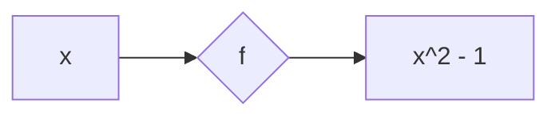
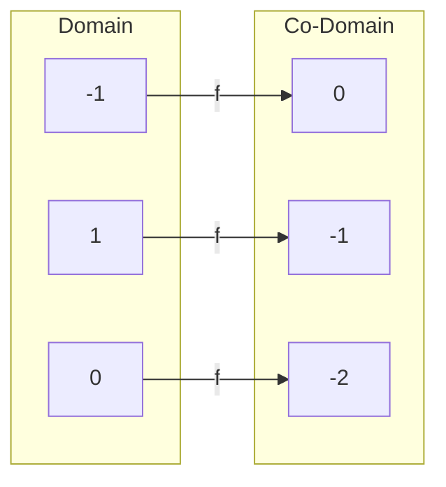
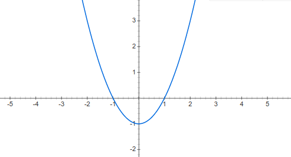
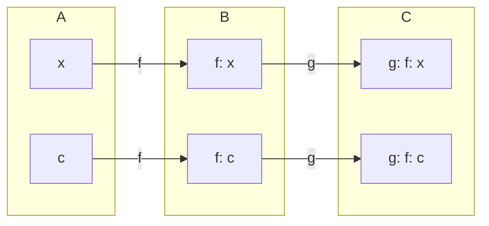

# Limits

## Limits of functions:
There are many ways to interpret a function:

+ As a formula

$f(x) = x^2 -1$

+ As a machine model

+ As an arrow diagram

+ As a graph

::: info Limits
Let $f: D \rightarrow \mathbb{R}$ be a function with domain $D \subseteq \mathbb{R}$.

We say $\lim_{x \to c} f(x) = L$

if f(x) tends to L whenever x tends to c.
:::
+ the limit point c does not need to be an element of D
+ while x approaches c (but is never equal to c), it must be an element of D.

::: info Replacement info
If $f(x) = g(x) \text{ for all } x \neq c \text{ then } \lim_{x \to c} f(x) = \lim_{x \to c} g(x)$
:::

#### One-sided limits

We say

$lim_{x \to c^-} f(x) = L$

if f(x) tends to L when x approaches c from the left.

$lim_{x \to c^+} f(x) = L$

if f(x) tends to L whenever x approaches c from the right.

::: info info
+ $\text{If }\lim_{x \to c} f(x) = L \text{ exists,  then } \lim_{x \to c^+} f(x) = \lim_{x \to c^-} f(x) = L \text{ exist}$
+ $\text{If }\lim_{x \to c^-} f(x) \text{ and } \lim_{x \to c^-} f(x) = L \text{ exist, then } \lim_{x \to c} f(x) = L \text{ exists}$
:::

+ The limit lim does not exist if one of the following is true:
    + the left limit does not exist. -
    + the right limit does not exist. +
    + both the left and right limit exist but they are not equal.

#### Limits to infinity

::: info Definition
We say $\lim_{x \to \infty} f(x) = L$
if f(x) tends to L whenever x tends to $\infty$, and 

$\lim_{x \to -\infty} f(x) = L$
if f(x) tends to L whenever x tends to $-\infty$
:::

::: warning
Even if $\lim_{x \to c} = +-\infty$, then the limit does <ins>not</ins> exist!
:::

## Well behaved functions

well behaved functions:
+ polynomials
+ exponential functions
+ logarithms
+ sine
+ cosine

because a limit to a point c in the domain of f can be calculated by direct substitution.

$\lim_{x \to c} f(x) = f(c)$

## Replacement Rule

::: info info (weak)
If $f(x) = g(x) for all x \neq c, then \lim_{x \to c} f(x) = \lim_{x \to c} g(x)$
:::

::: info info (strong)
Let I be an open interval containing c. If $f(x) = g(x) for all x \in I$,
then $\lim_{x \to c} f(x) = \lim_{x \to c} g(x)$
:::

## Limit Laws :scroll:
Assume that both $\lim_{x \to c} f(x) = L$ and $\lim_{x \to c} g(x) = M$ exist.

| Name | Rule |
| ---- | ---- |
| *Sum Rule* | $\lim_{x \to c} (f(x) + g(x)) = L + M$ |
| *Difference Rule* | $\lim_{x \to c} (f(x) - g(x)) = L - M$ |
| *Constant Multiple Rule* | $\lim_{x \to c} (k \cdot f(x)) = k \cdot L$ |
| *Product Rule* | $\lim_{x \to c} (f(x) \cdot g(x)) = L \cdot M$ |
| *Quotient Rule* | $\lim_{x \to c} \frac{f(x)}{g(x)} = \frac{L}{M}, M \neq 0$ |
| *Power Rule* | $\lim_{x \to c} (f(x))^n = L^n,\text{ with n } \in \mathbb{N}$ |
| *Root Rule* | $\lim_{x \to c} \sqrt{f(x)} = \sqrt{L} = L^\frac{1}{n}\text{, with n }\in \mathbb{N}$ |

## Indeterminate forms:
A limit is called an indeterminate form if applying the limit laws leads to an
indecisive result.

| limit law | Indeterminate Situation |
| --------- | ----------------------- |
| Difference Rule | $\infty - \infty$  |
| Product Rule | $0 \cdot infty$  |
| Quotient Rule | $\frac{\infty}{\infty} \, or \, \frac{0}{0}$  |
| Power Rule | $1^\infty, \, 0^0 \, or \, \infty^0$ |

## The Conjugate Trick
+ The conjugate trick is based on the following identity:
(a + b)(a - b) = a^2 - b^2
+ a + b is the conjugate of a - b (and vice versa)

## The sandwich info
+ Let f, g and h functions such that $g(x) \leq f(x) \leq h(x) \text{ for all } x \neq c$
+ f is "sandwiched" between g and h.

::: info info
If $\lim_{x \to c} g(x) and \lim_{x \to c}h(x)$ exist, and moreover, are equal
(say to L), then $\lim_{x \to c} f(x)$ exists, and is equal to L
:::

## Continuity at a point.
::: info Definition
Let $f: [a,b] \rightarrow \mathbb{R}$ be a function. Let $c \in [a,b]$.
*Interior Points*:

if a < c < b, then f is **continuous** at c if
$\lim_{x \to c} f(x) = f(c)$

*Endpoints*:

if c = a or c = b, then f is **continuous** at a if
$\lim_{x \to c} f(x) = f(a)$

and f is **continuous** at b if
$\lim_{x \to c} f(x) = f(b)$
:::

### Practical approach :mag:
::: info Continuity Test
A function f(x) is continuous at an interior point c of its domain if and only if
1. f(c) exists -> c lies in the domain of f.
2. $\lim_{x \to c} f(x)$ exists -> f has a limit as x approaches c.
3. $\lim_{x \to c} f(x) = f(c)$ -> the limit equals the function value.
:::

+ If one (or more) of the conditions is not satisfied, f is not continuous at c.

#### Discontinuities:
In all following cases f is not continuous at c:
| Functions | c | Violation |
| --------- | - | --------- |
| $f(x) = \frac{x^2 - 1}{x - 1}$ | 1 | f is not defined at c |

### Laws of continuity :scroll:
Assume that f and g are continuous at c, then the following combinations are continuous at c.
| Name | Rule |
| ---- | ---- |
| *Sums* | $f + g$ |
| *Differences* | $f - g$ |
| *Constant Multiples* | $k \cdot f, with k \in \mathbb{R}$ |
| *Products* | $f \cdot g$ |
| *Quotients* | $\frac{f}{g}, g(c) \neq 0$ |
| *Powers* | $f^n, with n \in \mathbb{N}$ |
| *Roots* | $\sqrt{f}, with n \in \mathbb{N}$ |

### Composition of continuous functions:

::: info info
If f is continuous at c, and g is continouous at f(c), then $g \circ f$ is continous at c.
:::

+ the composition $g \circ f$ is the function that maps x to g(f(x))

### Global continuity

::: info Definition
+ Let I be an interval in $\mathbb{R}$. A function f is **continuous on** I if
for all $c \in I$ the function f is continuous in c.
+ A function f is continuous if f is continuous on its domain.
:::

### Formula functions

::: info Definition
A formula function is a function constructed from elementary functions: 
+ polynomials
+ power functions
+ trig functions
+ exp functions
+ logarithms

and using algebraic operations like:
+ add
+ subtraction
+ multiplication
+ division
+ composition
:::

+ All formula functions are continuous.
+ For all formula functions f and for all $c \in Dom(f)$:
$\lim_{x \to c} f(x) = f(c)$