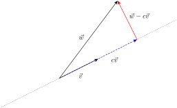
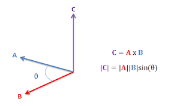

# Vectors

Vectors have magnitude and direction.

Example: Speed has a value and a direction.

::: info Definition
The vector $\overrightarrow{PQ}$ is the directed line segment with initial point P and terminal point Q.
:::

### Conventions and notation
+ Two vectors with the same length and the same direction are considered to be the same.
+ The name of a vector can be written in bold: **v** or underlined <ins>v</ins>

### Standard position and component form
::: info Defintion
+ A vector is in **standard position** if the origin is its initial point.
+ If the vector equals OP where O is the origin and P = (x, y, z), then we write **v** in **component form**:
$v = \langle x, y, z \rangle$
:::

::: info info
If vector **v** has initial point $P \langle x_1, x_2, x_3 \rangle$ and terminal point $Q \langle x_2, y_2, y_3 \rangle$ then

$v = \overrightarrow{PQ} = \langle x_2 - x_1 , y_2 - y_1, z_2 - z_1 \rangle$
:::

### The length of a vector
::: info Definition
The length of the vector v with initial point P and terminal point Q is denoted as $|v|$ and is defined as the distance between P and Q.
:::

+ $|v| = |PQ|$

+ If $v = \langle x,y,z \rangle$, then $|v| = \sqrt{x^2 + y^2 + z^2}$ *(in standard position)*

+ If $v = \overrightarrow{PQ}$  then **$|v| = \sqrt{(x_2 - x_1)^2 + (y_2 - y_1)^2 + (z_2 - z_1)^2}$**

### Unit Vectors
::: info Definition
A unit vector is a vector with length = 1.
:::

+ to get a unit vector from v: $v \neq 0$, then $\frac{v}{|v|}$ is a unit vector

### Direction
::: info Definition
The direction of a non-zero vector v is the vector $\frac{v}{|v|}$
:::

+ Directions are unit vectors.
+ If a direction is in standard position, its end point lies on the unit circle (in $\mathbb{R}^2$), or the unit sphere (in $\mathbb{R}^3$)

### Special vectors

+ **zero vector**: all components are 0, notaion: **0**
+ **standard base vectors**:
    + $\mathbb{R}^2 \langle 1,0 \rangle \langle 0,1 \rangle$
    + $\mathbb{R}^3 \text{:} \langle 1,0,0 \rangle \langle 0,1,0 \rangle \langle 0,0,1 \rangle$

### Scalar multiplication of vectors
Scalar multiplication of a vector v with a real number a results in a shorter or longer vector with the same or opposite direction as v.
::: info info
If $v = \langle v_1, ... , v_n \rangle$

Then $av = \langle av_1, ..., av_n\rangle \, \forall \, a \in \mathbb{R}$
:::

### Sum of two vectors
Two visual ways:
+ head to tail construction: shift v such that the initial point of v is the same as the terminal point of u.

+ parallelogram construction: shift v such that the initial points if u and v coincide.

algebraically:
::: info info
If $u = \langle u_1, ... , u_n \rangle \, v = \langle v_1, ... , v_n \rangle$

Then $u + v = \langle u_1 + v_1, ... u_n + v_n \rangle$
:::

#### Properties
+ $u + v = v + u$
+ $(u+v)+w = u+(v+w)$
+ $u+0 = u$
+ $u + (-u) = 0$
+ $0u = 0$
+ $1u = u$
+ $a(b\boldsymbol{u}) = (ab)\boldsymbol{u}$
+ a(u + v) = au + av
+ (a + b)u = au + bu

### The difference of two vectors.
visually:
+ head to head: shift the vectors such that the initial points coincide
+ v - u is the vector from the head of u to the head of v.
+ u - v is the vector from the head of v to the head of u.

### Dot product
::: info Definition
The dot product of two vectors v and u:

$u \cdot v = v_1u_1 + v_2u_2 + ... + u_nu_v$
:::

+ the dot product is a number.
+ the dot product can be used to describe the length of the vector: $|v| = \sqrt{v \cdot v}$

#### Properties
+ $u \cdot v = v \cdot u$
+ $(cu) \cdot v = u \cdot (cv) = c(u \cdot v)$
+ $u \cdot (v + w) = u \cdot v + u \cdot w$
+ $u \cdot u = |u|^2$
+ $u \cdot 0 = 0$

### The angle between unit vectors.
::: info info
if u and v are unit vectors, and $\theta$ is the angle between u and v, then:

$u \cdot v = \cos{\theta}$
:::

::: info info
if u and v are non-zero vectors and $\theta$ is the angle between u and v, then

$u \cdot v = |u||v|\cos{\theta}$
:::

### Orthogonality
::: info Definition
two vectors u and v are orthogonal or perpendicular if $u \cdot v = 0$
:::

+ if $u \neq 0, v \neq 0$, then the angle between u and v is $\frac{\pi}{2}$
+ if u = 0 or v = 0 then there is no angle between u and v but we still say that u and v are orthogonal.
+ we denote orthogonal vectors with the "$\perp$" symbol : $v \perp u$

### Projection

+ $\overrightarrow{w} - c\overrightarrow{v} \perp \overrightarrow{v}$ in other words:
$(\overrightarrow{w} - a\overrightarrow{v}) \cdot \overrightarrow{v} = 0$

::: info Definition
Let w and v be two vectors, $v \neq 0$ The **Projection** of w onto v is:
$proj_v(w) = (\frac{w \cdot v}{|v|^2})v$
:::

### Cross Product
+ Only in 3 dimensions => vector has 3 components

::: info Definition
Let $u = \langle u_1, u_2, u_3 \rangle\, , v = \langle v_1, v_2, v_3 \rangle$ be two vectors in $\mathbb{R}^3$ the cross product of u and b is:

$u \times v = \langle u_2v_3 - u_3v_2, u_3v_1 - u_1v_3, u_1v_2 - u_2v_1 \rangle$
:::

#### Cross Product Template:
1. Write u and v in a column:
    + $u = \langle u_1, u_2, u_3 \rangle$
    + $v = \langle v_1, v_2, v_3 \rangle$
2. copy the first two leftmost entries of u and v.
    + $u = \langle u_1, u_2, u_3 \rangle u_1 u_2$
    + $v = \langle v_1, v_2, v_3 \rangle v_1 v_2$
3. calculate the first entry of u x v, starting with u_2 in an x shape.
    + $u_2v_3 - u_3v_2$
4. calculate the second entry of u x v.
    + $u_3v_1 - u_1v_3$
5. calculate the third entry of u x v.
    + $u_1v_2 - u_2v_1$

#### Properties:
+ $(r\overrightarrow{u}) \times (s\overrightarrow{v}) = (rs)(\overrightarrow{u} \times \overrightarrow{v})$
+ $u \times (v + w) = u \times v + u \times w$
+ $u \times v = -(v \times u)$
+ $(v + w) \times u = v \times u + w \times u$
+ $0 \times u = u \times 0 = 0$
+ $u \times (v \times w) \neq (u \times v) \times w$

#### Geometric Properties:
+ $u \times v \perp u and u \times v \perp v$
+ $|u \times v| = |u||v|\sin{\theta}$ with $\theta$ being the angle between u an v.
+ right hand rule for $u \times v$:
    + index finger: first vector (u)
    + middle finger: second vector (v)
    + thumb: cross product ($u \times v$)

## Lines and Planes
::: info Definition
The line through P parallel to v is given by
$\{p + tv \in \mathbb{R}^3| t \in \mathbb{R}\}$
:::

where $p = \overrightarrow{OP}$

+ The vector p is called a support vector of l.
+ the vector v is called a direction vector of l.

### Planes in $\mathbb{R}^3$

+ A **normal vector** of M is a non-zero vector orthogonal to M.
+ A plane is determined by:
    + three points, not on one line.
    + by a support vector and a normal vector.

#### Planes by normal vector:
+ If n is a normal vector of M, then for every $X \in M n \perp \overrightarrow{PX}$
+ if $p = \,\overrightarrow{OP} \text{ and } x = \,\overrightarrow{OX}\text{ , then } n \cdot (x - p) = 0$ this equation is called the **normal equation** of M.

#### Planes determined by three points:
How to find a normal vector:
If P, Q and T are three points (not on a line), a normal vector of the plane can be found by taking a cross product, for example: $n = \overrightarrow{PQ} \times \overrightarrow{PR}$

#### Method: Finding a plane equation from three points
*The Plane W goes through three points A, B and C.*

*Determine an equation for the plane W of the form $ax+by+cz-d = 0$*

1. Find a normal vector for the plane W.
    + Find a vector: $\overrightarrow{AB} = \langle B_1 - A_1, B_2 - A_2, B_3 - A_3 \rangle$
    + Find another vector:  $\overrightarrow{AC} = \langle C_1 - A_1, C_2 - A_2, C_3 - A_3 \rangle$
    + Find the cross product of the vectors **AB** and **AC** (we use u and v for readability) $n = u \times v = \langle u_2v_3 - u_3v_2, u_3v_1 - u_1v_3, u_1v_2 - u_2v_1 \rangle$
2. Find a support vector p, which is a vector from the origin to any point on the plane.
    + Choose $p = \overrightarrow{OA}$
3. Replace n and p in $n \cdot (x - p) = 0$ (x can be replaced with $\langle x, y, z \rangle$)