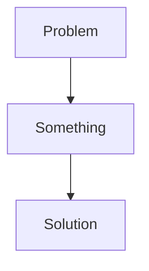
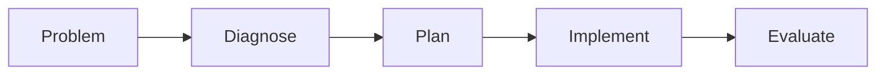

# Research Methodology

*general toolkit for problem solving*
can be used on different domains

study evaluation and design methods and techniques to systematically and transparently
take on the journey to move from a problem or challenge in practice and or theory to an evidence based
solution or answer.

### BIT examples:
+ Business process modelling
	+ Process optimization
+ Simulation
	+ Emergency response
	+ HR config
	+ Warehousing
+ Business & IT alignment
	+ Organization IT architecture

know how the process works at this moment
+ desk research
heuristics interviews
get input for the optimization

### Investigative abilities:
+ Investigative attitude
+ Being able to apply knowledge from others
+ Being able to do research

### Applied Research
aimed at solving practical problems.
+ Theory and research methods are not being tested.

### Fundamental Research
aimed at generating new (scientific) knowledge
that can be used to solve practical problems.
+ Theory and research methods are being tested.

### Research in practice
i.e organizational research

## Researcher Role:
+ Methodologically Sound
+ Practical Relevance

### at University:
1. BA : Stakeholder
2. MA : Field of Research
3. Ph.D. : Society and science

### Research types
+ Induction: Knowing, Generalize, new Knowledge
+ Deduction: Enhance, Contextualized usable knowledge

## Steps
::: info Structure
1. Introduction
*Convince people you know the problem*
	+ Justification
	+ Context: problem cluster
	+ Problem or challenge: Problem statement

2. Theory:
*Convince people you know the solution*
	+ Problem cause or challenge requirement 1
	+ Problem cause or challenge requirement 2
	+ Related work / state of the art
	+ Research questions / requirements

3. Research Method:
*Make this as retraceable as possible*
	+ Problem or challenge 1
	+ Problem or challenge 2

4. Results
*Display results*
	+ Problem or challenge 1
	+ Problem or challenge 2

5. Conclusion & Discussion
*What is happening in this situation*
	+ Problem or challenge 1
	+ Problem or challenge 2
	+ Main Problem

6. Recommendations
*How do the findings have impact*
	+ Main findings
	+ Practical implications
	+ scientific implication

7. Reference list
:::
