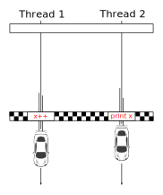
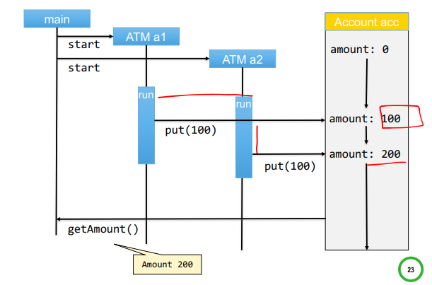
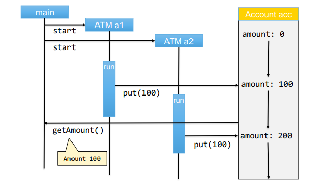
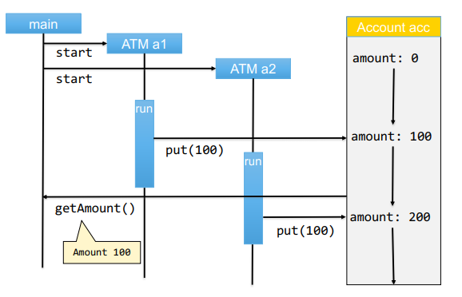

# Concurrency

## Classic Programming Model

A CPU reads instruction from memory and carries them out one after the other.

but,
Modern computers have multiple processors, making it possible for them to perform several tasks at the same time.

## Program, Process, Threads

+ `Program`: a series of coded software instructions to control the operation of a
computer or other machine.

+ `Process`: A program in execution. 

+ `Thread`: A separate thread of control (hence the name) sharing the context
(address memory, open files, etc.) of the process it’s part of.

## Thread Examples

Threads are useful for:
+ Attending network connections concurrently
    + In the case of a Multithreaded Web Server
    + One thread is started per client.
    + when one connection is blocked by an IO operation the processor can be used by other Thread.

+ Helper Tasks
    + For example a word processor.
    + reduces chances of blocking user interface.

## Thread Lifecycle

```plantuml

[*] --> New : instantiate
New --> Runnable : start()
Runnable --> Running : selected by the JVM scheduler
Running --> Non_Runnable : sleep(), block on IO, wait for lock, suspend, wait.
Non_Runnable --> Runnable
Running --> Terminated : run() method exits
Terminated --> [*] : garbage collector
```

## The Challenge Of Concurrency
Data races happen when two threads 
access the same variable, and one thread
is writing to that variable and another thread is reading that variable.

The result of the program depends on the scheduling of the threads.

For example:
```
x = 0

thread1 increases x by 1.
thread2 prints x.

there are two possible outputs for this program.
"0" or "1"
```

depending on which thread wins the data race:



Threads share the **context** of the process that owns them.
Shared access poses the threat of Data Races
We use “Synchronization Mechanisms” to avoid Data Races


## Creating A Thread

### Method 1: Extending Thread
1. extend `Thread`
2. override the `run()` method to define the thread's behavior.
3. extra information passed by `MyThread` constructor.

Example:
```java
public class MyThread extends Thread {
    @Override
    public void run() {
        // thread behavior
    }
}
```

#### Starting The Thread

+ Create an instance of the Thread you created (MyThread)
+ Invoke `start()` on it
+ The JVM will schedule the start of the new thread
+ The method `run()` (Overriden by you) will be invoked by the JVM scheduler

```java
Thread tt = new MyThread();
tt.start();
```

### Method 2: Implementing Runnable
The runnable interface allows the class
that should be run as a thread to extend
a class other than Thread.

Example:
```java
public class MyClass implements Runnable {
    @Override
    public void run() {
        // thread behavior
    }
}
```

#### Starting The Thread

```java
Runnable r = new MyClass();
Thread tt = new Thread(r);
tt.start();
```

## Thread Methods

```java
public class Thread {
public static void sleep(long millis); // sleep may be interrupted

//constructors
public Thread();
public Thread(String name);
public Thread(Runnable r);

public void setDaemon();
public void setName(String name);
public String getName();
public void interrupt();
public void start(); // execute in parallel
public void run();
public void join(); // wait for another thread to terminate.
...
}
```

## Data Races And Synchronization Mechanisms

### Data Race Example

```java
public class Account {
    private double amount = 0.0;

    public void put(double val) {
        amount = amount + val;
    }

    public double getAmount() {
        return amount;
    }

}
    
public class ATM extends Thread {
    private Account acc;
    public ATM(Account acc) {
        this.acc = acc;
    }
    public void run() {
        /* at this point
        * multiple instances of ATM
        * will change the same shared
        * variable
        */
        acc.put(100.0);
    }
}
```

Possible results of the following code are `100` and `200`.
These results are possible because:
+ We can’t predict the starting time
+ We can’t predict how much processor time each thread gets (the so-called time slice)

```java
public static void main(String[] args) {
    Account acc = new Account();
    ATM a1 = new ATM(acc);
    ATM a2 = new ATM(acc);
    a1.start();
    a2.start();
    System.out.println("Amount on account is " + acc.getAmount());
}
```

### Possible Executions

**Option 1:**



**Option 2:**


**Option 3:**


## Synchronization By "Server"
::: info synchronization
Advantages:
+ client does not
have to care about
synchronization
+ Server knows all calls are
correctly synchronized
:::

### Example:

```java
public class Account {

    public void put(double val) {
        synchronized(this) {
            amount = amount + val;
        }
    }

    // OR ...

    public synchronized void put(double val) {
        amount = amount + val;
    }
}
```

## Lock Interface
::: info Lock
Advantages:
+ More flexibility
+ Lock/unlock different methods
+ Different lock implementations
+ Easier to forget to unlock

methods:
+ `lock()`
+ `unlock()`
:::

### Usage Example

```java
public class Account {
    Lock l = new ReentrantLock();

    public void put(double val) {
        l.lock();
        amount = amount + val;
        l.unlock();
    }
}
```

## Synchronization GOLDEN RULES
+ All access to shared resources (not only variables) MUST be
synchronized to avoid Data Races
+ The **synchronized region** must be accurately defined
    + Not enough coverage -> Data Races
    + Longer than necessary -> Serialization (non parallelism, performance issues)
+ Two or more shared resources independently synchronized
    + May lead to **Deadlocks**
+ Release the synchronization when you finish (and do it quickly)
    + To avoid **Starvation**

## Deadlocks
::: info Deadlock
A deadlock occurs when the two threads need the same two shared resources.

The *first thread* locks one of the resources
at the same time as the *second thread*
locks the other resource.
+ Both threads get blocked “forever”
+ Both threads need the two resources
+ Each thread blocks one
:::

The Dining Philosopher’s Problem Formulated by Edsger Dijkstra is a illustration of deadlocks.

## Resource Starvation
::: info Resource Starvation
A problem encountered in concurrent
computing where a thread (or a process) is perpetually denied
necessary resources to its work 
:::